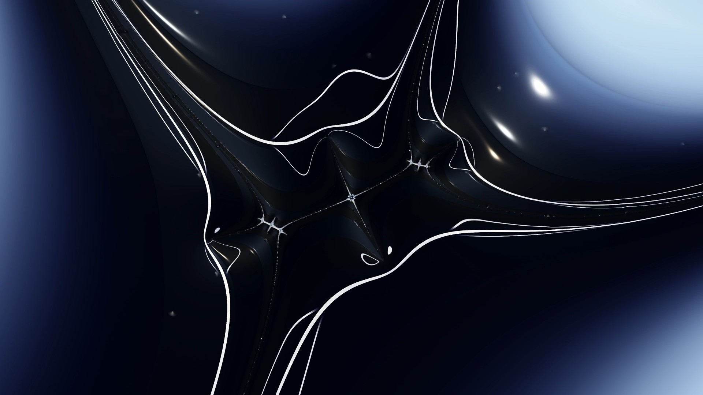

<!-- Modified by GPT-6 on 2026-09-11, 2026-09-24, 2026-09-25 -->
<!-- Modified by GPT-6 on 2026-09-25. -->

  

<h1 align="center">RFF_Super</h1>

  <strong>Explore Mandelbrot detail. Shape its appearance. Create stills and zoom films.</strong> 
  A Windows fractal renderer with Vulkan-powered shading, layered effects, and a video timeline.

  <strong>Windows x64 · C++20 · Vulkan · GMP · GPLv3</strong>

  <a href="guide/user-manual.md">User manual</a> ·
  <a href="guide/SETTINGS_GUIDE.md">Illustrated guide</a> ·
  <a href="documentation/BUILDING.md">Build instructions</a> ·
  <a href="CHANGELOG.md">Changelog</a>

  

  <a href="guide/visual-comparisons.md">Explore before-and-after renders and example settings →</a>

**RFF_Super** extends [RFF-2.0 by Merutilm](https://github.com/Merutilm/RFF-2.0), based on version **2.1.2.3**, with additional appearance controls, custom formulas, exploration tools, and animation workflows. It brings location, surface editing, animation, and export into four dedicated workspaces, with English and Japanese interface options.

> **About this fork:** RFF_Super is a modified version of the original, with changes from **2026-07-05** onward. Each changed source file carries its own modification notice and date. It was developed using AI-assisted “vibe coding” by an author without a mathematics specialization or extensive programming experience. Calculation precision may be lower than in the original; see [known limitations](#known-limitations).

## What you can create

| | Capabilities |
| --- | --- |
| **Explore fractals** | Mandelbrot deep zooms, minibrot finding, boundary tracing, free rotation, custom formulas, and planar or 360° projections. |
| **Design the surface** | Palettes, lighting and relief, textures, patterns, stripes, warp, fog, bloom, color correction, and configurable shader layer order. |
| **Animate the result** | Zoom sequences, camera and appearance tracks, interpolation, music, zoom overlays, and video export through FFmpeg. |
| **Work visually** | Searchable settings, Basic and Detail surface views, favorites, adjustable panels, undo/redo, and reference/current appearance comparisons. |
| **Keep reusable work** | Full settings, appearance presets, losslessly compressed iteration maps, and separate video timelines. |
| **Try assisted exploration** | Optional Local AI appearance and zoom tools with a separately configured model server. |

Custom formulas have a much shallower useful zoom range than the Mandelbrot path. See [exploration and calculation](guide/exploration-and-calculation.md) for the controls and their limits.

## Get started

### Prepare the application

Use **Windows x64** with a suitable **Vulkan-capable GPU and driver**. Keep the application's `bin/` and `shaders/` folders together as siblings, and keep the required runtime DLLs available.

- **Building from source:** follow [BUILDING.md](documentation/BUILDING.md) for the MSYS2 MINGW64 toolchain, dependencies, and build commands.
- **Exporting video or audio:** follow the [FFmpeg setup guide](guide/ffmpeg-setup.md) to install **FFmpeg separately**, make it available on PATH or beside the executable, and check the required encoders. FFmpeg is not needed for still-image rendering.
- **Using Local AI:** follow the [Local AI guide](guide/local-ai.md) to configure a separate model server. Ordinary fractal rendering does not require it.

### Make your first image

1. Launch `bin/RFF_Super.exe` and use **Load Location / Settings** to open the supplied [example settings](guide/examples/source-2.rfc). Download the file first if you are browsing on GitHub.
2. Wait for the fractal calculation to finish. Open **Surface Effects** and start with the palette or lighting controls.
3. Change one setting and choose **Apply & Render**. Use **Ctrl+F** to find a control, or compare appearances in the Comparison module.
4. Press **Ctrl+S** and choose a new `.rfc` filename to keep your version. Use **Save Image** to export the rendered picture.
5. For a zoom film, continue with [animation and export](guide/animation-and-export.md): generate source keyframes, edit the timeline, then export.

The [illustrated settings guide](guide/SETTINGS_GUIDE.md) includes downloadable examples and explains what each adjustment changes. To switch the interface language, use **View → Language / 言語** and restart the application.

## Find the right guide

| I want to… | Read this |
| --- | --- |
| Learn the complete workflow | [User manual](guide/user-manual.md) |
| See what settings do to an image | [Illustrated settings guide](guide/SETTINGS_GUIDE.md) · [Visual comparisons](guide/visual-comparisons.md) |
| Explore materials, lighting, and effects | [Shader overview](guide/shader-overview.md) · [More shader comparisons](guide/shader-comparisons.md) |
| Navigate, calculate, or find minibrots | [Exploration and calculation](guide/exploration-and-calculation.md) |
| Arrange panels, compare looks, or save work | [Workspace and files](guide/workspace-and-files.md) |
| Create animation and export a video | [Animation, timeline, and export](guide/animation-and-export.md) |
| Configure optional AI tools | [Local AI](guide/local-ai.md) |
| Look up a control or see its interface | [Field reference](guide/settings-reference.md) · [UI gallery](guide/ui-gallery.md) · [Feature coverage](guide/feature-coverage.md) |
| Recover a session or troubleshoot | [Presets, recovery, and diagnostics](guide/presets-and-recovery.md) |

### Choose the right save format

| Format | What it stores |
| --- | --- |
| `.rfc` | Location and configuration, including calculation, appearance, and video settings. |
| `.rfsp` | An appearance preset to reuse at another location. |
| `.rfl` | Legacy location data: center, log zoom, and iteration limit. |
| `.rfm` / `.rfmz` | Computed iteration maps; `.rfmz` uses lossless disk compression. |
| `.rfvt` / `.json` | Video timeline, tracks, and references to audio and other assets. |
| `.png` | Rendered pixels for viewing and sharing. |

Settings and timeline files do **not** bundle external textures, keyframe maps, music, or fonts. Keep referenced assets alongside your saved work. See [file handling](guide/workspace-and-files.md) for details.

## Rendering foundations

RFF_Super inherits the original project's Mandelbrot calculation approach:

- **Perturbation theory** calculates nearby pixels around a high-precision reference orbit.
- **Fast-period-guessing (FPG)** detects the current view's maximal period automatically.
- **Multilevel Periodic Approximation (MPA)** skips variable-length groups of iterations using the reference orbit's periodic structure.
- **Reference and approximation-table compression** reduce memory requirements and table-building work.

Vulkan handles the rendering and shading pipeline. Supersampling improves image sampling at the cost of additional work and memory.

## Known limitations

- **Calculation precision:** results may be less precise than in the original RFF-2.0. Inspect fine boundaries when changing approximation settings.
- **Black or white lines:** try lowering **Precision Level** to a more negative value and recalculating. This can resolve approximation artifacts, but lines can also have other causes.
- **Long, high-resolution video exports:** a reported `VK_ERROR_DEVICE_LOST` failure can terminate export and leave a truncated `.mp4`. The cause remains unresolved; an application bug has not been ruled out. Try lowering **Supersampling (SSAA)** before generating source keyframes to reduce per-frame GPU load without changing the output dimensions at the same canvas size and Clarity.

For recovery options and diagnostic information, see [presets, recovery, and diagnostics](guide/presets-and-recovery.md).

## Build and project resources

| Resource | Contents |
| --- | --- |
| [Build instructions](documentation/BUILDING.md) | Toolchain, dependencies, shaders, local builds, and distribution builds. |
| [Distribution guide](documentation/DISTRIBUTION.md) | Binary packaging and matching dependency/source bundles. |
| [Project layout](documentation/project-layout.md) | Source, documentation, tools, and runtime-file locations. |
| [Changelog](CHANGELOG.md) | Changes in RFF_Super. |
| [Third-party materials](third-party/README.md) | Dependency license texts, matching sources, and reconstruction instructions. |

## Credits and license

**Original RFF-2.0:** [Merutilm](https://github.com/Merutilm/RFF-2.0). 
**RFF_Super modifications:** SuperFractal, from 2026-07-05 onward.

RFF_Super is free software under the **GNU General Public License v3**. See [LICENSE](LICENSE) for the full text and the reproduced licenses of the primary linked components.

[NOTICE](NOTICE) records third-party components, named algorithms, their sources, and applicable licenses. The source tree bundles stb_image and nlohmann/json; other build dependencies are installed separately. Review the [distribution guide](documentation/DISTRIBUTION.md) and the matching [third-party materials](third-party/README.md) when preparing a binary release.
