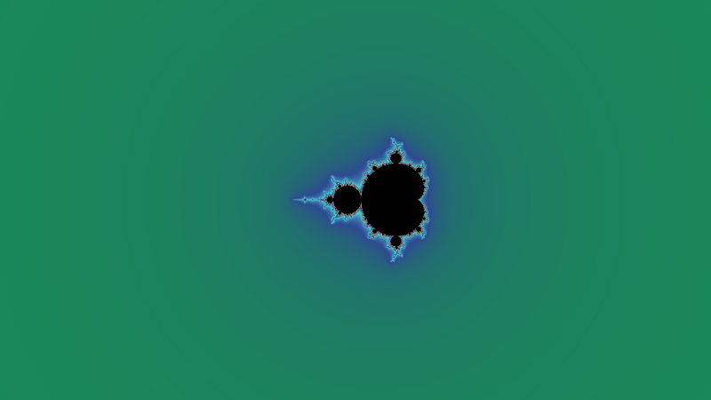

<!-- Created by GPT-6 on 2026-09-24. -->
<!-- Modified by GPT-6 on 2026-09-25. -->
# RFF_Super settings guide

Learn what each group of settings changes, see before-and-after renders, and understand calculation settings. This guide describes the source tree on **September 24, 2026**.

For detailed workflows beyond shaders, open the **[complete user manual](user-manual.md)**. It covers files, workspace layout, comparison, calculation, Local AI, timeline AI exchange, animation, export, presets, recovery, and diagnostics, with **[actual UI images](ui-gallery.md)** and diagrams. The **[feature coverage map](feature-coverage.md)** locates every top-level menu action.

Start with the illustrated sections below. Use the **[complete field reference](settings-reference.md)** to look up individual controls, choices, and fresh-session defaults. Saved files and presets can have different defaults.

For every shader feature, including advanced Surface controls and names that differ between panels, use the **[shader feature overview](shader-overview.md)**. Its [menu map](shader-overview.md#find-a-feature-from-the-shader-menu) covers all 17 Shader menu entries, and its [coverage checklist](shader-coverage.md) maps the source groups to their descriptions. The main guide below is the illustrated introduction, not the sole description of every field.

The overview now includes more images alongside the explanations. The **[24 additional shader comparisons](shader-comparisons.md)** cover grooves, ornaments, lighting, materials, emission, print colors, pixelation, outlines, layer order, and HDR, with before/after settings to download. Together with the original examples, there are **54 render comparisons**.

## Contents

- [Getting started](#getting-started)
- [Location, formula, and iterations](#location-formula-and-iterations)
- [MP-Approximation and reference compression](#mp-approximation-and-reference-compression)
- [Resolution, performance, and image quality](#resolution-performance-and-image-quality)
- [All shader feature groups](#all-shader-feature-groups)
- [Palette and band lines](#palette-and-band-lines)
- [Lighting, relief, and surface styles](#lighting-relief-and-surface-styles)
- [Textures, patterns, warp, and stripes](#textures-patterns-warp-and-stripes)
- [Color correction, bloom, and blur](#color-correction-bloom-and-blur)
- [Animation, video, and the timeline](#animation-video-and-the-timeline)
- [HDR and tone mapping](#hdr-and-tone-mapping)
- [Exploration tools and workspace preferences](#exploration-tools-and-workspace-preferences)
- [When a setting seems to do nothing](#when-a-setting-seems-to-do-nothing)
- [Using this guide on GitHub](#using-this-guide-on-github)

## Getting started

1. Load a settings file (`.rfc`) to restore the location and the full configuration. A shader preset (`.rfsp`) restores the appearance without moving the location.
2. Open the relevant settings panel, or search for the English control name. Change one control, then choose **Apply & Render** in a panel that has that button. **Discard** drops pending edits; Undo/Redo lets you compare applied changes.
3. Wait for a fresh calculation when changing location, formula, iteration settings, MPA, or resolution. Appearance settings usually reuse the existing iteration map.
4. Save a new `.rfc` when you want to keep the result. The examples below include downloadable before/after settings.

### About the pictures

Fractal comparisons below are actual renders. The six workflow diagrams in the animation section explain timeline, audio, camera, and export behavior; they are labeled illustrations, not application screenshots or additional rendering benchmarks.

The supplied `1.rfc` and `2.rfc` from `C:\video_frame\10` provide these two locations. The pictures are real RFF_Super Vulkan renders, not illustrative mockups. They are reduced to **800 × 450**, with **2× SSAA in each dimension**, Clarity 1, and Precision Level −7. The log zoom is adjusted by `log10(800/1280)` to preserve the original field of view. The supplied files are preserved unchanged.

| Location 1: overview | Location 2: detail |
| --- | --- |
|  |  |

The comparisons use the second location and a controlled baseline: animation is stopped, color correction is neutral, and unrelated effects are disabled. Each caption states the changed controls. A style selection applies a complete recipe, so a **style comparison intentionally changes several settings**. All pictures are SDR; an ordinary GitHub image does not demonstrate a monitor's HDR brightness.

[Download the comparison baseline](examples/baseline.rfc) · [All visual comparisons](visual-comparisons.md) · [How the images were checked](validation.md)

## Location, formula, and iterations

| Setting | What changes and when to use it |
| --- | --- |
| Real / Imaginary | Moves the center in the complex plane. Keep the complete decimal coordinates when copying deep locations. |
| Log Zoom (e) | Controls the scale. Despite the label's `e`, the renderer uses **base 10**: adding 1 magnifies by 10 at the same canvas size. This is not a natural-log control. |
| Rotation | Rotates the calculated view; also supplies yaw in panorama projections. This requires recalculation. Video Camera Rotation transforms saved source maps separately. |
| Automatic Iterations | For Mandelbrot, derives the iteration limit from the detected period and Auto Iteration Multiplier. Fast-period-guessing stays automatic. |
| Max Iteration | Manual escape-iteration limit when Automatic Iterations is off. Raising 1000 to 2000 permits twice as many iterations for difficult pixels; it does not double the work of pixels that already escape early. |
| Auto Iteration Multiplier | Multiplies the detected period. For the example's period 16, 150 gives a limit of 2400; 300 gives 4800. More iterations can resolve detail that previously reached the limit. |
| Bailout | Escape radius. It affects when an orbit is considered escaped and its smooth iteration value; it is not the MPA error tolerance. |
| Decimalize Iteration | Controls fractional iteration coloring. The quadratic escape-potential path returns the same continuous smoothing for the exposed non-None choices under normal bailout conditions; identical results here can be intentional. |
| Absolute Iteration Mode | Changes iteration reporting. Boundary Trace Fill is bypassed in this mode. Compare a fresh render before using it for an established coloring recipe. |
| Formula Type / Custom Formula | Switches between Mandelbrot and expressions such as `z^3+c` or `conj(z)^2+c`. Changing the formula normally resets the view. Custom formulas use manual iterations and have a much shallower useful zoom range than Mandelbrot. |
| Projection | Planar, 360° Equirectangular, or 360° Camera. These calculate different projections; they do not merely resize the picture. |
| Layout / Pitch / Field of View / Panorama Range | Select ground-and-sky versus full-sphere mapping, aim the perspective camera, widen its view, and limit the mapped radius. Planar projection does not use the panorama controls. |

## MP-Approximation and reference compression

**MPA means Multilevel Periodic Approximation.** It uses the reference orbit's periodic structure to skip variable-length groups of iterations. Period detection is automatic. MPA is not BLA.

The objective is to calculate the same fractal with less work and manageable memory. An approximation tolerance is not a promise of a particular number of correct decimal digits. Check difficult boundaries after changing it.

| Change | Speed and memory | Precision / practical effect |
| --- | --- | --- |
| Precision Level −3 → −5 | A stricter validity test can reduce usable skips; the speed change depends on the location. Table size need not change. | The internal epsilon changes from `10^-3` to `10^-5`: **100× smaller**, not “100× more accurate pixels.” Lower the value further if unexpected lines or unstable detail remain. |
| Precision Level −5 → −7 | Another 100× smaller epsilon; often more conservative. | This guide uses −7 for its final images. |
| Min Skip Reference 4 → 32 | Skips shorter than the minimum cease to be useful. This can reduce tables but increase ordinary perturbation work. | A minimum above the longest available period leaves no usable MPA skips. |
| Max Multiplier Between Levels | Changes the spacing of intermediate period levels and the balance between table size and skip selection. | It does not set the orbit's detected period. There is no universal faster value. |
| Selection Method: Highest / Lowest | Starts the search at a different end of the available MPA levels. | Use a timed comparison at your own location. This changes the search strategy, not the requested precision. |
| Compression Method: No compression → Little compression → Strongest | Packs MPA tables more aggressively. Strongest can reduce allocation and table construction, but lookup work can increase. | Compression method and Precision Level are separate controls. Savings require suitable periodic/repeated structure. |
| Compression Criteria | A positive value sets the repeated-reference batch threshold; 0 disables reference compression. Lower positive thresholds can make shorter repeats eligible. | This is reference-orbit storage compression, separate from MPA table compression and `.rfmz` disk compression. |
| Compression Threshold 7 → 11 | The relative matching threshold goes from `10^-7` to `10^-11`. Tighter matching can retain more data. | Higher positive values are stricter. A value of 0 produces a zero tolerance in the implementation; use **Compression Criteria = 0** to explicitly disable compression. |
| Disable Normalization | Alters normalization of the reference compressor's representation. | An advanced storage choice. Leave it at the chosen preset's value unless you are measuring a specific large reference. |
| Reuse Reference: Disabled / Current / Centered | Reuses an existing reference where applicable, avoiding some setup work. | The first calculation has no previous reference to reuse. Use Disabled for independent comparisons or after an incompatible location change. |

## Resolution, performance, and image quality

**Clarity changes output size; Supersampling adds samples before reduction.** At canvas size `W × H`, Clarity `C`, and SSAA `S`, the ordinary internal grid is approximately `(W × C × S) × (H × C × S)`, with integer rounding. Padding for video sources can enlarge it further.

| Example, 1280 × 720 canvas | Final ordinary image size | Internal samples | One double-precision iteration array only |
| --- | --- | --- | --- |
| Clarity 1, SSAA 1 | 1280 × 720 | 0.922 million | 7.03 MiB |
| Clarity 1, SSAA 2 | 1280 × 720 | 3.686 million (**4×**) | 28.13 MiB |
| Clarity 1, SSAA 4 | 1280 × 720 | 14.746 million (**16×**) | 112.50 MiB |
| Clarity 2, SSAA 1 | 2560 × 1440 | 3.686 million (**4×**) | 28.13 MiB |

These are calculated sample counts and array sizes (`8 bytes × samples`), **not measured total RAM/VRAM or render-time multipliers**. The renderer also needs reference tables, intermediate images, buffers, and driver allocations. SSAA reduces spatial aliasing; it does not repair insufficient iteration limits or approximation precision.

| Setting | Effect |
| --- | --- |
| Canvas Width / Canvas Height | Base canvas dimensions. Exported video dimensions also depend on the saved keyframes. |
| Linear Interpolation | Smooths image sampling. It cannot recreate fractal detail that was never calculated. |
| Dither | Adds small noise to reduce 8-bit gradient banding. It changes pixel values slightly and should be disabled for exact repeatability tests. |
| Rendering FPS | Live display rate limit. Lowering 60 to 30 reduces the maximum number of preview updates, not the video export frame rate. |
| Calculation Threads | Parallel CPU work. More workers can help until CPU/memory limits dominate; twice as many threads does not guarantee twice the speed. |
| Boundary Trace Fill | Uses boundary tracing to fill qualifying regions. Benefit depends on the view; it is bypassed in Absolute Iteration Mode. |
| Two-Color Preview | A classification-oriented calculation preview. Use the normal coloring mode to judge appearance settings. |
| Coarse Preview | Displays a coarse initial result before refinement. Judge final detail after calculation completes. |

## All shader feature groups

| Feature group | What to find in the detailed overview |
| --- | --- |
| [Palette and band lines](shader-overview.md#palette-and-band-lines) | Cycle mapping, color interpolation, interior color, palette gloss, grooves, spines, ornaments, line glow, stops, and recipes. |
| [Lighting and relief](shader-overview.md#lighting-and-relief) | Shading/surface blends, light transitions, fill light, specular/anisotropy, macro relief, cavities, tint, local tone, rim light, gloss, and Lustre zoom compensation. |
| [Studio and surface styles](shader-overview.md#studio-and-surface-styles) | All six styles; material/reflection/coating controls; palette and surface tints; film, prism, glints, sigil ink, flames, frost, emission, particles, print, VHS, pixelation, grain, and style mixes. |
| [Textures](shader-overview.md#textures) and [Patterns](shader-overview.md#patterns) | Four layers each, blend modes, coordinates, sizing, repetition, outlines, motion, and layer actions. |
| [Warp](shader-overview.md#domain-warp) and [Stripe](shader-overview.md#stripe) | Coordinate displacement sources/detail and the separate iteration-stripe effect. |
| [Animated Materials](shader-overview.md#animated-materials) | All eight effect types, masks, blending, shape, colors, motion synchronization, and band period. |
| [Color correction](shader-overview.md#color-correction), [Fog and selective blur](shader-overview.md#fog-and-selective-blur), and [Bloom](shader-overview.md#bloom) | Grading, fog masks, Focus Band, Chaos Blur, blur quality, and bright-area glow. |
| [HDR and tone mapping](shader-overview.md#hdr-and-tone-mapping) | All eight display curves, exposure, headroom, MFR peak, and the distinction from HDR export. |
| [Shader Layers](shader-overview.md#shader-layers) | All 29 compositing slots, custom order, visibility, and restoring the original rendering path. |
| [Movement](shader-overview.md#movement) and [Imports and presets](shader-overview.md#imports-and-presets) | Shader animation, frozen colors, timeline links, color imports, shader presets, and Local AI appearance. |

Some Surface controls use shorter displayed names: for example **Prism Width** is listed as **Rainbow Width** in the underlying field registry. The [display-name mapping](settings-reference.md#surface-editor-display-names) lets you find the same setting from either name.

## Palette and band lines

**Cycle Length (R/G/B)** determines how many iterations span a color cycle. Halving all three makes the colors repeat more frequently. **Start Offset** moves the color cycle without moving the fractal. **Iteration Coloring** bends the iteration-to-color mapping; **Cycle Bias** and **Cycle Curve** redistribute color within each cycle.

| Saved cycle lengths | Half the cycle lengths |
| --- | --- |
|  |  |

**Color Smoothing** controls interpolation through colors; **Color Interpolation** selects RGB, OKLab, or Linear RGB blending. **Seamless (Mirror)** changes how the palette repeats. **Palette Gloss** adds palette-linked highlights; its bands can move with the color animation. **Mandelbrot Color** is the interior color and will be invisible in an entirely exterior view.

**Band Lines** outline regular positions in each palette cycle. Lines per Cycle, Line Width, Opacity, Softness, and Color shape them. Recessed Grooves adds relief; Spine and Ornament controls decorate the lines. Line Glow has its own width and color.

| Band Lines off | On: 8 lines/cycle, width 0.09 |
| --- | --- |
|  |  |

Use **Selected Stop**, **Stop Position**, and **Stop Color** to edit a stop palette. **Create 8 Stops (Lossy)** resamples and replaces the existing palette representation; it is not a lossless view of the original. Preset + Seed gives repeatable generated palettes. Color Settings File imports colors from RFC, RFSP, KFR, or KFP; Include Color Correction also imports the six grading controls.

[More palette examples and downloadable settings](visual-comparisons.md#palette) · [Every palette field](settings-reference.md#palette)

## Lighting, relief, and surface styles

**Shading Depth** changes the strength of the relief normal; **Slope Opacity** blends its shading into the picture. High depth can saturate the apparent slope, so a large numeric increase may become visually small. Try a small depth such as 0.02 when learning the light controls.

| Slope Opacity 0 | Slope Opacity 1, Shading Depth 0.02 |
| --- | --- |
|  |  |

Light Direction rotates illumination around the relief; Light Zenith changes its elevation. Shadow Floor lifts the dark side. Fill Intensity adds a second light with its own direction. Specular Intensity controls highlights, Specular Power tightens them, and anisotropy stretches them. Independent Specular Light allows a highlight direction different from the main light.

| Light Direction 45° | Light Direction 225° |
| --- | --- |
|  |  |

**Macro Relief** emphasizes broader structure; **Cavity Intensity** darkens recessed regions. **Tint Intensity** mixes Light-Facing and Shadow-Facing colors. Shadow Chroma is used by OKLab Tint. **Rim Intensity** emphasizes rims, while **Gloss** creates repeated highlights from a relief-based source. Gloss Source is independent of Palette Gloss.

**Lustre Relief** enables the alternate relief treatment. Lustre Depth, Normal Smoothing, AO Radius, Relief Waves, and Wave Frequency adjust it. Invert Relief flips its orientation. Auto Zoom Compensation uses Zoom Reference to keep relief behavior consistent while zooming; **Use Current Zoom** binds that reference to the current view.

### Studio materials and surface styles

Enable **Studio** for material controls. Roughness spreads reflections; Metalness changes the metallic response; Index of Refraction controls dielectric reflection; Clearcoat adds a separate coating with its own roughness. Direct Light and Studio Reflections control different light contributions.

| Roughness 0.1 | Roughness 0.8 |
| --- | --- |
|  |  |

Both pictures use Studio On and Specular Intensity 0.8. With Specular Intensity 0 in the initial comparison, the roughness change produced identical images; the final example enables that contribution so the setting can be seen.

Base Style offers **Original, Liquid Metal, Cyber Sigilism, PHONK, Black Metal, Deep Sea, and Ukiyo-e**. Selecting a style applies a recipe, including associated band-line and finishing choices. The style's related controls tune reflections, film color, emission, grain, or print colors. **Complete Replacement** replaces the palette with the style; Legacy Compositing preserves the blend controls. The six style mixes allow combined looks.

| Liquid Metal | Ukiyo-e |
| --- | --- |
|  |  |

Iridescence and Film Thickness change thin-film color. Reflection Detail, Contrast, Brightness, and Curvature tune reflections. Deep Sea has body/emission colors, particles, and glow thresholds. Ukiyo-e has print colors, color count, foam, grain, flatness, and tone balance. PHONK and Black Metal use their damage, grain, monochrome, and VHS controls. See the field reference for which contribution each control shapes.

[All six style comparisons](visual-comparisons.md#surface-styles) · [Lighting fields](settings-reference.md#lighting--relief) · [Surface fields](settings-reference.md#surface-effects)

## Textures, patterns, warp, and stripes

Textures use an image file; Patterns generate Stripes, Checker, Grid, Dots, Diamond, Honeycomb, Waves, or Cloud without one. Each has four layers. In their ordinary stack, Layer 1 is the bottom and Layer 4 is the top. A disabled layer or zero Opacity has no visible effect.

**UV Source** determines placement: Screen stays aligned to the image; Cycle × Angle, Cycle × Screen, and Cycle × Band combine the iteration cycle with another coordinate. Repeat U/V set repetition. Texture/Pattern Period 0 follows the palette period; a positive value gives an independent iteration period. Palette Follow, Scroll U, and Scroll V control movement.

Pattern Ink Mode selects a fixed Ink Color or a shifted palette color. Sharpness changes the shape's boundary; Edge controls add a separate outline. Domain Warp displaces these color/decor coordinates using Noise or a texture source. It changes the appearance, not the underlying fractal formula.

| Screen-aligned checker, warp off | Same checker, Warp Amount 0.4 |
| --- | --- |
|  |  |

**Stripe** is a separate iteration-based shading effect. Choose a non-None Stripe Type, set the two intervals, and raise Opacity. Offset shifts the pattern; Animation Speed moves it over time.

**Animated Materials** provides Rain, Flame, Embers, Mist, Heat Haze, Ripples, Flow Light, and Aurora. Enable a layer, select its Mask and Blend, and adjust Opacity. Density, Surface Scale, Shape Length/Width, Surface Depth, Glow, colors, and Seed shape the effect; Speed, Evolution, and Flow Bend shape its motion. Rain Shape and Drop Size are rain-specific. A static image cannot demonstrate a speed setting by itself.

| Flame layer off | Flame layer on: Opacity 0.85, Glow 1, at 2 s |
| --- | --- |
|  |  |

The **shader layer workspace** controls ordering and visibility when the ordered stack is enabled. A hidden layer can keep valid settings while contributing nothing. Order matters: blur before a pattern differs from blur after it.

## Color correction, bloom, and blur

| Control | Neutral value | What increasing it does |
| --- | --- | --- |
| Gamma | 1 | Above 1 lifts midtones; below 1 darkens them. |
| Exposure, under Color Correction | 0 | Brightens the encoded color through its grading curve. This control is **not measured in photographic stops**. |
| Hue | 0 | Rotates hues; 0.25 is one quarter turn. |
| Saturation | 0 | Increases saturation. −1 makes the image grayscale. |
| Brightness | 0 | Adds an offset to all color channels. |
| Contrast | 0 | Expands differences around the midpoint; negative values flatten contrast. |

| Saturation 0 | Saturation −1 |
| --- | --- |
|  |  |

**Bloom** spreads bright areas into a halo. Threshold selects the bright areas, Radius spreads them, Softness mixes sharp thresholded glow toward blurred glow (1 is fully blurred), and Intensity controls the strength. Linear Light changes the light-addition method. Raising Threshold can remove bloom entirely if no pixels are bright enough.

| Bloom off | Bloom Intensity 1.2, Threshold 0.3, Radius 0.2, Softness 1 |
| --- | --- |
|  |  |

**Fog** mixes blurred color according to Radius and Opacity. Center Start and Invert Falloff shape its screen-space coverage. Rim Mask uses the rim-light footprint; it requires a useful rim contribution. Rim Mask Boost and Rim Blur strengthen and soften that region.

**Focus Band** uses iteration depth rather than physical camera distance. Focus Depth selects the sharp band, Focus Range widens it, Focus Falloff shapes the transition, and Focus Blur sets the out-of-focus radius. Focus Amount 0 disables this contribution.

**Chaos Blur** detects locally intricate iteration structure. Amount controls strength; Detail Scale and Threshold determine what is selected; Transition and Feather soften the selection; Blur Radius sets the blur; Highlight Detail restores some bright detail; Shade darkens the selected regions.

| Chaos Blur off | Amount 1, Threshold 0.15, Blur Radius 12 |
| --- | --- |
|  |  |

**Blur Quality: Speed** caps the relevant full-resolution blur radius at 16 texels. **Appearance** preserves larger requested radii, up to the shader's 4096-texel safety limit, and allows a denser sampling grid. For ordinary local blur below the 16-texel cap, the two modes can use the same samples. Chaos Blur uses a denser circular sampling grid in Appearance even below that cap, so its image and cost can still change. These are sampling differences, not measured speed ratios.

[Additional color and blur comparisons](visual-comparisons.md#finishing)

## Animation, video, and the timeline

There are three separate rates: **Rendering FPS** for the live display, **Video Frame Rate** for encoded frames, and **Zoom Speed** for progression through saved keyframes.

| Setting group | What to change |
| --- | --- |
| Color Animation Speed | Iterations per second of palette drift. Negative reverses direction; 0 stops that drift. |
| Animation Mode | Linear uses simple drift. Breathing, Turbulence, and Psychedelic add different flow. Flow Amount, Scale, and Speed shape it; Swirl is used by Psychedelic. |
| Frozen colors | Frozen Iteration Values and Freeze Match Tolerance hold selected palette bands still. A larger tolerance freezes a wider band. |
| Zoom Speed / Extra Final Zoom-in | Sets progression in keyframes per second and extra zoom beyond the final saved stage. For pauses, add a timeline hold rather than setting a speed key to zero. |
| Zoom Step per Keyframe | The saved-map magnification ratio: 2 means neighboring maps differ by a factor of 2. Wider spacing requires fewer maps but puts more demand on transitions. |
| Rotation / 360 Padding | Calculates a larger source area for rotation/projection. Camera Padding Scale 2 → 4 multiplies padded pixel count by 4. Existing unpadded maps do not gain missing detail when this switch changes. |
| Render from PNG Images | Uses already-colored pictures. Iteration-based recoloring and relief need RFM/RFMZ sources; PNGs support the available image finishing path. |
| Timeline Enabled | Applies saved parameter tracks. Keys are attached to depth, so changing zoom speed changes their timing while keeping their location. |
| Estimated Keyframes | Preview estimate before loading a folder. It does not create maps or change the actual folder's file count. |
| Camera Rotation / Projection / Pitch / Field of View / Range / Layout | Transforms the saved view during playback. Rotations and panorama views need suitable source coverage. |
| Rotation Mode: Constant Period | Replaces rotation keys with a continuous turn. Seconds per Turn controls the duration, Direction sets its sign, and Start Angle sets the phase. Rotation continues during zoom holds. |

| Linear color motion at 0 s | Same settings at 1 s, speed 16 |
| --- | --- |
|  |  |

### Timeline controls

Add a parameter track, select a key, and set **Keyframe Depth**, **Value** (or Color), and **Interpolation**. Step holds a value until the next key; Linear changes at a constant rate with depth; Smooth uses smoothstep to ease the ends; Cubic makes a curved transition using neighboring keys. Discrete choices use Step. Turning a track off retains its keys. Zoom holds specify depth and duration.

#### Walkthrough: animate camera rotation

1. Load the saved-map sequence into the Timeline Editor. This example assumes its available depth range includes 10 through 0. Use three available depths in your own sequence if it is shorter. **Keyframe Depth is the sequence position**, not the Explore panel's Log Zoom. Playback progresses from higher to lower depth values.
2. Set **Timeline Enabled** to On and **Rotation Mode** to **Keyframes**. Constant Period replaces rotation keys with continuous rotation.
3. Use **Add Parameter** to select **Camera / Rotation**. Select an existing key or use **Add Key at Playhead** to add one; a track's context menu also offers **Add Key Here**.
4. In the inspector, set the three keys to depth/value pairs **10 / 0°**, **5 / 45°**, and **0 / 90°**, applying the edits. Keep keys at least one keyframe apart; the editor validates this spacing.
5. Set the first two keys' **Interpolation** to **Linear**. The context menu calls this **To Next Key**: it controls the segment leaving that key.
6. Move the playhead between keys and preview. At depth 7.5 the rotation is 22.5°; at depth 2.5 it is 67.5°. Changing Zoom Speed changes when you reach these depths, while the key values stay attached to their depths.

These angles are calculated examples from the interpolation rule. The diagram is not a captured playback test. Check source coverage before rotating, as illustrated below.

#### Choose how the value changes

Try the same two key values with **Step**, **Linear**, and **Smooth**. Step produces an abrupt change at the next key; Linear spreads the change evenly across depth; Smooth slows the change near each end. If Zoom Speed varies, even Linear will not have a constant rate in seconds. **Cubic** also depends on neighboring keys and may overshoot the endpoint values, within the parameter's allowed range. Use Step for switches and menu choices.

#### Change speed or add a pause

Holds are stored in the timeline; this version has no hold-entry inspector. Edit `timeline.holds` in an exported JSON document and reload it, as explained in the [detailed timeline chapter](animation-and-export.md#speed-and-holds).

For a sequence spanning depth 10 to 0, with no speed keys and no extra final zoom, **Zoom Speed 1 → 2** changes the travel time from **10 s → 5 s**. Restore speed 1 and add a **2-second zoom hold at depth 5** to make it **12 s**. Depth-based tracks stay at the held depth during the pause. Time-based palette animation and Constant Period camera rotation can continue, so a zoom hold does not necessarily freeze the entire picture. Active speed-track keys override the fallback Zoom Speed; disable that track to compare these constant-speed examples.

#### Trim and place audio

The current Audio inspector exposes Export Audio and Master Volume. Clip addition, trimming, placement, and fades are edited through the complete timeline JSON, not through an unimplemented clip editor. See [the JSON clip example](animation-and-export.md#audio) for exact units and fields.

**Export Audio** includes the music track. Master Volume scales the whole mix; a clip has its source file, timeline start, source in/out points, gain, mute, fade-in, and fade-out. Clips cannot overlap. Audio fades affect sound, not fractal opacity.

For this example, use a source at least 20 seconds long. Keep **source In 12 s / Out 20 s**, set the clip's **timeline start to 3 s**, and set **fade-in and fade-out to 1 s** each. The eight-second selection plays from video time **3 s to 11 s**, fading in from 3–4 s and out from 10–11 s. The shaded shape shows a volume envelope, not a waveform. The two fades together cannot exceed the clip duration. Place another clip at 11 s or later to avoid overlap. Keep Export Audio on, the clip unmuted, and both master and clip gain above zero to hear it in the exported video.

**Show Zoom Ratio** adds the overlay to preview and exported video. Decimal Places controls its precision. Custom Appearance enables font, style, size, alignment, position, text color/opacity, outline, and shadow. Position is a percentage of the frame, font size a percentage of height, and outline/shadow sizes percentages of the font. **YouTube Shorts Guide** is a preview composition guide and is never exported. Panel docking and width settings only rearrange the editor.

#### Prepare maps for camera movement

The blue area is available source data; the orange outline is the rotated output view. Enable **Rotation / 360 Padding** before generating maps and choose coverage suitable for the intended camera movement. Changing the option after generation does not expand existing maps: regenerate them. At fixed base dimensions, increasing **Camera Padding Scale from 2 to 4** quadruples padded pixel count; this is a geometric workload comparison, not a claim that measured render time or total process memory always quadruples. The drawing illustrates coverage and does not represent those exact scale values.

### Export settings

Keep duration and resolution fixed when comparing these controls. A **10-second** video contains **300 frames at 30 fps** or **600 at 60 fps**. At **20,000 kbps**, its target video payload is about **25 MB**; at **40,000 kbps**, about **50 MB** (`kbps × seconds ÷ 8000`, decimal MB). These are arithmetic estimates excluding audio and container overhead, not measured export results. Increasing frame rate does not itself double file size when bitrate stays fixed.

| Setting | Before → after |
| --- | --- |
| Video Frame Rate 30 → 60 | Twice as many encoded frames for the same duration; potentially smoother motion and more rendering/encoding work. |
| Video Bitrate 20000 → 40000 kbps | Approximately twice the target video data rate, not twice the detail. Actual file size depends on the encoder. Ignored for lossless SDR. |
| Lossless Video | Uses RGB lossless SDR in MKV. It avoids lossy video compression but does not restore detail missing from the rendered source. HDR uses its selected HDR transfer path. |
| Keyframe Transition Samples 1 → 2 | Uses a 2 × 2 spatial grid near saved-map transitions, increasing spatial samples from 1 to 4 there. |
| Color Animation Samples 1 → 2 | Uses 2 temporal samples within a frame. Near transitions, the renderer uses the larger of the spatial sample count and temporal sample count; it does not multiply the two. Elsewhere it uses the temporal count. These controls do not change output resolution, and the PNG-source path uses one sample. |
| Compress Keyframes | Writes lossless `.rfmz` maps. File size and compression time depend on the data. Recoloring remains possible. |
| Create Video After Keyframes | Starts video export after keyframe generation completes. |
| Show Video Export Preview | Displays the export while it runs. Turning it off reduces display work while retaining progress/cancellation. |
| Pause Preview During Export / Generation | Stops competing preview work during long jobs; it does not pause the export itself. |
| Image File / Video File / Keyframe Folder | Chooses the output destination or existing input sequence. Export does not create a missing source sequence automatically. |

FFmpeg is needed for video/audio export. See [BUILDING.md](../documentation/BUILDING.md#5-supply-ffmpeg) for setup; the full build guide also explains output logs and supported encoders.

## HDR and tone mapping

| Setting | Meaning |
| --- | --- |
| HDR Rendering | Keeps highlights above display white in the rendering chain. Its intermediate images require more storage than 8-bit images. |
| Tone Mapping | Chooses how the HDR picture is shown in the SDR preview and ordinary image output. The ACES choice is a curve approximation, not a complete ACES transform. |
| Exposure, under HDR & Tone Mapping | Measured in stops: +1 multiplies linear light by 2; −1 halves it. This differs from Color Correction's Exposure. |
| Highlight Headroom | Controls the linear highlight range for applicable conventional tone-mapping modes. MFR SDR display modes ignore it. |
| MFR Mastering Peak | Display metadata/curve control for MFR Shoulder and MFR Log View; reference white is 203 nits. It does not change the underlying source light. |
| Video Transfer | SDR, HDR10 (PQ), or HLG. PQ/HLG export requires HDR Rendering. |
| HDR Peak Brightness (nits) | Sets peak brightness for PQ output, independently of MFR Mastering Peak. |

The MFR choices are MFR Shoulder, MFR Log View, MFR Linear Clip, and MFR False Color. False Color is a diagnostic: −16 EV is navy, −8 blue, 0 gray, +8 yellow, and +16 red; zero light is black. It is not a natural-color render. See the [MFR preview notes](../docs/mfr-hdr-preview.md) for the complete behavior.

## Exploration tools and workspace preferences

**Local LLM** is a separate optional workflow using the configured model server. Desired Appearance describes the requested look. Generate Settings produces a result; Apply Settings applies it; Undo AI Changes reverses an applied change. Automatically Apply and Refine and Max Changes control bounded refinement; Error Limit controls retries. AI Zoom Exploration has Features to Explore, Zoom per AI Step, Exploration Steps, and its own Error Limit. The optional minibrot search can lower log zoom and retry on failure, and repeat exploration until canceled. Connection Information reports the configured connection. These features were documented from their controls, not exercised during this guide's image tests.

Language, light/dark appearance, panel placement, search, favorites, recent settings, and comparison layouts change the workspace. They do not change the mathematical location. The comparison workspace lets you examine saved appearances side by side. Save a full `.rfc` for portable artwork settings, and keep external texture/audio assets alongside your project.

## When a setting seems to do nothing

| Symptom | Check |
| --- | --- |
| The typed value has no effect | Apply the pending edits and check validation messages. Wait for calculation to finish where required. |
| A layer changes numerically but not visually | Enable the layer, raise Opacity, check its Mask, and check visibility/order in the layer stack. |
| Studio Roughness has no effect | Enable Studio and a visible specular/reflection contribution. The initial test with Specular Intensity 0 was identical; Intensity 0.8 made the difference visible. |
| A style control does nothing | Check the corresponding style/mix and whether Complete Replacement bypasses the legacy blend control. |
| Flow Amount / Swirl does nothing | Flow Amount is not used by Linear; Swirl is used by Psychedelic. |
| Animation speed seems unchanged in a still | Compare two times with playback running. A picture taken at time zero is not a speed test. |
| Interior color does nothing | The view may contain no pixels classified as interior. |
| Fog or bloom radius changes nothing | Raise the relevant opacity/intensity; check threshold, mask, and available bright pixels. |
| Precision or compression changes little | The current reference may be too short or may never use the affected skips/compression. No visual change is normally desirable for calculation/storage options. |
| New camera padding has no effect | Regenerate keyframes; it cannot add coverage to an existing sequence. |
| PNG source ignores iteration effects | Use RFM/RFMZ data for iteration-dependent recoloring, patterns, and relief. |
| Unexpected thin lines or unstable details | Lower Precision Level, recalculate, and compare. SSAA alone does not correct calculation errors. |

The first draft of this guide's images had a narrow erroneous strip at the right edge. The comparison program supplied the same map for two different zoom levels. It was corrected to supply genuinely matching neighboring maps, and all final illustrations were regenerated and inspected. No crop was used to hide that artifact. This was a guide-generation error, not evidence of a new application defect.

## Using this guide on GitHub

Keep this file and the **entire `guide/` folder** together in the repository. All embedded images and example downloads use relative paths, so GitHub renders them without a website, local drive, or image-hosting service. The companion pages use ordinary Markdown tables and GitHub-supported collapsible sections.

Open `SETTINGS_GUIDE.md` on the repository's **Code** tab to read it. If copying it into a GitHub Wiki, copy the assets and adjust the relative paths for the Wiki's separate repository. This change prepares the files locally; it does not publish or push them to GitHub.
