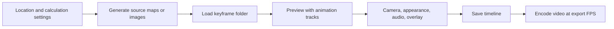
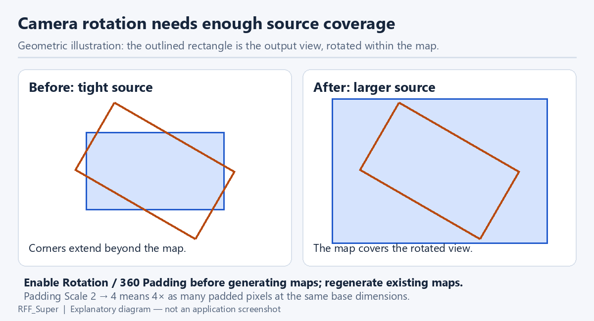
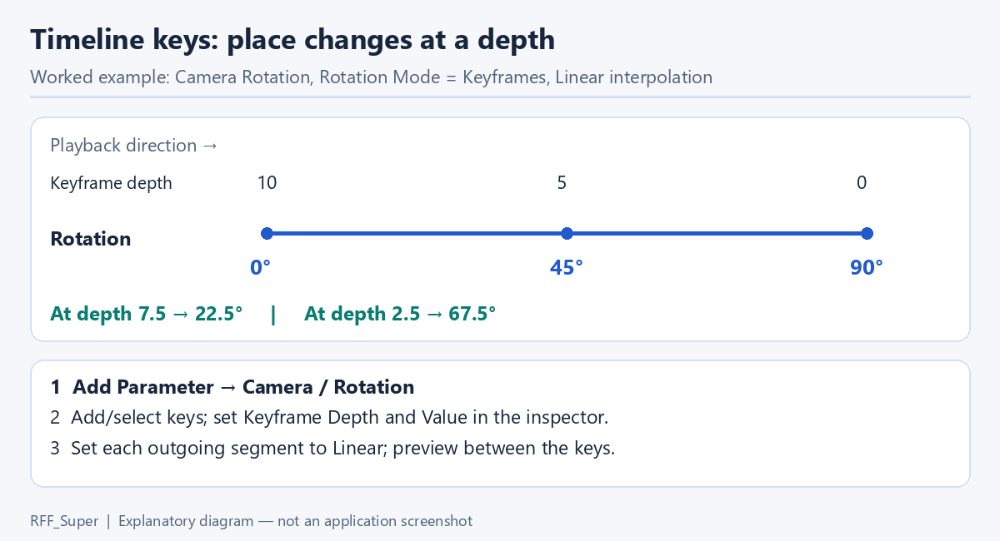
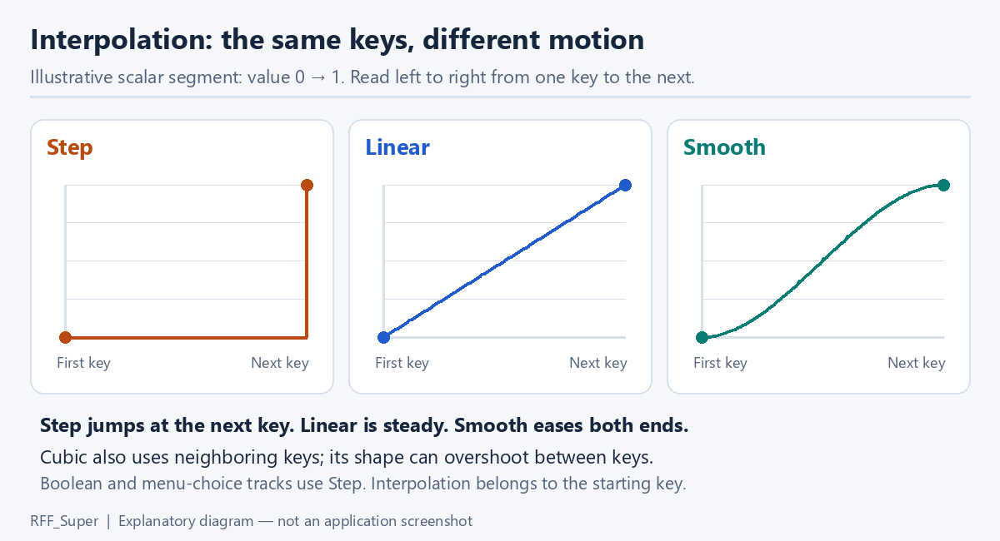
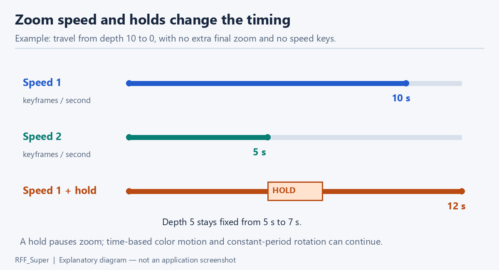
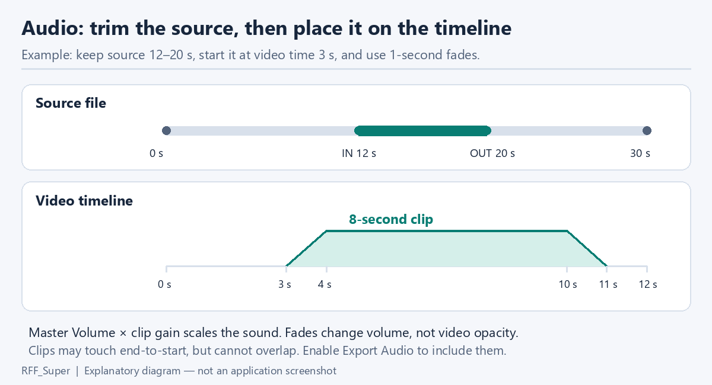
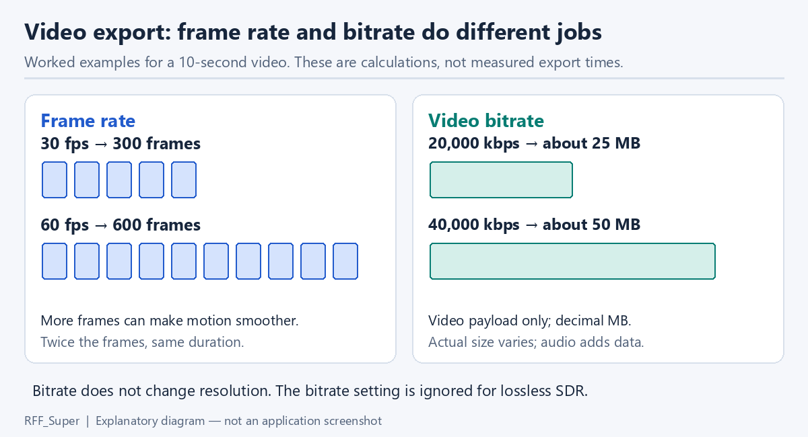

<!-- Created by GPT-6 on 2026-09-24. -->
# Animation, timeline, and export

[Manual](user-manual.md) · [Animation fields](settings-reference.md#animation) · [Export and timeline controls](settings-reference.md#export-and-timeline-controls)

## Understand the two kinds of keyframe

A **source keyframe** is a saved map or image at a particular zoom level. An **animation key** is a value placed on a parameter track, such as camera rotation or exposure. Adding an animation key does not calculate another fractal map. Changing source-map coverage generally requires regenerating the source keyframes.



## Color motion and frozen colors


**Color Animation Speed** moves through the palette in iterations per second: zero stops drift, negative reverses it. **Animation Mode** selects Linear, Breathing, Turbulence, or Psychedelic motion. Linear uses the ordinary speed; **Flow Amount**, **Flow Scale**, and **Flow Speed** shape the other flow modes. **Swirl** is used by Psychedelic. Selecting a mode can establish suitable starting values for related fields, so a mode change can affect more than one value.

**Palette Start Offset** chooses the phase at time zero. **Color Smoothing** affects transitions, and animation edits can enable Normal smoothing if it was None. Preview play/pause affects viewing; it does not erase the saved speeds used for export. Resetting preview time is useful for comparing two appearance edits at the same phase.

In **Frozen Colors**, choose the pick action and click a color in the fractal to retain that iteration band while the rest of the palette moves. **Frozen Iteration Values** holds up to 16 comma-separated values; empty clears them. **Freeze Match Tolerance** is a fraction of a color cycle: smaller values freeze a narrower band. **Clear Frozen Colors** removes all matches. Freezing a color is not freezing all geometry or stopping the entire video.

## Generate source keyframes

Use **Animation → Keyframe Generation** (also reached through **Video → Data Settings**) to configure sources, then **Video → Generate Video Keyframe** after choosing a location and quality settings. **Zoom Step per Keyframe** is the scale ratio between adjacent saved views and must be greater than 1. More closely spaced views require more source frames over the same zoom span. **Compress Keyframes** writes lossless RFMZ maps; **Create Video After Keyframes** starts video output when generation completes.

**Render from PNG Images** selects already-colored image sources. PNG sources retain finishing operations such as Color, Fog, and Bloom, but cannot supply iteration-derived palette/stripe/slope data. The timeline catalog filters unsupported parameter types while retaining saved unsupported tracks rather than converting pixels back into iterations.

For rotation or 360 camera motion, enable **Rotation / 360 Padding** before generation. **Camera Padding Scale** expands both source dimensions while retaining pixel density; 2× dimensions means about 4× source pixels, 3× means 9×. All-angle rotation can require additional coverage based on the frame diagonal. Existing maps do not gain coverage when the switch is changed later.



**Pause Preview During Generation** holds the main picture while maps are calculated. It reduces competing preview work and does not lower the requested map precision. Cancel the active generation through its progress controls and verify which files completed before reusing an interrupted folder.

## Open the timeline and load sources

Choose **Video → Timeline Editor** or **Open Timeline Editor** in Animation. Select the source keyframe folder. Before loading sources, **Estimated Keyframes** provides a planning length; the preview can show a sample overlay, as in this actual UI image:


The top controls select the folder, load/save a timeline, export, and open AI Edit. The middle transport controls play, pause, stop, and loop. Distance/keyframe/time readouts identify the playhead; they describe related positions rather than three independent animations. The lower area contains tracks and keys. The right inspector provides exact fields for the selection and other timeline settings.

When a source folder loads, the preview may preload reduced previews to RAM. If the preload is cancelled or insufficient memory is available, it can fall back to loading on demand. **Stop** can cancel preloading. A reduced-resolution interactive preview is not evidence that the final export uses the same preview sampling.

## Add and edit parameter tracks

1. In the inspector choose **Add Parameter**, then select a supported parameter from its group.
2. Move the playhead to the desired depth and choose **Add Key at Playhead**, or double-click the track.
3. Select the key and edit **Keyframe Depth**, **Value** (or Color), and **Interpolation** in Selection.
4. Add a second key and preview the interval.
5. Save the timeline and the base RFC settings.

Animation keys remain at their depth when zoom speed changes. Drag a key to change its position/value, or use the inspector for precise input. Select a row to work with its parameter; select a key to work with that point. Delete removes the selected key, or the selected removable parameter when no key is selected. The Speed track is part of the schedule and has special behavior.

Tracks can be enabled/disabled without deleting their keys. Reordering track rows organizes the editor; it is separate from shader compositing order. The track context menu's **Parameters** submenu opens the corresponding **Add Parameter** catalog in the inspector. Add/select a track there, then edit its keys in **Selection**; changing an ordinary Shader settings panel does not automatically record animation keys. Configure non-animated base resources, including texture image paths, separately.

Matching R/G/B color-cycle tracks can appear as one linked row, with key edits mirrored across the channels. This link state is inferred from the tracks' enabled states, key depths, values, and interpolation modes; the current inspector has no dedicated unlink switch. Distinct channel curves are retained as separate tracks.



### Interpolation

| Mode | Between this key and the next | Use |
| --- | --- | --- |
| Step | Holds the earlier value until the next key. | On/off switches, enumerated choices, abrupt changes. |
| Linear | Changes at a constant rate in the track's depth coordinate. | Predictable ramps. |
| Smooth | Eases with `u²(3−2u)`. | Soft starts and stops. |
| Cubic | Uses neighboring values to shape the curve. | Continuous multi-key motion; inspect intermediate values. |

Boolean and enumerated parameters require **Step**. Choosing a smooth interpolation for a numeric track does not imply constant change per second when the zoom speed is itself changing.

Color tracks interpolate perceptual OKLab color components, with alpha handled separately. A Linear color transition is therefore not a straight interpolation of the displayed sRGB channel numbers.



### Speed and holds

**Zoom Speed** is keyframes per second. The Speed track varies that progression; saved holds pause zoom at a depth for a duration. For ten keyframe units, constant speed 1 takes ten seconds; speed 2 takes five. A two-second hold adds two seconds. The actual schedule includes configured endpoints and final zoom behavior.

In this version the inspector does not expose a hold-entry editor. Save a timeline as JSON, edit its `timeline.holds` array, and load the complete document again. An entry `{"depth": 5, "seconds": 2}` holds at depth 5 for two seconds; depth must be appropriate for the current source range. Keep all other fields and the source frame count intact. Do not try to create a hold by entering zero into a positive-only Zoom Speed field.



**Extra Final Zoom-in** adds final zoom beyond the ordinary range, from 0 to 8. It cannot add missing calculated source detail. Preview the final interval closely when changing it.

## Camera and constant rotation


**Camera Rotation** is in degrees; values beyond 360 allow multiple turns. In **Constant Period** rotation mode, **Seconds per Turn**, **Rotation Direction**, and **Rotation Start Angle** determine rotation over time. This replaces rotation keys while allowing other camera tracks to operate. Rotation continues during zoom holds. In keyed mode, rotation follows the parameter keys.

**Camera Projection** selects Planar, 360 Camera, or 360 Equirectangular. **Pitch** and **Field of View** control the perspective 360 camera. **Camera Panorama Range** is a log10 radius limit capped by saved coverage. **Camera Layout** selects Ground and Sky or Full Sphere. A 2:1 output is appropriate for equirectangular mapping. Regenerate sufficiently padded sources if the new transform exposes uncovered edges.

## Audio

The timeline's Audio section exposes **Export Audio** and **Master Volume** (0 silent, 1 original level, up to 4). Individual clips are stored in the timeline file; this version does not expose an add/trim clip editor in that inspector. Edit clips through a complete exported timeline JSON document and reload it. Audio clips use a source file, source in/out points, a placement time in the video, volume, and fades. A clip's duration is `source out − source in`; placement time is not another source trim value.

For example, trim a track to 12–20 seconds and place it at video time 3 seconds: eight seconds of audio plays from video seconds 3–11. Fades must fit the clip and clips must not overlap. After editing zoom speed or holds, recheck music alignment because video timing changes while the audio uses seconds.



Keep the referenced music files with the project. Timeline saving can write relative paths; moving the timeline without its music can break those references. Turning **Export Audio** off preserves the editing context while omitting music from the output.

JSON audio times are **integer microseconds**, with 1,000,000 units per second. For the 12–20 second example, an entry in `timeline.audio.clips` could be the following. Replace the path and source duration with a real file and its actual duration, and use an unused clip ID. This is a clip fragment, not a complete importable timeline:

```json
{
  "id": 1,
  "path": "music.wav",
  "sourceDuration": 30000000,
  "start": 3000000,
  "in": 12000000,
  "out": 20000000,
  "fadeIn": 1000000,
  "fadeOut": 1000000,
  "gain": 1,
  "muted": false
}
```

IDs must be unique; source trim must fit the source; gains are 0–4; fade durations are nonnegative and their sum cannot exceed the trimmed duration. Times must fit within seven days. Changing zoom speed does not automatically reposition audio clips. JSON import validates the complete document before replacing the timeline.

## Zoom overlay and preview guides

Enable **Show Zoom Ratio** to render a zoom readout. The Zoom Overlay settings control decimal places, custom appearance, font, size/style, text and outline colors/opacities, outline width, shadow offset/color/opacity, anchor, and position. Exact available fields are listed in [Zoom Overlay](settings-reference.md#zoom-overlay).

**Choose Font** selects a font; font files are not embedded in a saved timeline. **Reset Position** returns to standard placement. **Fit Inside Frame** moves the enabled readout within the frame; reduce font size if the readout itself is too large. **Reset Appearance** resets its styling. **Edit Overlay Position** enables dragging in the preview; arrow keys nudge it, Shift moves ten pixels, and Escape cancels a drag.

**YouTube Shorts Guide** draws approximate safe-area margins for preview only. **Show Guide Descriptions** toggles explanatory labels. Top/Bottom/Left/Right margins are independently editable from 0–40%. The guide is never exported and does not guarantee placement on every device layout.

## Editor layout and keyboard controls

**Hide Tracks** expands the preview without discarding animation. **Hide Settings** closes the inspector. Drag dividers or choose **70% Preview**, **50% / 50%**, or **70% Tracks**. Move the inspector left/right or reset its width. These choices change the editor arrangement, not the output.

| Key | Action, when the timeline itself has focus |
| --- | --- |
| Space | Play/pause; a focused track/key can handle the key contextually. |
| Home / End | Move the playhead to the schedule endpoints. |
| Enter / F2 | Open exact editing for the selected key. |
| Delete / Backspace | Delete the selected key, or remove the selected removable parameter. |
| Ctrl+Z / Ctrl+Y | Undo/redo timeline edits. |
| F11 / Escape | Enter fullscreen / leave fullscreen. |
| `+` / `−`, `0` | Zoom the track view in/out, or reset the view. |
| F1 / Controls | Open the complete context-sensitive controls guide. |
| Wheel / Shift+Wheel / Ctrl+Wheel | Zoom the axis / pan the axis / scroll tracks. |
| Insert | Add a key on the selected track. |
| Alt+Up/Down | Reorder the selected track. |
| Shift+Up/Down | Extend the track selection. |
| Right-click / Shift+F10 | Open the track context menu. |

Click Distance, Keyframe, or Time to enter an exact value or supported formula; Enter applies it and Escape cancels. Zoom is read-only. With a track/key focused, Up/Down selects tracks and Left/Right selects keys.

## Save and load timelines

**Save** supports binary `.rfvt` and editable `.json`. **Load** accepts both. Timeline JSON has a 16 MiB limit and is validated before application. An imported JSON document must keep `estimateKeyframes` equal to the currently loaded source folder's frame count. Binary timeline loading can retarget saved depth positions to the loaded folder's count; do not assume JSON import uses the same rule.

Keep base shader settings, keyframe maps/images, texture assets, music, and required fonts with the timeline. The timeline is an animation description, not a complete packaged movie project.

## Timeline AI Edit

**AI Edit** provides file exchange with an AI tool of your choice. It does not call the Local AI appearance endpoint automatically.

1. Load keyframes and wait for the preview renderer to become available.
2. Choose a **2 × 2** or **3 × 3** image grid.
3. Choose **Save prompt + JSON and all images to folder…** and select a destination parent.
4. Use the generated prompt and image pages in your chosen editing workflow.
5. Save the returned complete valid timeline JSON and load it with **Load**. Keep the frame count unchanged and inspect playback before exporting.

The generated timestamped folder contains `prompt.txt` with the instructions and current editable timeline, `page_000001.png` onward in playback order, `backup/timeline.json`, and `backup/images.json`. The manifest records each page's keyframe range and whether generation completed, failed, or was cancelled. **Cancel image generation** stops the job; already-saved files remain and should not be mistaken for a complete bundle.

At the same frame count, a 3 × 3 grid holds nine source pictures per page versus four for 2 × 2, reducing page count. Each picture keeps a 512 × 320 pixel area plus a 32-pixel label strip: the complete sheet is 1024 × 704 for 2 × 2 or 1536 × 1056 for 3 × 3. A viewer fitting both sheets to the same display width can make the larger sheet's pictures appear smaller, but their saved tile dimensions do not change. This is a presentation choice, not a rendering-quality setting for the final video.

## Still-image export


Choose **Image File**, set **Resolution & Quality**, apply the settings, and choose **Export Image**. The job can wait for rendering to finish. Existing destinations require confirmation. **Cancel Export** requests cancellation; inspect the reported completion/failure state.

**Canvas Width/Height** range from 64–16384; **Clarity** scales ordinary image output, while **Supersampling** adds internal samples before reduction. Combined canvas, clarity, supersampling, and source padding must fit GPU limits. Decrease one of the marked values if validation rejects the combination. Video dimensions come from source keyframes, so changing the current canvas is not a way to resize existing video maps.

## Video encoding, HDR, and export load


Choose a **Keyframe Folder**, a **Video File**, and **Export Video**. **Video FPS** accepts fractional values from 1–1000. Higher FPS increases output frames at the same duration, but does not add source keyframes. **Video Bitrate** is 1–1,000,000 kbps; increasing it can reduce compression artifacts while increasing target size. **Lossless Video** uses RGB lossless SDR output in MKV and ignores bitrate. Verify playback compatibility when choosing it as a master format.

**Keyframe Transition Samples** (legacy name: Keyframe-boundary anti-aliasing) adds spatial samples near transitions. **Color Animation Samples** (legacy name: Color-animation anti-aliasing) addresses temporal changes. At a transition, spatial factor K requests K² samples; the combined count is the maximum of K² and the temporal count, rather than their product. Away from a transition, the temporal count controls sampling. Both are disabled for static PNG sources. There is no separate Stripe Antialiasing field in the current export form. See [export controls](settings-reference.md#export-and-timeline-controls) for dependencies.



**HDR Rendering** enables the floating-point light pipeline. **Video Transfer** selects SDR, HDR10/PQ, or HLG. PQ/HLG require HDR Rendering and use the HDR encoding path; they do not use the SDR lossless RGB mode. **Peak Brightness** is used by PQ. The tone-mapped SDR preview and ordinary guide PNGs cannot demonstrate absolute HDR display brightness. See [HDR and tone mapping](settings-reference.md#hdr-and-tone-mapping) for exposure, headroom, display curves, MFR modes, and their ignored-field cases.

**Show Video Export Preview** turns the export picture on/off while retaining progress/cancellation. **Pause Preview During Export** reserves more GPU time for the export by suspending the main live preview. Neither changes the intended video FPS. If a live preview looks flat during HDR export, assess the encoded file through the appropriate HDR playback path rather than treating that preview as an SDR comparison.

Source basis: [AnimationModel](../src/rff2/ui/workspace/AnimationModel.hpp), [TimelineWindow](../src/rff2/ui/TimelineWindow.cpp), [TimelineInspector](../src/rff2/ui/TimelineInspector.cpp), [Timeline AI exchange](../src/rff2/ui/TimelineAiExchange.cpp), and [ExportWorkspace](../src/rff2/ui/workspace/ExportWorkspace.hpp). These descriptions do not claim a new end-to-end audio/video encode test.
