<!-- Created by GPT-6 on 2026-09-24. -->
<!-- Modified by GPT-6 on 2026-09-25, 2026-09-26, 2026-09-30, 2026-10-01. -->
<!-- Modified by Opus 5.5 on 2026-10-04. -->
# Animation, timeline, and export

[Manual](user-manual.md) · [Animation fields](settings-reference.md#animation) · [Export and timeline controls](settings-reference.md#export-and-timeline-controls)

## Understand the two kinds of keyframe

A **source keyframe** is a saved map or image at a particular zoom level. An **animation key** is a value placed on a parameter track, such as camera rotation or exposure. Adding an animation key does not calculate another fractal map. Changing source-map coverage generally requires regenerating the source keyframes.

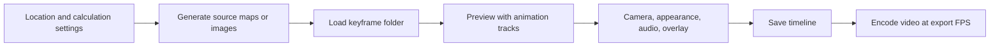
```mermaid
flowchart LR
    A[Location and calculation settings] --> B[Generate source maps or images]
    B --> C[Load keyframe folder]
    C --> D[Preview with animation tracks]
    D --> E[Camera, appearance, audio, overlay]
    E --> F[Save timeline]
    F --> G[Encode video at export FPS]
```

## Color motion and frozen colors

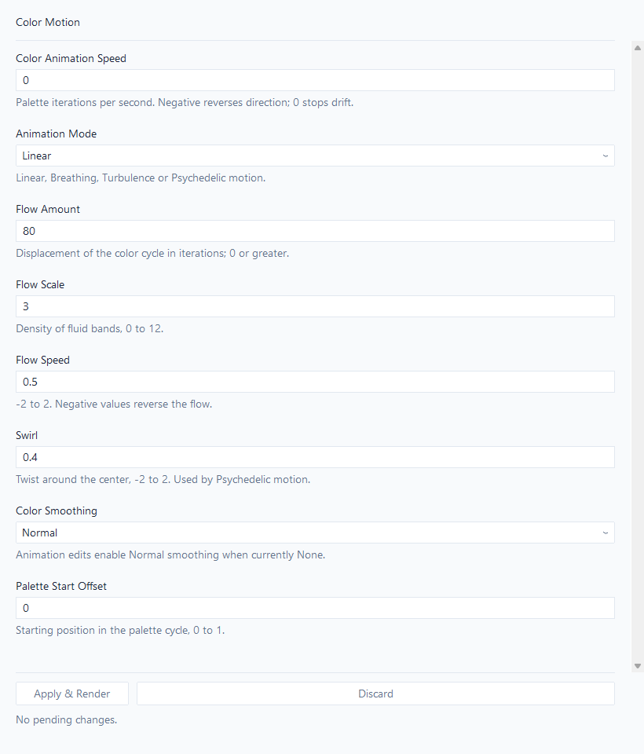

**Color Animation Speed** moves through the palette in iterations per second: zero stops drift, negative reverses it. **Animation Mode** selects Linear, Breathing, Turbulence, or Psychedelic motion. Linear uses the ordinary speed; **Flow Amount**, **Flow Scale**, and **Flow Speed** shape the other flow modes. **Swirl** is used by Psychedelic. Selecting a mode can establish suitable starting values for related fields, so a mode change can affect more than one value.

**Palette Start Offset** chooses the phase at time zero. **Color Smoothing** affects transitions, and animation edits can enable Normal smoothing if it was None. Preview play/pause affects viewing; it does not erase the saved speeds used for export. Resetting preview time is useful for comparing two appearance edits at the same phase.

In **Frozen Colors**, choose **Pick Color to Freeze** and click a color in the fractal to retain that iteration band while the rest of the palette moves. The **Frozen Colors** field shows each frozen band as a swatch, up to 16; click a swatch to remove that band. A swatch marked **?** means the picked screen color is not available in this session; the band itself is still frozen. **Freeze Match Tolerance** is a fraction of a color cycle: smaller values freeze a narrower band. **Clear Frozen Colors** removes all matches. Freezing a color is not freezing all geometry or stopping the entire video.

## Generate source keyframes

Use the **Keyframes** section of the Animation workspace (also reached through **Video → Data Settings**) to configure sources, then choose **Generate Keyframes** there, or **Video → Generate Video Keyframe**, after choosing a location and quality settings. **Zoom Step per Keyframe** is the scale ratio between adjacent saved views and must be greater than 1. More closely spaced views require more source frames over the same zoom span. **Compress Keyframes** writes lossless RFMZ maps; **Create Video After Keyframes** starts video output when generation completes.

**Render from PNG Images** selects already-colored image sources. PNG sources retain finishing operations such as Color, Fog, and Bloom, but cannot supply iteration-derived palette/stripe/slope data. The timeline catalog filters unsupported parameter types while retaining saved unsupported tracks rather than converting pixels back into iterations.

Keep the generated source folder intact. PNG keyframes also need their matching numbered **`.rfsm` metadata files**, which store zoom and dimensions and, for newer files, the maximum iteration count. A folder of arbitrary PNG images alone is not a complete RFF_Super keyframe sequence. Dynamic sources use numbered `.rfm` or `.rfmz` files. Map dimensions, including internal sampling and padding, must also fit the **100,000,000-pixel map-file limit**.

Source numbering must be contiguous from the first keyframe, and frames must have matching dimensions. A missing number can make later files unavailable; a mismatched or unreadable map/image pair prevents playback of that pair. Keep PNG and RFSM basenames together when moving a sequence.

For rotation or 360 camera motion, enable **Rotation / 360 Padding** before generation. **Camera Padding Scale** expands both source dimensions while retaining pixel density; 2× dimensions means about 4× source pixels, 3× means 9×. All-angle rotation can require additional coverage based on the frame diagonal. Existing maps do not gain coverage when the switch is changed later.

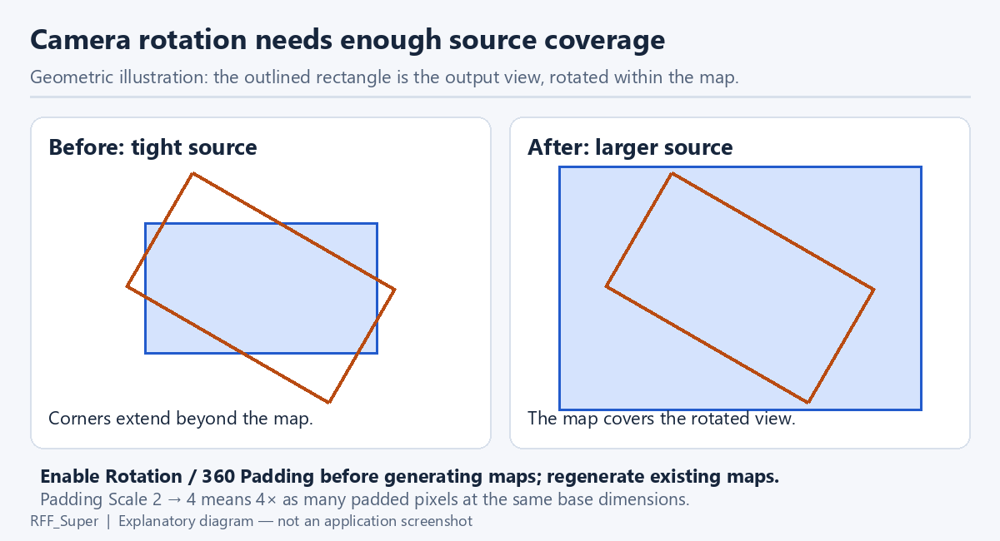

**Pause Preview During Generation** holds the main picture while maps are calculated. It reduces competing preview work and does not lower the requested map precision. Cancel the active generation through its progress controls and verify which files completed before reusing an interrupted folder.

## Open the timeline and load sources

Choose **Video → Timeline Editor** or **Open Timeline Editor** in Animation. Select the source keyframe folder: with no folder loaded, the preview reads **No keyframes loaded** and offers **Select keyframe folder...** in its middle. Before loading sources, **Estimated Keyframes** in the Animation workspace provides a planning length. This actual UI image shows the editor before loading keyframes:

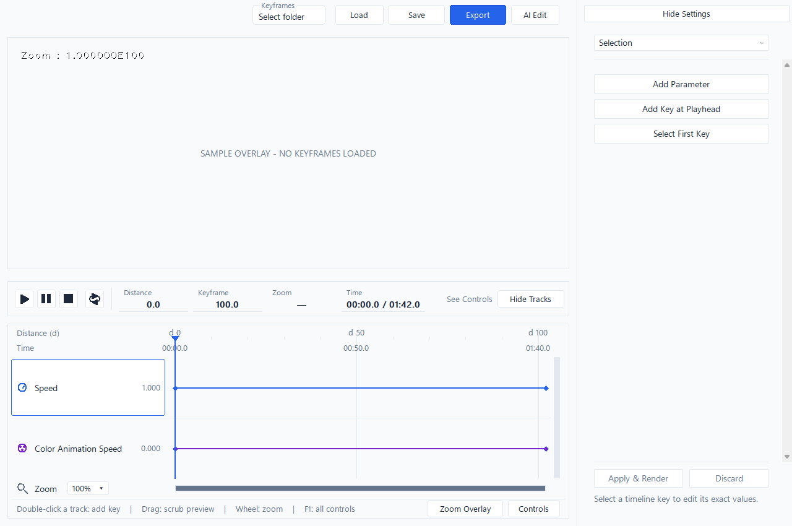

The top controls select the folder, load/save a timeline, and export. The optional AI Edit button requires [enabling its visibility](workspace-and-files.md#menu-visibility-and-optional-ai-entry-points). The middle transport has one **Play / Pause** button, which shows Pause while playback runs, plus **Stop** and **Loop**. Distance/keyframe/time readouts identify the playhead; they describe related positions rather than three independent animations. **Magnification** reads the zoom of the source keyframes at the playhead. The ruler marks the end of the video with its distance and total time. The lower area contains tracks and keys; **Timeline zoom** below the tracks chooses the visible timeline range. The right inspector provides exact fields for the selection and other timeline settings. The image is a September 24 capture, so it predates the empty-folder prompt, the single Play / Pause button and the Magnification and Timeline zoom names; newer overlay controls are described below.

When a source folder loads, the preview may preload reduced previews to RAM. If the preload is cancelled or insufficient memory is available, it can fall back to loading on demand. **Stop** can cancel preloading. A reduced-resolution interactive preview is not evidence that the final export uses the same preview sampling.

## Add and edit parameter tracks

1. In the inspector choose **Add Parameter**, then select a supported parameter from its group. The new track starts with one key at the start, holding the parameter's current value through the end, so adding it changes nothing yet.
2. Move the playhead to the desired depth and choose **Add Key at Playhead**, or double-click the track.
3. Select the key and edit **Keyframe Depth**, **Value** (or Color), and **Interpolation** in Selection.
4. Add a second key and preview the interval.
5. Save the timeline and the base RFC settings.

Animation keys remain at their depth when zoom speed changes. Drag a key to change its position/value, or use the inspector for precise input. Select a row to work with its parameter; select a key to work with that point. Delete removes the selected key, or the selected removable parameter when no key is selected. The Speed track is part of the schedule and has special behavior.

Tracks can be enabled/disabled without deleting their keys. Reordering track rows organizes the editor; it is separate from shader compositing order. The track context menu's **Parameters** submenu opens the corresponding **Add Parameter** catalog for shader parameters. **Audio**, **Zoom Overlay**, and **Max Iterations Display** instead open their settings directly. Add/select a track there, then edit its keys in **Selection**; changing an ordinary Shader settings panel does not automatically record animation keys. Configure non-animated base resources, including texture image paths, separately.

Matching R/G/B color-cycle tracks can appear as one linked row, with key edits mirrored across the channels. This link state is inferred from the tracks' enabled states, key depths, values, and interpolation modes; the current inspector has no dedicated unlink switch. Distinct channel curves are retained as separate tracks.

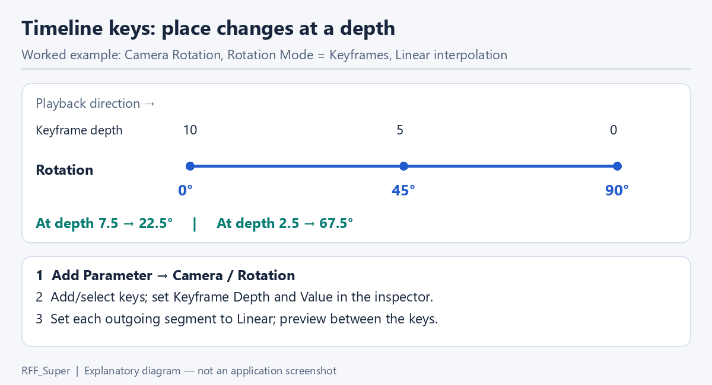

### Interpolation

| Mode | Between this key and the next | Use |
| --- | --- | --- |
| Step | Holds the earlier value until the next key. | On/off switches, enumerated choices, abrupt changes. |
| Linear | Changes at a constant rate in the track's depth coordinate. | Predictable ramps. |
| Smooth | Eases with `u²(3−2u)`. | Soft starts and stops. |
| Cubic | Uses neighboring values to shape the curve. | Continuous multi-key motion; inspect intermediate values. |

Boolean and enumerated parameters require **Step**. Choosing a smooth interpolation for a numeric track does not imply constant change per second when the zoom speed is itself changing.

Color tracks interpolate perceptual OKLab color components, with alpha handled separately. A Linear color transition is therefore not a straight interpolation of the displayed sRGB channel numbers.

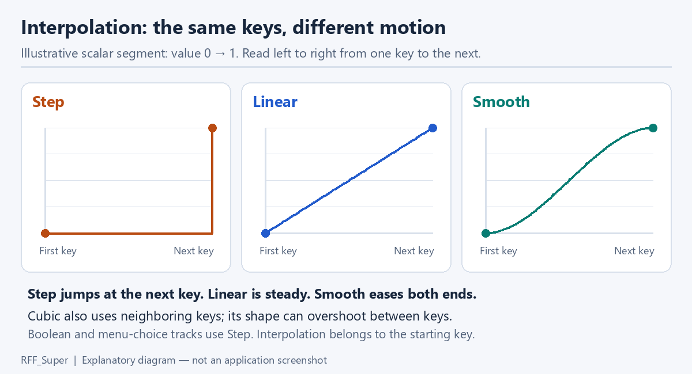

### Speed and holds

**Zoom Speed** is keyframes per second. The Speed track varies that progression; saved holds pause zoom at a depth for a duration. For ten keyframe units, constant speed 1 takes ten seconds; speed 2 takes five. A two-second hold adds two seconds. The actual schedule includes configured endpoints and final zoom behavior.

Move the playhead to the desired position, open **Zoom Holds** in Timeline Settings, and choose **Add Zoom Hold at Playhead**. A new hold starts at two seconds; adding at an existing hold selects it. Choose a **Zoom Hold**, edit **Hold Keyframe** and **Hold Duration (s)**, then **Apply**. Duration 0 disables the hold. **Remove Selected Hold** deletes it, and Undo restores changes. Multiple holds are supported; their positions remain tied to keyframe depths when speed changes. Holds outside the loaded source range remain saved but do not play. Color animation, constant-period rotation, and audio continue during a zoom hold. Settings, binary timelines and JSON retain holds. JSON also accepts `{"depth": 5, "seconds": 2}` in `timeline.holds`. Do not try to create a hold by entering zero into a positive-only Zoom Speed field.

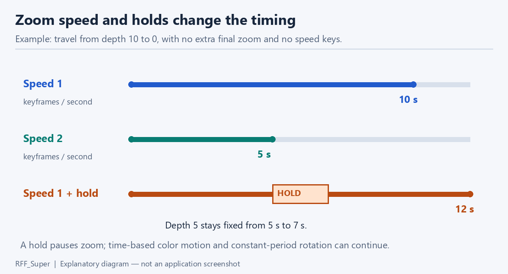

**Extra Final Zoom-in** adds final zoom beyond the ordinary range, from 0 to 8. It cannot add missing calculated source detail. Preview the final interval closely when changing it.

## Camera and constant rotation

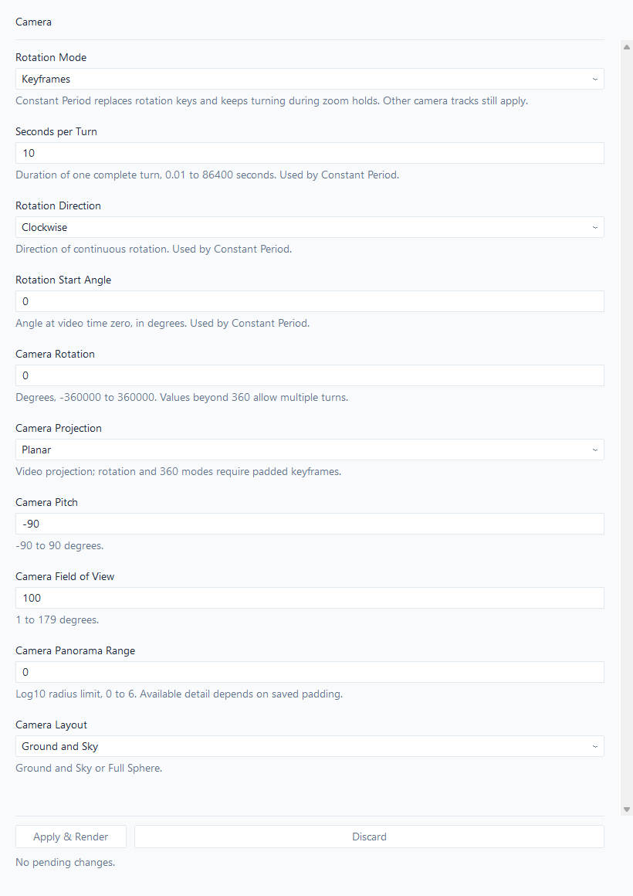

**Camera Rotation** is in degrees; values beyond 360 allow multiple turns. In **Constant Period** rotation mode, **Seconds per Turn**, **Rotation Direction**, and **Rotation Start Angle** determine rotation over time. This replaces rotation keys while allowing other camera tracks to operate. Rotation continues during zoom holds. In keyed mode, rotation follows the parameter keys.

**Camera Projection** selects Planar, 360 Camera, or 360 Equirectangular. **Pitch** and **Field of View** control the perspective 360 camera. **Camera Panorama Range** is a log10 radius limit capped by saved coverage. **Camera Layout** selects Ground and Sky or Full Sphere. A 2:1 output is appropriate for equirectangular mapping. Regenerate sufficiently padded sources if the new transform exposes uncovered edges.

**Match Planar Framing** (Video Camera section of Animation, the legacy Video Camera window, or the right-click menu of a camera track) sets up a 360 camera that shows the same framing as the planar view at the playhead. It writes keys at the playhead for Camera Projection (360 Camera), Pitch (−90°, facing down), Field of View (calculated from the loaded keyframes' aspect ratio), Camera Layout (Ground and Sky) and a Panorama Range wide enough for the frame, enabling those tracks; rotation is retained. The Timeline Editor must have keyframes loaded that were generated with **Rotation / 360 Padding**, and the aspect ratio must need a field of view between 1° and 179°. Undo restores all of these settings together.

## Audio

Open **Audio** in the timeline settings, or right-click the track area and choose **Parameters → Audio**. **Export Audio** enables sound in the completed video, and **Master Volume** scales the mix (0 silent, 1 original level, up to 4). Choose **Add Audio File** and select a source. RFF_Super reads its duration using `ffprobe.exe`, which must be beside `RFF_Super.exe` or on PATH. A new clip initially uses the whole source and is placed after the existing clips. Audio clips use a source file, source in/out points, a placement time in the video, volume, and fades. A clip's duration is `source out − source in`; placement time is not another source trim value.

The **Audio** row starts below the parameter tracks and scrolls vertically with them. Drag its name or press Alt+Up/Down to reorder it; Undo/Redo restores the row order. The Audio row position is an editor-session layout setting, not part of the saved timeline. Select the row to open its settings. This row shows clips as named blocks aligned with the timeline ruler. Add several files by choosing **Add Audio File** again for each file. Drag the middle of a block to move it without changing its source selection. Drag the left edge to change the start in the video and source In together; drag the right edge to change source Out. Clips cannot overlap. Shortening a clip also shortens fades if necessary. Escape or loss of mouse capture cancels the drag; Undo restores a completed edit. Clicking a block opens its Audio settings. An empty Audio row opens the file chooser. Only intervals within the current video view are shown; use Start in Video to bring an out-of-view clip into range. The ruler follows zoom distance, so held-depth intervals may occupy a very narrow block; use exact seconds for those intervals.

Use **Audio Clip** to select a clip, then edit **Start in Video (s)**, **Source In (s)**, **Source Out (s)**, **Fade In (s)**, **Fade Out (s)**, **Clip Volume**, and **Mute Clip**. Choose **Apply** to commit edits and clip selection. **Audio File** can replace the source; a new source defaults to its full length and clears fades unless those fields are also edited. Adjust placement if it would overlap another clip. **Remove Audio Clip** removes the selected clip; Undo restores it. Times in these fields are seconds, and the status text shows source and trimmed lengths. Timeline playback previews enabled audio clips with their trim, placement, volume and fades through the Windows default output device. Pause and Stop silence the audio, and seeking or looping restarts it at the new video time. FFmpeg must be available. Add Audio File applies valid pending edits before opening the next file chooser; invalid values remain visible for correction.

For example, trim a track to 12–20 seconds and place it at video time 3 seconds: eight seconds of audio plays from video seconds 3–11. Fades must fit the clip and clips must not overlap. After editing zoom speed or holds, recheck music alignment because video timing changes while the audio uses seconds.

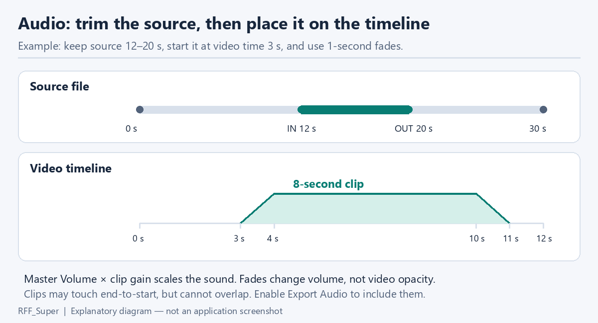

Keep the referenced music files with the project. Timeline saving can write relative paths; moving the timeline without its music can break those references. Turning **Export Audio** off preserves the editing context while omitting music from the output. Enabled, unmuted clips are encoded with their trims, placement, volume and fades. Gaps remain silent and audio ends with the video. Standard SDR and HDR output use 48 kHz stereo AAC; lossless SDR uses 48 kHz stereo FLAC. A missing active audio source stops export and is identified in the encoder log.

JSON audio times are **integer microseconds**, with 1,000,000 units per second. For the 12–20 second example, an entry in `timeline.audio.clips` could be the following. Replace the path and source duration with a real file and its actual duration, and use an unused clip ID. This is a clip fragment, not a complete importable timeline:

```json
{
  "id": 1,
  "path": "music.wav",
  "sourceDuration": 30000000,
  "start": 3000000,
  "in": 12000000,
  "out": 20000000,
  "fadeIn": 1000000,
  "fadeOut": 1000000,
  "gain": 1,
  "muted": false
}
```

IDs must be unique; source trim must fit the source; gains are 0–4; fade durations are nonnegative and their sum cannot exceed the trimmed duration. Times must fit within seven days. Changing zoom speed does not automatically reposition audio clips. JSON import validates the complete document before replacing the timeline.

## Zoom overlay and preview guides

Open **Zoom Overlay** or **Max Iterations Display** using the footer buttons, or right-click the track area and choose **Parameters → Zoom Overlay** or **Parameters → Max Iterations Display**. These entries open the corresponding settings without adding tracks.

Enable **Show Zoom Ratio** to render a zoom readout. The Zoom Overlay settings control decimal places, custom appearance, font, size/style, text and outline colors/opacities, outline width, shadow offset/color/opacity, anchor, and position. Exact available fields are listed in [Zoom Overlay](settings-reference.md#zoom-overlay).

**Choose Font** selects a font; font files are not embedded in a saved timeline. **Reset Position** returns to standard placement. **Fit Inside Frame** moves the enabled readout within the frame; reduce font size if the readout itself is too large. **Reset Appearance** resets its styling. **Edit Overlay Position** enables dragging in the preview; arrow keys nudge it, Shift moves ten pixels, and Escape cancels a drag.

Set **Display Start (s)** and **Display End (s)** independently for each overlay, then enable its Show switch and apply. Start 0 means the video start; End 0 means the video end. Either value can remain 0. The start is inclusive and the end is exclusive. Times include zoom holds. Preview and video export use these settings; settings files and timeline files retain them. Dedicated overlay tracks are no longer offered; previously saved overlay tracks are retained but ignored.

Open **Max Iterations Display** to enable **Show Max Iterations**. This second overlay has independent placement, font, colors, outline and shadow, and appears in both preview and export. It reports the source-map iteration limit, not the iteration value of a pixel. With **Interpolate per Frame** off, the transition readout uses the larger limit of the two source maps; on interpolates the displayed count between them. This changes the text only, not the fractal calculation or rendering limit. PNG sources read the optional count from their `.rfsm` metadata; older metadata without a count displays **N/A**. Both overlays are saved with the timeline. See [the field reference](settings-reference.md#max-iterations-display).

**YouTube Shorts Guide** draws approximate safe-area margins for preview only. **Show Guide Descriptions** toggles explanatory labels. Top/Bottom/Left/Right margins are independently editable from 0–40%. The guide is never exported and does not guarantee placement on every device layout.

## Editor layout and keyboard controls

**Hide Tracks** expands the preview without discarding animation. **Hide Settings** closes the inspector. Drag dividers or choose **70% Preview**, **50% / 50%**, or **70% Tracks**. Move the inspector left/right or reset its width. These choices change the editor arrangement, not the output.

| Key | Action, when the timeline itself has focus |
| --- | --- |
| Space | Play/pause; a focused track/key can handle the key contextually. |
| Home / End | Move the playhead to the schedule endpoints. |
| Enter / F2 | Open exact editing for the selected key. |
| Delete / Backspace | Delete the selected key, or remove the selected removable parameter. |
| Ctrl+Z / Ctrl+Y | Undo/redo timeline edits. |
| F11 / Escape | Enter fullscreen / leave fullscreen. |
| `+` / `−`, `0` | Zoom the track view in/out, or reset the view. |
| F1 | Open the complete context-sensitive controls guide. The former Controls button is now Max Iterations Display. |
| Wheel / Shift+Wheel / Ctrl+Wheel | Zoom the axis / pan the axis / scroll tracks. |
| Insert | Add a key on the selected track. |
| Alt+Up/Down | Reorder the selected track. |
| Shift+Up/Down | Extend the track selection. |
| Right-click / Shift+F10 | Open the track context menu. |

Click Distance, Keyframe, or Time to enter an exact value or supported formula; Enter applies it and Escape cancels. Magnification is read-only. With a track/key focused, Up/Down selects tracks and Left/Right selects keys.

## Save and load timelines

**Save** supports binary `.rfvt` and editable `.json`. **Load** accepts both. Timeline JSON has a 16 MiB limit and is validated before application. An imported JSON document must keep `estimateKeyframes` equal to the currently loaded source folder's frame count. Binary timeline loading can retarget saved depth positions to the loaded folder's count; do not assume JSON import uses the same rule.

Keep base shader settings, keyframe maps/images, texture assets, music, and required fonts with the timeline. The timeline is an animation description, not a complete packaged movie project.

## Timeline AI Edit

**AI Edit** provides file exchange with an AI tool of your choice. It does not call the Local AI appearance endpoint automatically.

The button is hidden by default. Enable `"Timeline Editor": { "AI Edit": true }` in [menu-visibility.json](workspace-and-files.md#menu-visibility-and-optional-ai-entry-points), then restart RFF_Super.

1. Load keyframes and wait for the preview renderer to become available.
2. Choose a **2 × 2** or **3 × 3** image grid.
3. Choose **Save prompt + JSON and all images to folder…** and select a destination parent.
4. Use the generated prompt and image pages in your chosen editing workflow.
5. Save the returned complete valid timeline JSON and load it with **Load**. Keep the frame count unchanged and inspect playback before exporting.

The generated timestamped folder contains `prompt.txt` with the instructions and current editable timeline, `page_000001.png` onward in playback order, `backup/timeline.json`, and `backup/images.json`. The manifest records each page's keyframe range and whether generation completed, failed, or was cancelled. **Cancel image generation** stops the job; already-saved files remain and should not be mistaken for a complete bundle.

At the same frame count, a 3 × 3 grid holds nine source pictures per page versus four for 2 × 2, reducing page count. Each picture keeps a 512 × 320 pixel area plus a 32-pixel label strip: the complete sheet is 1024 × 704 for 2 × 2 or 1536 × 1056 for 3 × 3. A viewer fitting both sheets to the same display width can make the larger sheet's pictures appear smaller, but their saved tile dimensions do not change. This is a presentation choice, not a rendering-quality setting for the final video.

## Still-image export

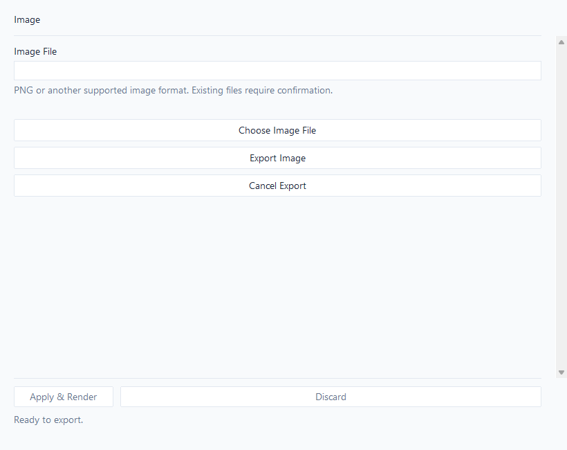

Choose **Image File**, set **Resolution & Quality**, apply the settings, and choose **Export Image**. The job can wait for rendering to finish. Existing destinations require confirmation. **Cancel Export** requests cancellation; inspect the reported completion/failure state.

**Canvas Width/Height** range from 64–16384; **Clarity** scales ordinary image output, while **Supersampling** adds internal samples before reduction. Combined canvas, clarity, supersampling, and source padding must fit GPU limits. Decrease one of the marked values if validation rejects the combination. Video dimensions come from source keyframes, so changing the current canvas is not a way to resize existing video maps.

## Video encoding, HDR, and export load

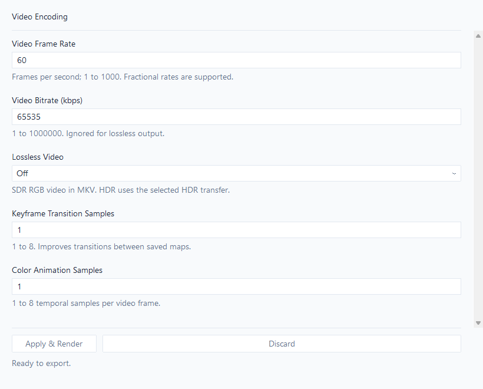

Choose a **Keyframe Folder**, a **Video File**, and **Export Video**. **Video Frame Rate** (legacy window: Frame Rate (FPS)) accepts fractional values from 1–1000. Higher FPS increases output frames at the same duration, but does not add source keyframes. **Video Bitrate** is 1–1,000,000 kbps; increasing it can reduce compression artifacts while increasing target size. **Lossless Video** uses RGB lossless SDR output in MKV and ignores bitrate. Verify playback compatibility when choosing it as a master format.

**Keyframe Transition Samples** (legacy name: Keyframe-boundary anti-aliasing) adds spatial samples near transitions. **Color Animation Samples** (legacy name: Color-animation anti-aliasing) addresses temporal changes. At a transition, spatial factor K requests K² samples; the combined count is the least common multiple of K² and the temporal count. Away from a transition, the temporal count controls sampling. Both are disabled for static PNG sources. There is no separate Stripe Antialiasing field in the current export form. See [export controls](settings-reference.md#export-and-timeline-controls) for dependencies.

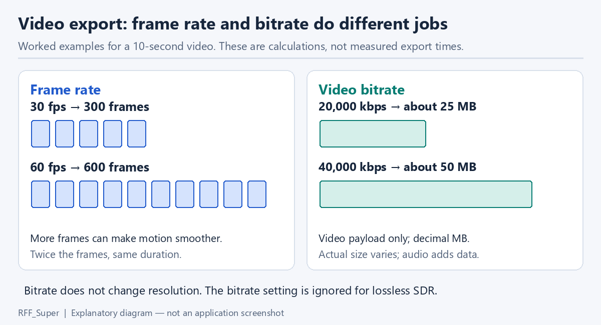

**HDR Rendering** enables the floating-point light pipeline. **Video Transfer** selects SDR, HDR10/PQ, or HLG. PQ/HLG require HDR Rendering and use the HDR encoding path; they do not use the SDR lossless RGB mode. **HDR Peak Brightness (nits)** is used by PQ; the arrow keys change it by 100 nits, or 1000 with Shift. The tone-mapped SDR preview and ordinary guide PNGs cannot demonstrate absolute HDR display brightness. See [HDR and tone mapping](settings-reference.md#hdr-and-tone-mapping) for exposure, headroom, display curves, MFR modes, and their ignored-field cases.

**Show Video Export Preview** turns the export picture on/off while retaining progress/cancellation. **Pause Preview During Export** reserves more GPU time for the export by suspending the main live preview. Neither changes the intended video FPS. If a live preview looks flat during HDR export, assess the encoded file through the appropriate HDR playback path rather than treating that preview as an SDR comparison.

**Open Encoder Log** in the Export workspace opens the latest export log. Logs remain beside the chosen output, using the temporary video filename plus `.ffmpeg.log`, and contain the encoder version, command, audio processing settings, diagnostics and exit code. Timeline export failure dialogs offer to open the same log.

Source basis: [AnimationModel](../src/rff2/ui/workspace/AnimationModel.hpp), [TimelineWindow](../src/rff2/ui/TimelineWindow.cpp), [TimelineInspector](../src/rff2/ui/TimelineInspector.cpp), [Timeline AI exchange](../src/rff2/ui/TimelineAiExchange.cpp), and [ExportWorkspace](../src/rff2/ui/workspace/ExportWorkspace.hpp). Audio export validation uses the production encoder pipe with synthetic video frames and a known WAV source; see [the validation record](validation.md#audio-export-validation-2026-09-25). This does not exercise interactive GPU rendering.


## Multi-day timelines

Time readouts use `MM:SS.s`, `HH:MM:SS.s`, or `Dd HH:MM:SS.s`, depending on duration. Exact Time edits remain seconds and accept six decimal places. Playback measures elapsed time from an anchored clock rather than repeatedly adding rounded frame intervals. Schedule times, export frame timestamps and CPU animation timing use double precision; saved keyframe depths and existing hold fields retain their original file representation. GPU uniform formats are unchanged.

Audio placement remains limited to seven days. Preview seeks remove preceding timeline silence before decoding the selected interval. Tests at 48 hours and six days verify millisecond clock progress, frame timestamps at 1000 FPS, and audio onset after a seek. These do not constitute a multi-day render endurance test or acoustic/GPU synchronization measurement. Export resume remains unavailable.
