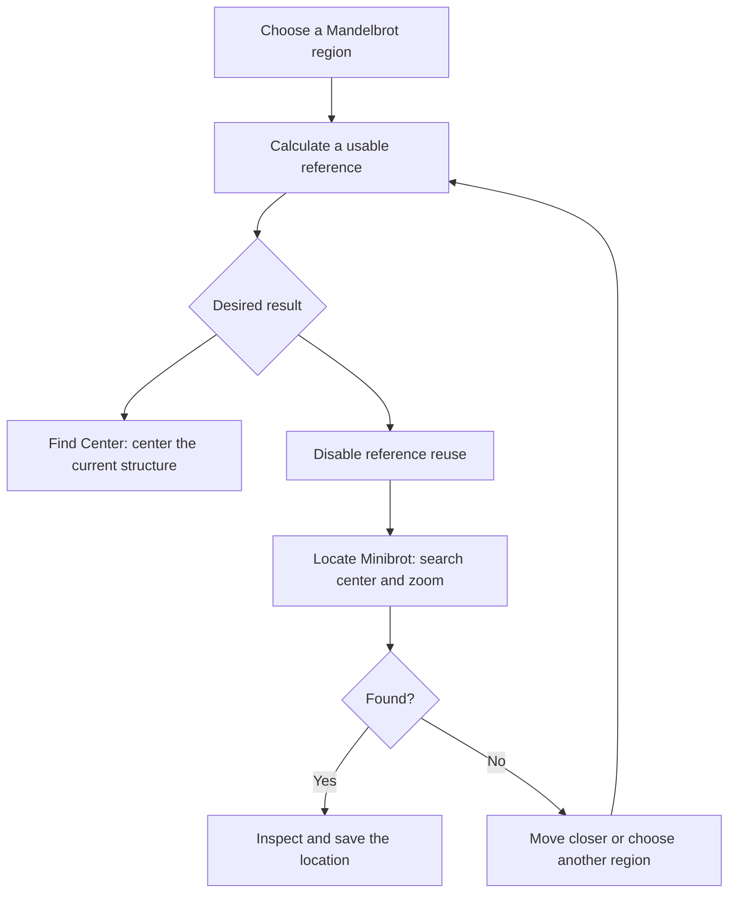

<!-- Created by GPT-6 on 2026-09-24. -->
<!-- Modified by GPT-6 on 2026-09-25. -->
# Exploration and calculation

[Manual](user-manual.md) · [Exact calculation fields](settings-reference.md#explore)

## Navigate and choose a formula

Drag the planar fractal to move its center and use the wheel to zoom around the pointer. **Smooth Zooming** supplies transitional navigation while new calculations catch up. Escape settles/cancels pending smooth navigation. Exact **Real**, **Imaginary**, **Log Zoom**, and **Rotation** fields are useful for copying locations reproducibly; preserve every coordinate digit at deep zoom.

**Shift+drag** draws a box to zoom into the selected region; release after a sufficiently large drag to apply it. In panorama views, dragging changes orientation rather than ordinary planar translation; vertical camera movement applies to the perspective 360 mode. After calculation, hovering can show the sampled iteration value in the status area. If color-freeze picking is active, the next click selects a frozen iteration band instead of starting a pan.

The Mandelbrot calculation uses high-precision reference orbits and perturbation. The application chooses the light/deep calculation path as needed. **Formula Type** can instead select a custom expression. Custom formulas use manual iteration limits and do not inherit every Mandelbrot-only feature. Changing formula normally resets the view; save the old location first if you want to return to it.

Start with a simple supported expression such as `z^3+c`. Recompute, then adjust the manual iteration cap. An invalid expression is an input error, not an empty-fractal preset. Do not infer that the custom path supports the same extreme zoom range, automatic period workflow, or minibrot location tools as Mandelbrot.

## Iterations and reference

**Automatic Iterations** derives the Mandelbrot limit from the detected period and **Auto Iteration Multiplier**. Fast-period-guessing itself is automatic and has no user-editable speed/accuracy knob. For period 16, multipliers 150 and 300 give caps of 2400 and 4800. Raising the cap permits more work for unresolved pixels; already-escaped pixels do not automatically take twice as long.

Turn Automatic Iterations off to set **Max Iteration** manually. If increasing the cap reveals detail in a formerly solid region, the earlier cap was insufficient there. **Bailout** is the escape radius and influences the smooth escape value. **Decimalize Iteration** controls fractional iteration reporting for coloring. In the quadratic escape-potential implementation, exposed non-None modes can produce identical results under ordinary bailout conditions; they are not guaranteed visibly different filters.

**Absolute Iteration Mode** changes reported iteration values and bypasses Boundary Trace Fill. Keep it fixed when comparing a palette recipe. **Reuse Reference** can reuse Current or Centered reference data to avoid setup, but it has no benefit before a suitable reference exists. Disable reuse for independent timing/accuracy comparisons and when loading an unrelated location.

## MPA and three different kinds of compression

MPA skips variable-length iteration spans derived from the reference orbit's periodic structure. **It is not BLA.** Its Precision Level is an approximation tolerance, not a decimal-digit guarantee.

| Control family | What changes | How to evaluate it |
| --- | --- | --- |
| Precision Level | More negative values make the validity test stricter. −5 to −7 means epsilon is 100 times smaller. | Compare complete recalculations, especially thin boundaries. Time setup and pixels separately. |
| Min Skip Reference | Removes shorter candidate skips. | A value above all useful periods can eliminate the table and increase ordinary perturbation work. |
| Max Multiplier Between Levels | Changes intermediate level spacing. | Compare table memory and traversal time at the same tolerance. |
| Selection Method | Changes which end of the available levels is tried first. | Highest/Lowest is a search strategy, not a precision level. |
| MPA Compression Method | Changes approximation-table storage and table-building work. | Smaller allocation can trade against lookup cost. |
| Reference Compression Criteria / Threshold / Normalization | Changes how repeated reference-orbit data is stored. | Criteria 0 explicitly disables it; stricter matching can retain more entries. |
| RFMZ disk compression | Compresses a saved map losslessly. | Compare saved file size and I/O time; it does not change the orbit tolerance. |

Performance and accuracy depend on the location and settings. Check difficult detail after a full recalculation. The guide images use Precision Level −7.

## Projection

**Planar** is the ordinary complex-plane view. **360° Equirectangular** generates a panorama layout suitable for spherical presentation. **360° Camera** produces a perspective camera view of that mapping. **Layout** chooses Ground and Sky or Full Sphere; **Pitch** aims the camera vertically, **Field of View** changes the visible angle, and **Panorama Range** changes the mapped extent. Rotation also supplies panorama yaw.

These are calculation projections. The similarly named camera controls in Animation transform saved video source maps. If you change the calculation projection, recompute; if you change the video camera, verify that saved padded source maps cover the new view.

## Calculation and preview performance

**Calculation Threads** affects the next CPU calculation, from one worker up to the computer's logical core count. Increasing it can shorten independent pixel work, but setup, memory traffic, and GPU work can limit the benefit. **Rendering FPS** caps live redraws; it does not change exported video FPS or the CPU iteration limit.

**Coarse Preview** shows an early coarse result during computation. **Two-Color Preview** uses a simplified calculation preview. **Boundary Trace Fill** changes how regions are filled during calculation; compare critical fine detail after toggling it. These controls trigger recalculation. **Linear Interpolation** smooths resampling; **Dither** reduces visible quantization banding with small output variations. Neither creates missing fractal detail.

Canvas dimensions, **Clarity**, and **Supersampling** multiply sample counts. At 1280 × 720, Clarity 1 and SSAA 2 produce about four times as many internal samples as SSAA 1, while ordinary output remains 1280 × 720. Clarity 2 also doubles both output dimensions. These ratios describe sample work and buffer size, not measured elapsed time. See [the memory table](SETTINGS_GUIDE.md#resolution-performance-and-image-quality).

## Recompute, cancel, reset, and automatic location tools

| Action | Result and prerequisites |
| --- | --- |
| **Recompute** | Recalculates the current view. Also releases a recovery hold when you are ready to generate. |
| **Cancel** | Requests cancellation. Wait for the job to stop before starting another operation. |
| **Reset** | Requests default settings, shader refresh, resizing, and recalculation. This is broader than resetting only the camera. |
| **Find Center** | Uses the current Mandelbrot reference/period information to find a center. Requires a usable calculation/reference; changes center without performing the full minibrot zoom-location workflow. |
| **Locate Minibrot** | Searches for a Mandelbrot minibrot center and suitable zoom. Requires Reuse Reference Disabled. If no suitable minibrot is found, move closer to an appropriate structure and try again. |

Cancellation is distinct from “no center found.” Avoid repeatedly treating an interrupted job as evidence that the mathematical search failed.

Source basis: [ExploreModel](../src/rff2/ui/workspace/ExploreModel.hpp), [exploration commands](../src/rff2/ui/CallbackExplore.cpp), [RenderScene](../src/rff2/ui/RenderScene.cpp), and [preview forms](../src/rff2/ui/workspace/AppearanceForms.cpp).
