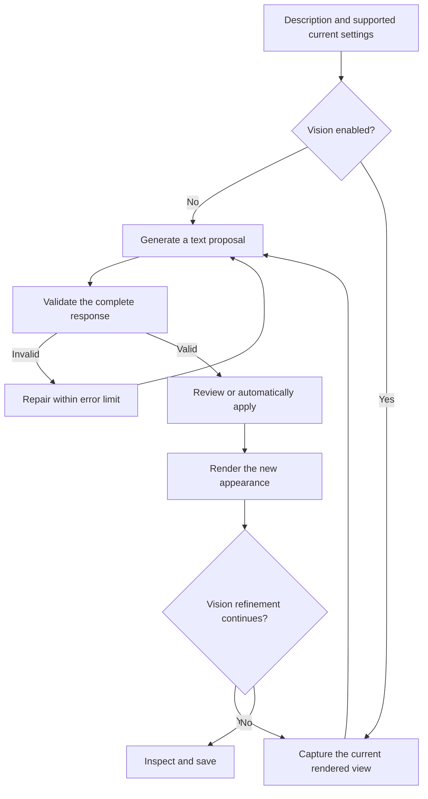

<!-- Created by GPT-6 on 2026-09-24. -->
# Local AI: appearance and exploration

[Manual](user-manual.md) · [Timeline AI exchange](animation-and-export.md#timeline-ai-edit)

Open **Shader → Local AI appearance**. The window contains **Appearance settings** and **AI zoom exploration** tabs. The first proposes shader settings; the second moves the fractal view toward visual features. They have different prerequisites and stopping behavior.

The images below use the actual production controls with connection requests disabled for documentation. No generated result, model performance, or successful exploration is implied.

## Set up a connection

RFF_Super connects to a separately running server with an OpenAI-compatible chat API. The value `"provider": "openai"` identifies the API format; it does not mean that the server must be hosted by OpenAI. Model selection, context size, GPU offload, and inference parameters are configured in files/server options, not in the RFF_Super settings UI.

An illustrative `local-ai.json` is:

```json
{
  "provider": "openai",
  "endpoint": "http://127.0.0.1:18080/v1/chat/completions",
  "model": "your-server-model-alias",
  "timeout_seconds": 300,
  "max_errors": 3,
  "max_refinements": 3,
  "vision": false,
  "request": {}
}
```

Replace the endpoint and model alias with those of your running server. This is a configuration example, not a ready-to-run model installation. Text-only appearance generation can use `vision: false`. Visual refinement and AI zoom need `vision: true` **and** a server/model that actually accepts images. A boolean flag cannot add vision capability to a text-only model.

For ordinary relative configuration filenames, the current code checks an existing file in the working directory, then beside the executable, then its parent folder. An explicitly supplied absolute path is used directly. Put the intended files in a consistent location to avoid an older working-directory copy taking precedence.

| File or option | Purpose |
| --- | --- |
| `local-ai.json` | API endpoint, model alias, request options, timeout, error/refinement limits, and vision switch. |
| `local-ai-server.json` | Executable/model paths, port, and server arguments for the bundled launcher workflow. |
| `local-ai-system-prompt.md` | UTF-8 instructions and the supported settings catalog placeholder, read again for each new appearance request. |
| `timeout_seconds` | Integer 1–900; longer permits a slow request to finish but does not accelerate inference. Default 300. |
| `max_errors` | Integer 1–100; limits repair/error handling. Default 3. The appearance UI can save a revised limit. |
| `max_refinements` | Integer 1–10; limits successive appearance changes. Default 3. |
| `request` | Object containing generation options supported by the configured server. The application supplies its model/messages and structured-response requirements. |

Keep **`{{SETTINGS_CATALOG}}` exactly once** in the system prompt. The program replaces it with currently supported appearance keys, ranges, types, and values. Missing/duplicate markers or an unreadable/invalid prompt stop generation. Do not replace the marker with an old copied catalog.

### Managed launcher

Copy [the server configuration example](../example/local-ai-server.example.json) to `local-ai-server.json` at the project root and replace its executable/model paths. Local connection and server configuration files are excluded from Git; supply them separately on each machine.

After supplying compatible server/model files and the configuration, run [tools/start-rff-local-ai.ps1](../tools/start-rff-local-ai.ps1) from the project. The script validates the paths and port, starts its dedicated server, waits for readiness, and launches RFF_Super. Its connection must use `127.0.0.1` and match the configured server port. It refuses an occupied port and reports startup failures in `debug/local_ai/managed-server-error.log`. The launcher stops the server it started when its application process exits.

Running the application directly still requires a running compatible API. **Connection information** displays available model/context/speed information; an unavailable measurement is not zero tokens per second. Model loading, prompt processing, and output generation are separate phases, so the first response can take longer than later tokens.

## Generate and review an appearance


1. Calculate the view you want to style. Save its current RFC if you want a durable checkpoint.
2. In **Desired appearance**, describe the result, for example: “Keep the spiral readable, use cool blue shadows and restrained warm highlights, and reduce bloom.”
3. Set **Error limit** and **Max changes**. Leave **Automatically apply and refine** off for a manual first review.
4. Choose **Generate settings**. Read **Result / generation log** while it streams.
5. Wait until the full proposal validates. Then choose **Apply settings**, or **Apply and refine** when vision is enabled.
6. Inspect the rendered result and use **File → Save Settings** or **Save Location / Settings** to keep it.

Partial streamed text is not an applied configuration. The apply action becomes available after the complete response passes validation. Unsupported keys, invalid values, malformed JSON, or a failed request can trigger repair/retry within the error limit. Reasoning text, when supplied by the server, appears separately under **[Reasoning]**; only the response is considered for settings.

Appearance generation changes the supported shader settings. It does not change location, fractal calculation precision, or image dimensions. A proposal can still have a small visible effect when a master effect is off, opacity is zero, the view contains little of the affected structure, or the suggested settings are close to the current ones. Use a fixed-time [comparison](workspace-and-files.md#compare-appearances-fairly) to assess it.

## Visual refinement, cancellation, and undo



**Automatically apply and refine** allows the validated proposal to be applied without waiting for the manual apply step and continues the visual evaluation loop. It requires vision. **Max changes 1 → 3** allows more successive changes; it can consume more inference/rendering time, but it does not guarantee a better result. The application tracks evaluated appearances and can retain the best evaluated result when finishing or cancelling, provided the view has not changed.

**Cancel** requests a stop. A pending server request or minibrot search may take time to acknowledge cancellation. **New chat** cancels an active job first and then clears the AI conversation state; it is not a new fractal document. **Undo AI changes** restores the appearance from before the AI application when the current appearance still matches the AI-applied result. If you made newer appearance edits, undo is skipped rather than overwriting them.

Changing the view or relevant settings during a run can invalidate its evidence. The application checks revisions and stops or requests a fresh rendered image as appropriate. Wait for a current image before assessing the next proposal.

## AI zoom exploration


This workflow requires a vision-capable connection and **Planar projection**. Describe **Features to explore**, such as a spiral junction or a small minibrot, then set the following controls.

| Control | Result of changing it |
| --- | --- |
| Zoom per AI step | Factor strictly greater than 1 and at most 100. Larger factors move deeper per accepted step and can jump past useful structure. A factor of 2 is not a log-zoom increment of 2. |
| Exploration steps | Integer 1–1000; number of successful exploration rounds requested. More rounds can take more model and render time. |
| Error limit | Bounds unsuccessful/recovery attempts. Raising it allows more recovery work, not more mathematical precision. |
| Locate Minibrot after exploration | Runs the separate mathematical location search after exploration. This needs Mandelbrot and reference reuse disabled. |
| On failure, lower log zoom and retry Locate Minibrot | Retries the final locator from a wider view. This retry changes log zoom rather than requesting a new AI target. |
| Retry log zoom decrease | Amount subtracted per locator retry. For example, 0.5 widens the scale by approximately 3.16 at fixed dimensions. |
| After success, repeat exploration until cancelled | Starts another exploration cycle after a successful final search. Use Cancel when the desired result is reached. |

Choose **Start AI zoom** after the current calculation is ready. The model selects a target from rendered evidence; the application renders the candidate and checks it. If structure validation fails, it restores the prior view, excludes failed candidates where applicable, and can reduce the attempted factor. This is a bounded search rather than a guarantee to find every feature named in the prompt.

**Cancel** retains the current location when stopping exploration. The appearance-only Undo button is not a general camera-history restoration tool; save locations you want to keep before and after exploration.

## Common problems

| Symptom | Check and remedy |
| --- | --- |
| Connection settings not found | Check filename and search locations; an empty file is not a valid configuration. |
| Connection refused / timeout | Confirm the configured server is running at the endpoint and the model alias matches. Check launcher logs. Increase timeout only if a healthy request needs longer. |
| Vision/refinement rejected | Confirm both `vision: true` and actual image support; check any required server projection/model files. |
| No streamed text yet | The server may still be loading/processing the prompt. Consult connection/log status before repeatedly restarting. |
| Apply remains unavailable | Wait for the complete response; inspect validation errors and error-limit exhaustion. |
| No apparent visual change | Check effect dependencies and compare at a fixed time. The valid response may also intentionally propose no further change. |
| Undo is skipped | A newer manual edit changed the appearance after the AI result. Use ordinary history or a saved RFC checkpoint as appropriate. |
| AI zoom cannot start | Check Planar projection, vision, a completed render, factor/step limits, and the separate locator prerequisites. |

These workflows are checked against [LocalAiWindow.cpp](../src/rff2/ui/LocalAiWindow.cpp) and [LocalAiSettings.cpp](../src/rff2/io/LocalAiSettings.cpp). The guide does not benchmark a model or report unperformed AI runs.
