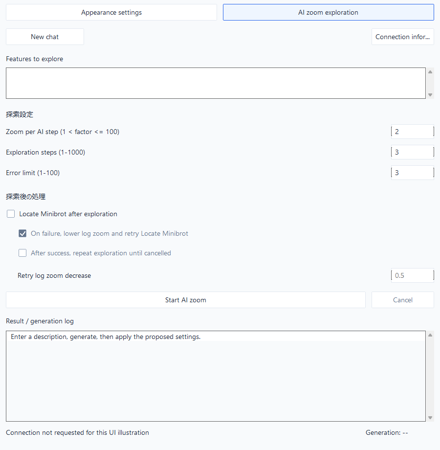

<!-- Created by GPT-6 on 2026-09-24. -->
<!-- Modified by GPT-6 on 2026-09-26, 2026-09-27, 2026-09-30. -->
<!-- Modified by Opus 5.5 on 2026-10-04. -->
# Local AI: appearance and exploration

[Manual](user-manual.md) · [Timeline AI exchange](animation-and-export.md#timeline-ai-edit)

First enable `"Shader": { "Local AI appearance": true }` in [menu-visibility.json](workspace-and-files.md#menu-visibility-and-optional-ai-entry-points) and restart; this menu entry is hidden by default. Open **Shader → Local AI appearance**. The window contains **Appearance settings**, **AI zoom exploration**, and **Automatic video** tabs. AI can propose appearance settings, choose exploration targets and generate automatic-video concepts. Appearance adjustment and RandomSmooth palette generation are separate choices.

The images below use the actual production controls with connection requests disabled for documentation. No generated result, model performance, or successful exploration is implied.

## Set up a connection

RFF_Super connects to a separately running server with an OpenAI-compatible chat API. The value `"provider": "openai"` identifies the API format; it does not mean that the server must be hosted by OpenAI. Model selection, context size, GPU offload, and inference parameters are configured in files/server options, not in the RFF_Super settings UI.

An illustrative `local-ai.json` is:

```json
{
  "provider": "openai",
  "endpoint": "http://127.0.0.1:18080/v1/chat/completions",
  "model": "your-server-model-alias",
  "timeout_seconds": 300,
  "max_errors": 3,
  "max_refinements": 3,
  "vision": false,
  "request": {}
}
```

Replace the endpoint and model alias with those of your running server. This is a configuration example, not a ready-to-run model installation. RandomSmooth palette generation does not need a model connection. AI zoom and automatic video need `vision: true` **and** a server/model that actually accepts images. A boolean flag cannot add vision capability to a text-only model.

These files live in the `config/` folder beside `bin/`, whatever the working directory. A copy that an older build left at the application root is moved into `config/` the first time it is needed. An explicitly supplied absolute path is used directly.

| File or option | Purpose |
| --- | --- |
| `local-ai.json` | API endpoint, model alias, request options, timeout, error/refinement limits, and vision switch. |
| `local-ai-server.json` | Executable/model paths, port, and server arguments for the bundled launcher workflow. |
| `local-ai-system-prompt.md` | UTF-8 instructions and the supported settings catalog placeholder, read again for each new appearance request. |
| `timeout_seconds` | Integer 1–900; longer permits a slow request to finish but does not accelerate inference. Default 300. |
| `max_errors` | Integer 1–100; limits repair/error handling. Default 5. AI zoom and automatic video can save a revised limit. |
| `max_refinements` | Manual AI appearance change limit, 1–10. |
| `request` | Object containing generation options supported by the configured server. The application supplies its model/messages and structured-response requirements. |

Keep **`{{SETTINGS_CATALOG}}` exactly once** in the system prompt. The program replaces it with currently supported appearance keys, ranges, types, and values. Missing/duplicate markers or an unreadable/invalid prompt stop generation. Do not replace the marker with an old copied catalog.

### Managed launcher

Copy [the server configuration example](../example/local-ai-server.example.json) to `config/local-ai-server.json` and replace its executable/model paths, which are relative to the project root. Local connection and server configuration files are excluded from Git; supply them separately on each machine.

After supplying compatible server/model files and the configuration, run [tools/start-rff-local-ai.ps1](../tools/start-rff-local-ai.ps1) from the project. The script validates the paths and port, starts its dedicated server, waits for readiness, and launches RFF_Super. Its connection must use `127.0.0.1` and match the configured server port. It refuses an occupied port and reports startup failures in `debug/local_ai/managed-server-error.log`. The launcher stops the server it started when its application process exits.

AI zoom and automatic video require a running compatible API. **Connection information** displays available model/context/speed information; an unavailable measurement is not zero tokens per second. Model loading, prompt processing, and output generation are separate phases, so the first response can take longer than later tokens. Manual RandomSmooth palette generation works without an API.

### Locally installed model profiles

If this machine has Bonsai and Qwen profiles installed under `debug/local_ai/profiles/`, close RFF_Super and its AI server, then run `./tools/use-rff-local-ai-model.ps1 -Model Qwen` or `-Model Bonsai` from the project root. Start the normal launcher afterward. The switcher checks model/runtime paths, refuses a running server on the target port, backs up the preceding configuration, and changes model/server request settings while preserving other current connection preferences. Profiles and model weights are local installation files and are not shipped with the source code.

Leave GPU memory available for rendering when configuring an AI profile. Partial CPU offload can provide that headroom at the cost of inference speed; a small idle footprint alone does not establish the peak usage of image requests and rendering together.

The locally installed Qwen profile supplies its appearance response format through `request.response_format` in `local-ai.json`. This is an editable JSON setting; it does not require changing application code. Application validation still checks values before applying settings.

## Adjust appearance or change palette colors

In **Appearance settings**, enter **Desired appearance** and choose **Generate settings** for an AI proposal. Enable **Limit AI changes to palette colors** to restrict AI to colors and color stops; disable it to allow shading, lighting and other supported effects too. Choose **Apply** to apply the proposal once. To evaluate and improve the image automatically, enable **Automatically apply and refine** before generating; **Max changes** limits the applied changes. Two-view evaluation is also available. Color-animation speed, mode and flow settings remain fixed in both scopes. The palette-only choice is saved immediately.

Alternatively, choose **Generate RandomSmooth palette**. Each click generates and applies fresh colors without an AI request. **Undo appearance changes** restores the preceding appearance if no newer edits have been made.

Only the palette color data changes. Shading, lighting, effects, palette spacing, smoothing, and color-animation speed, mode and flow settings stay unchanged. Generated colors replace any previous positioned stops or recipe reference so saved settings reproduce the new palette.

## Automatic video appearance

The automatic-video **Appearance** page has four independent choices, saved when changed:

| Setting | Behavior |
| --- | --- |
| Generate a RandomSmooth [10-20] palette for each video | Generates fresh colors and sets the palette cycle length to 10–20 before any optional AI appearance adjustment. Off retains the starting palette until AI changes it, if AI is enabled. |
| Enable AI appearance adjustment | Evaluates and refines appearance. Off skips AI appearance requests. |
| Adjust appearance before Auto Zoom | Off (default): Auto Zoom, appearance, then video. On: appearance, Auto Zoom, then video. Includes RandomSmooth when enabled. The early adjustment evaluates the overview and starting location, since the destination is not yet known; it does not repeat after exploration. Saved in `automatic_video.appearance_before_zoom`; older files without this key retain the original order. |
| Limit AI changes to palette colors | Restricts enabled AI to colors and color stops. Off also permits shading, lighting and supported effects. |

Both AI and RandomSmooth can be enabled, either can be used alone, or both can be disabled to retain the starting appearance. Max changes is available when AI adjustment is enabled. Missing options default to AI on, RandomSmooth on, and palette-only limit on. Explicitly saved choices are retained.

For automatic video, **Max changes (0 = initial proposal only)** accepts 0–10. With 0, AI proposes the initial appearance once and RFF_Super applies it without another image evaluation or refinement request, then proceeds to Auto Zoom or video generation according to the selected order. Values 1–10 retain their existing behavior, including evaluation after the final change.

The **Appearance** page retains **Color Animation Speed**. **Color Animation Mode** is fixed to Linear and its selector is disabled. Earlier automatic-video mode selections load as Linear. The selected speed and Linear mode are applied at the start of the run and retained through RandomSmooth and AI changes, including nonzero and negative animation speeds.

## Create automatic videos

1. Prepare a **Planar Mandelbrot** view and wait for calculation to finish. Configure [FFmpeg](ffmpeg-setup.md), source-keyframe quality, output FPS/encoding, and any timeline settings before starting. A vision-capable model connection is required even when AI appearance adjustment is off, because theme generation and AI exploration still use the model.
2. Open **Automatic video**, choose an output folder, and set **Videos** to 1–1000, or 0 to continue until cancelled. **Error limit** accepts 1–100 and defaults to 5 when not saved.
3. On its exploration page, set **Zoom per AI step** (>1–100) and **Exploration steps** (1–1000). These are independent of the standalone AI zoom page. Optionally enable **Limit Log Zoom to**; the ceiling must be at least 1 and at least the starting view's Log Zoom. The final exploration step is shortened to respect the ceiling. Video camera tracks and Extra Final Zoom-in remain separate.
4. Optionally enable **Locate Minibrot after exploration** with reference reuse disabled. **On failure, lower Log Zoom by** retries from a wider view at the same center; its decrease must be >0–10. Choose the appearance options described above.
5. Choose **Start automatic video**. The run generates a theme, explores and adjusts appearance in the selected order, generates source keyframes, then encodes the video. Use **Cancel** to stop; closing the Local AI window also cancels its work.

Current automatic video cycles through **Free exploration**, **Needle near Re=-2**, and **Elephant Valley near Re=+0.25** in shuffled groups of three videos. Free exploration starts at the location captured when the run began; the other routes set their own starting center and zoom, with alternating sides on later visits. Retries for the same video keep its route. Therefore, saving a starting location does not force every automatic video to begin there. The chosen route, coordinates, zoom and random seed are recorded in `route.json`; there is no route selector in this UI.

Each concept attempt uses a fresh `rff_ai_...` folder containing its route, `concept.json`, `settings.rfc`, `session.log`, a keyframe folder, and the completed `video_1.mp4` (MKV for lossless SDR). Failed or cancelled attempts can leave partial folders; a video counts as complete only after rendering and encoding succeed. A failed concept starts another attempt until Error limit is reached; completing a video resets that failure count for the next one. Existing textures, audio and timeline tracks remain in use, so review them before running.

Automatic-video options are saved under `automatic_video` in `local-ai.json` after successful start validation; the appearance checkboxes also save when changed. The output folder and video count are session-only. Settings are locked during a run, but its pages and log remain available for inspection.

## AI zoom exploration



This workflow requires a vision-capable connection and **Planar projection**. Describe **Features to explore**, such as a spiral junction or a small minibrot, then set the following controls.

| Control | Result of changing it |
| --- | --- |
| Zoom per AI step | Factor strictly greater than 1 and at most 100. Larger factors move deeper per accepted step and can jump past useful structure. A factor of 2 is not a log-zoom increment of 2. |
| Exploration steps | Integer 1–1000; number of successful exploration rounds requested. More rounds can take more model and render time. |
| Error limit | Bounds unsuccessful/recovery attempts. Raising it allows more recovery work, not more mathematical precision. |
| Locate Minibrot after exploration | Runs the separate mathematical location search after exploration. This needs Mandelbrot and reference reuse disabled. |
| On failure, lower log zoom and retry Locate Minibrot | Retries the final locator from a wider view. This retry changes log zoom rather than requesting a new AI target. |
| Retry log zoom decrease | Amount subtracted per locator retry. For example, 0.5 widens the scale by approximately 3.16 at fixed dimensions. |
| After success, repeat exploration until cancelled | Starts another exploration cycle after a successful final search. Use Cancel when the desired result is reached. |

Choose **Start AI zoom** after the current calculation is ready. The model selects a target from rendered evidence; the application renders the candidate and checks it. If structure validation fails, it restores the prior view, excludes failed candidates where applicable, and can reduce the attempted factor. This is a bounded search rather than a guarantee to find every feature named in the prompt.

If AI generation is interrupted, RFF_Super retries within **Error Limit**. In standalone AI zoom, exhausted retries restore the initial view and shader, clear AI state and restart after a short pause until cancelled. Automatic video retains the failure reason and failed-concept count, retries with a new theme, and stops when that count reaches **Error limit**. A context capacity too small for a fresh request stops automatic video immediately. Theme generation precedes the selected appearance/zoom order; its attempt number and failure reason appear in the log. User edits made outside Local LLM stop the run instead of being overwritten. Completed video files are retained.

**Cancel** retains the current location when stopping exploration. The appearance-only Undo button is not a general camera-history restoration tool; save locations you want to keep before and after exploration.

## Common problems

| Symptom | Check and remedy |
| --- | --- |
| Connection settings not found | Check filename and search locations; an empty file is not a valid configuration. |
| Connection refused / timeout | Confirm the configured server is running at the endpoint and the model alias matches. Check launcher logs. Increase timeout only if a healthy request needs longer. |
| Vision/refinement rejected | Confirm both `vision: true` and actual image support; check any required server projection/model files. |
| No streamed text yet | The server may still be loading/processing the prompt. Consult connection/log status before repeatedly restarting. |
| No apparent visual change | Check whether the current view exposes the palette colors and compare at a fixed animation time. |
| Undo is skipped | A newer manual edit changed the appearance after generating the palette. Use ordinary history or a saved RFC checkpoint as appropriate. |
| AI zoom cannot start | Check Planar projection, vision, a completed render, factor/step limits, and the separate locator prerequisites. |

These workflows are checked against [LocalAiWindow.cpp](../src/rff2/ui/LocalAiWindow.cpp) and [LocalAiSettings.cpp](../src/rff2/io/LocalAiSettings.cpp). The guide does not benchmark a model or report unperformed AI runs.
