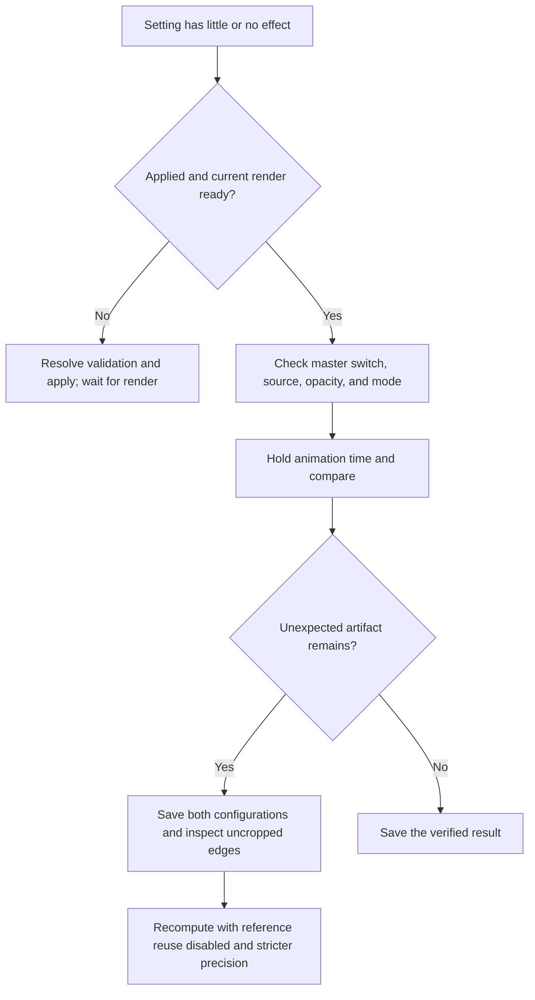

<!-- Created by GPT-6 on 2026-09-24. -->
<!-- Modified by GPT-6 on 2026-09-25. -->
# Presets, recovery, and diagnostics

[Manual](user-manual.md) · [Calculation explanation](exploration-and-calculation.md)

## Calculation presets

A calculation preset changes MPA/reference-compression settings together. The names describe intended tradeoffs; they do not rank pixel accuracy across all locations. In particular, **Stable** presets emphasize compressed storage and use a less strict MPA exponent than Ultra Best.

| Preset | Minimum skip | MPA precision | MPA compression | Reference criteria | Reference threshold | Disable normalization |
| --- | --- | --- | --- | --- | --- | --- |
| Ultra Fast | 4 | −3 | No compression | 0 | 0 | Off |
| Fast | 8 | −4 | No compression | 1,000,000 | 7 | Off |
| Normal | 8 | −5 | Little compression | 1,000,000 | 11 | Off |
| Best | 8 | −6 | Little compression | 1,000,000 | 15 | Off |
| Ultra Best | 8 | −7 | Little compression | 1,000,000 | 19 | Off |
| Stable | 8 | −4 | Strongest | 1,000,000 | 6 | Off |
| More Stable | 8 | −4 | Strongest | 100,000 | 6 | Off |
| Ultra Stable | 8 | −4 | Strongest | 10,000 | 6 | On |

All eight use Max Multiplier Between Levels 2 and Highest selection. Criteria 0 disables reference compression. The threshold column is an exponent used by reference matching; it is not the same convention as the negative MPA precision exponent.

After applying a preset, recompute the same location and inspect difficult detail. For an independent comparison, disable reference reuse. Measure setup time, pixel time, and storage at your own location instead of inferring speed from the preset name.

## Render and resolution presets

Render presets set Clarity and also establish related render defaults, including SSAA 1, 60 live FPS, linear interpolation, the logical-core thread count, Boundary Trace Fill off, Two-Color Preview off, and Coarse Preview on. Recheck individual settings after selecting a preset; it is broader than editing Clarity alone.

| Render preset | Clarity | Pixel count relative to High, before rounding |
| --- | --- | --- |
| Potato | 0.1 | 0.01× |
| Low | 0.3 | 0.09× |
| Medium | 0.5 | 0.25× |
| High | 1 | 1× |
| Ultra | 2 | 4× |
| Extreme [DANGER] | 4 | 16× |

These are geometric sample/output-size ratios, not measured rendering-speed ratios. Extreme can require much more memory without fixing a calculation-tolerance issue.

Resolution presets choose **640×360**, **960×540**, **1280×720**, **1600×900**, **1920×1080**, or portrait **360×640**. Resolution changes the base canvas; Clarity and SSAA still apply. A portrait canvas and a 360 panorama are different features.

## Shader presets and palette recipes

The Shader preset menu groups **Palette**, **Stripe**, **Slope**, **Color**, **Fog**, **Bloom**, and available **Example** files. A group preset changes that group; a saved shader preset restores a broader look. A Surface style can apply a complete material recipe, so selecting a style is not a one-number experiment.

Palette choices include classic/rainbow, random smooth, cinematic, natural, and glossy families. The visual and numerical behavior of palette interval, smoothing, phase, random recipes, import, and layer blending is covered in the [shader overview](shader-overview.md). Recipe-based palettes retain their preset ID and seed; use the same recipe/seed for reproducibility rather than manually recreating its displayed colors.

**Load KFR Color** imports compatible KFR color information. **Import Color** provides color import through the palette module. These are color workflows, not general import of another renderer's entire calculation project. **Save Shader Preset** and **Load Shader Preset** provide `.rfsp` reuse within RFF_Super. Keep external texture images available when transferring an appearance.

Example menu entries are collected from available files. Their count and names can differ between installations; an absent example file is not a missing rendering feature. See the [source menu mapping](feature-coverage.md) and [full shader fields](settings-reference.md).

## Session recovery

After an abnormal close or an interrupted rendering session, the recovery prompt can offer saved location/settings. It is a recovery snapshot, not a substitute for named project saves or a complete archive of computed maps and external assets.

| Recovery choice | What happens | When it helps |
| --- | --- | --- |
| **Restore and generate** | Restores location, fractal, render, shader, video settings, and window size, then computes. | The saved workload was reasonable and you want to continue. |
| **Restore and wait** | Restores the same state but holds computation. Review it, lower expensive settings if needed, then choose Generate. | The prior run was too heavy or repeatedly failed. |
| **Generate the location** | Retains center, zoom, iterations, and formula while other settings return to defaults. | A setting or shader combination is suspected. |
| **Ignore** | Starts with the default view; kept recovery settings remain available for manual opening. | You want to start normally and inspect recovery later. |

The prompt may also show descriptive labels such as Resume rendering, Review settings, Keep only location, and Start fresh. **Generate** after review computes using the settings as they now stand. **Explore → Recompute** also releases the hold. This prevents an expensive restored configuration from immediately restarting before you can adjust it.

## Diagnose an unexpected result

If an image is unchanged, inspect dependencies before repeatedly increasing a value. Roughness needs an active reflection/specular contribution; camera padding only affects newly generated maps; PNG sources do not contain iteration values; linear color motion does not use every flow control. See the [specific dependency checklist](SETTINGS_GUIDE.md#when-a-setting-seems-to-do-nothing).

For an unexpected border, inspect the full image and an enlarged edge. Do not crop it away and declare the issue solved. Compare a fresh render using the same inputs. During this guide's preparation, an incorrect inner/outer map pairing in the documentation renderer caused an edge artifact; the pairing was corrected and the final images regenerated. See [validation corrections](validation.md#corrections-during-preparation).

## Debug-build tools and version

Debug builds expose **Dump Scene State**, **Measure GPU Pass Times**, and **Show GPU Pass Times**. A scene dump helps record the internal state at a problem. GPU timing is optional because timestamp recording itself adds work; enabling a new measurement clears earlier samples. Use Show GPU Pass Times after gathering frames to identify expensive passes. GPU pass time is not total CPU calculation or end-to-end export time.

The Debug menu is conditional and can be absent from release builds. **? → Version** reports the application's version for a bug report. Include the relevant RFC, source type, canvas/quality settings, changed controls, and an uncropped result when describing a reproducible problem.

The brief empty-border flash that can occur while moving between native Windows menu-bar popups is a separately documented native-menu behavior. It is distinct from a persistent blank panel, a missing menu item, or corruption in the exported picture; investigate those symptoms on their own evidence.

Source basis: [calculation presets](../src/rff2/preset/calc/CalculationPresets.cpp), [render presets](../src/rff2/preset/render/RenderPresets.cpp), [resolution presets](../src/rff2/preset/resolution/ResolutionPresets.cpp), [recovery prompt](../src/rff2/ui/RecoveryPrompt.cpp), and [menus](../src/rff2/ui/SettingsMenu.cpp).
