<!-- Created by GPT-6 on 2026-09-24. -->
# More shader comparisons

[Shader overview](shader-overview.md) · [Original comparisons](visual-comparisons.md) · [Main guide](SETTINGS_GUIDE.md) · [Validation](validation.md)

These **24 additional before/after pairs** show controls that previously had only text descriptions. All are actual RFF_Super Vulkan renders using the supplied second location, the same framing, 800 × 450 output, and 2× SSAA in each dimension. The baseline and original 30 comparisons are unchanged. Each pair includes its complete settings files.

Captions list changed values and important prerequisites. Other settings are held fixed within a pair. A recipe may be used to make a contribution visible; compare within the pair rather than comparing brightness across different recipes. Click an image for full size. Mist uses the same 2-second timestamp on both sides. HDR examples are SDR previews, not HDR-encoded PNGs.

## Contents

- [Band decoration](#band-decoration)
- [Lighting](#lighting)
- [Material and reflection](#material-and-reflection)
- [Surface details](#surface-details)
- [Pattern and layer order](#pattern-and-layer-order)
- [HDR and animated materials](#hdr-and-animated-materials)

## Band decoration

### Recessed grooves

| Before: Recessed Grooves: Off; band lines enabled | After: Recessed Grooves: On; Auto Groove: Off; Depth: 3; Width: 0.12 |
| --- | --- |
|  | 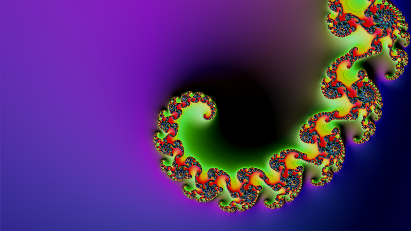 |

The black line becomes a shaded recessed groove. The manual width and depth are explicitly set so Auto Groove does not choose them.

[Before settings](examples/grooves-before.rfc) · [After settings](examples/grooves-after.rfc)

### Spines

| Before: Spine Amount: 0; band lines enabled | After: Spine Amount: 1; Spine Length: 1.5 |
| --- | --- |
| 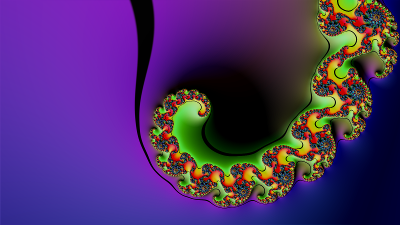 | 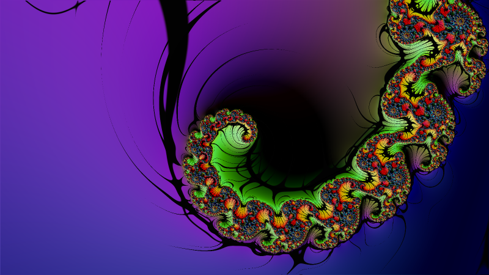 |

Branch-like extensions appear along the band contours. The band-line color, opacity, and framing stay fixed.

[Before settings](examples/spines-before.rfc) · [After settings](examples/spines-after.rfc)

### Ornaments

| Before: Ornament Amount: 0; band lines enabled | After: Ornament Amount: 1; Ornament Size: 1.5 |
| --- | --- |
|  | 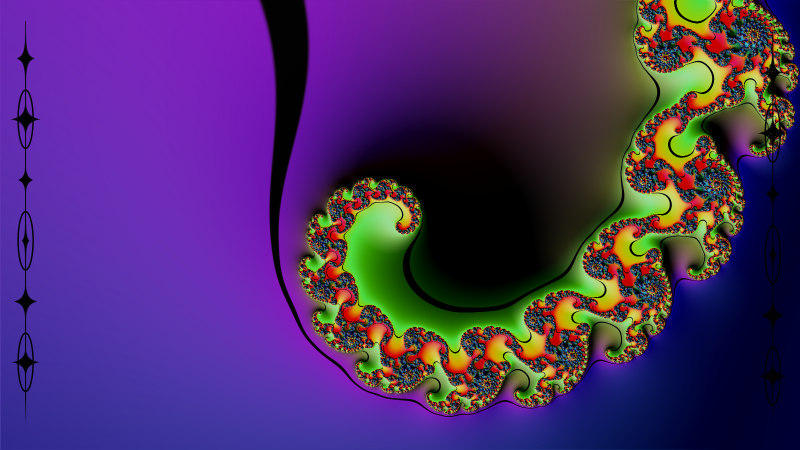 |

Look at the sparse ornaments near the left and right edges. This localized change is easy to miss in a reduced thumbnail; click to inspect the full image.

[Before settings](examples/ornaments-before.rfc) · [After settings](examples/ornaments-after.rfc)

### Palette Gloss

| Before: Palette Gloss: Off | After: Palette Gloss: On; white Gloss Color |
| --- | --- |
|  | 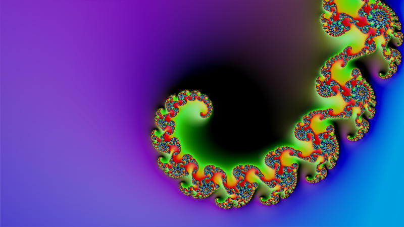 |

Palette-linked highlights brighten selected parts of the color cycle. Relief Gloss remains disabled.

[Before settings](examples/palette-gloss-before.rfc) · [After settings](examples/palette-gloss-after.rfc)

## Lighting

### Fill light

| Before: Fill Intensity: 0 | After: Fill Intensity: 0.8; Direction: 315 degrees; Zenith: 60 degrees |
| --- | --- |
|  | 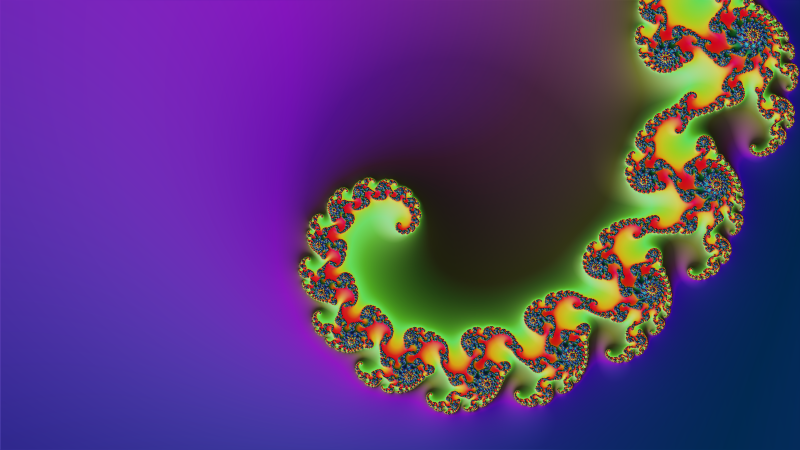 |

The secondary light lifts the dark side. The main light direction stays fixed.

[Before settings](examples/fill-light-before.rfc) · [After settings](examples/fill-light-after.rfc)

### Lit and shadow tint

| Before: Tint Intensity: 0; warm/cool tint colors set | After: Tint Intensity: 0.8; same tint colors |
| --- | --- |
|  | 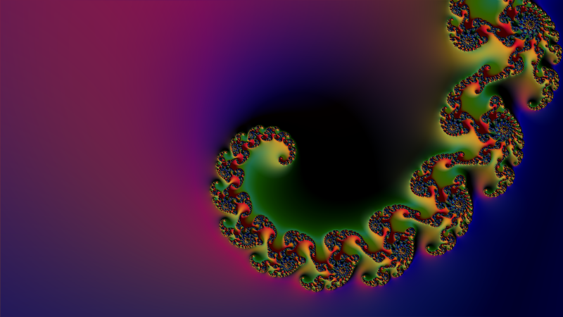 |

The same warm light-facing and cool shadow-facing colors are configured on both sides; only Tint Intensity changes.

[Before settings](examples/light-tint-before.rfc) · [After settings](examples/light-tint-after.rfc)

### Relief Gloss

| Before: Gloss Intensity: 0 | After: Gloss Intensity: 0.8; Bands: 4; Sharpness: 12 |
| --- | --- |
|  | 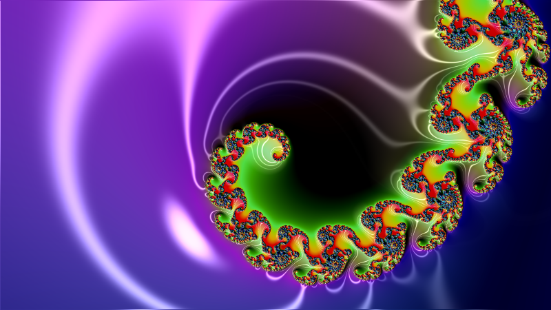 |

Bright repeated highlights follow the relief. This is the relief Gloss control, separate from Palette Gloss.

[Before settings](examples/relief-gloss-before.rfc) · [After settings](examples/relief-gloss-after.rfc)

### Specular anisotropy

| Before: Specular Anisotropy: 0; Specular Intensity: 1; Power: 32 | After: Specular Anisotropy: 0.9; Anisotropy Angle: 45 degrees |
| --- | --- |
| 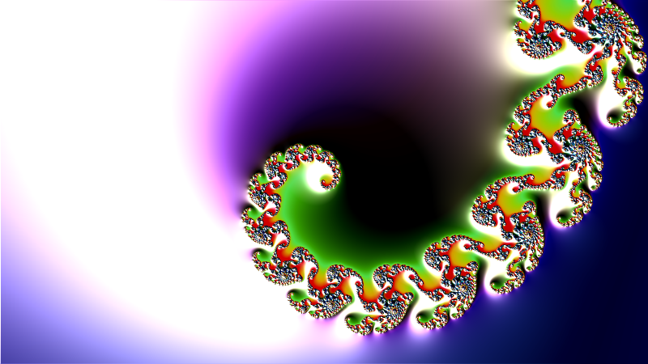 | 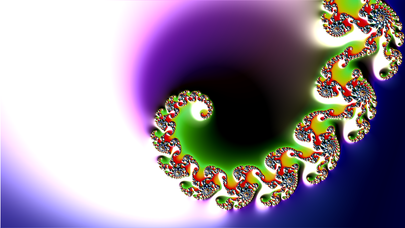 |

Specular highlights stretch with the anisotropy setting. Both sides have Specular Intensity 1 and Power 32 so the response is visible.

[Before settings](examples/anisotropy-before.rfc) · [After settings](examples/anisotropy-after.rfc)

## Material and reflection

### Metalness

| Before: Studio On; Metalness: 0 | After: Studio On; Metalness: 1 |
| --- | --- |
| 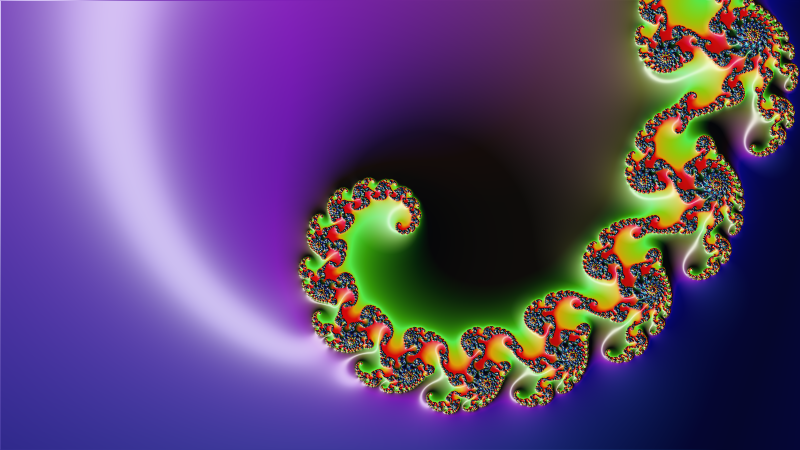 | 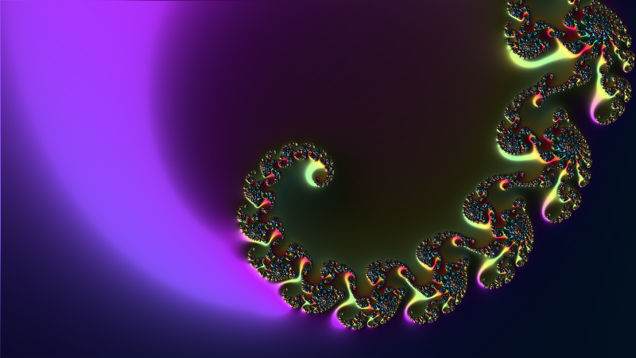 |

Studio is enabled with Specular Intensity 0.8 on both sides. Increasing Metalness changes both the reflected color and the balance of the material response.

[Before settings](examples/metalness-before.rfc) · [After settings](examples/metalness-after.rfc)

### Clearcoat

| Before: Studio On; Clearcoat: 0; Coat Roughness: 0.15 | After: Studio On; Clearcoat: 1; Coat Roughness: 0.15 |
| --- | --- |
|  | 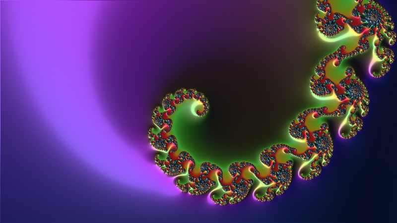 |

The coating adds a modest reflection change over the same base material. Studio and Specular Intensity 0.8 are held fixed.

[Before settings](examples/clearcoat-before.rfc) · [After settings](examples/clearcoat-after.rfc)

### Environment rotation

| Before: Studio On; Follow Light Direction: 0; Environment Rotation: 0 degrees | After: Environment Rotation: 120 degrees; other light controls unchanged |
| --- | --- |
| 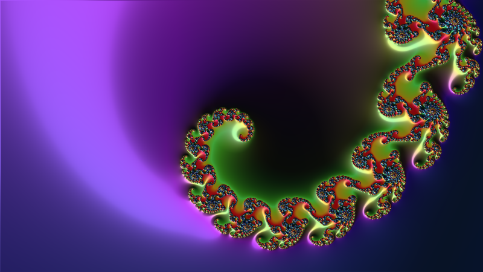 | 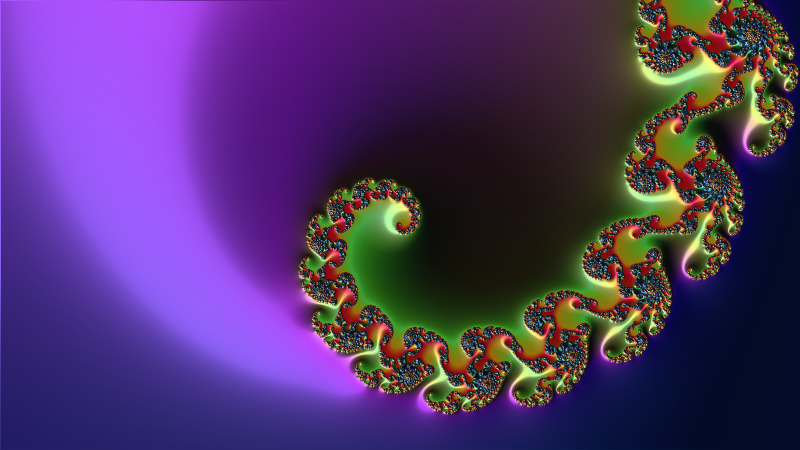 |

Only the Studio environment is rotated. Follow Light Direction is 0 on both sides, so the main light does not drive this comparison.

[Before settings](examples/environment-before.rfc) · [After settings](examples/environment-after.rfc)

### Film thickness

| Before: Advanced Iridescence: 1; Film Thickness: 200 nm | After: Advanced Iridescence: 1; Film Thickness: 800 nm |
| --- | --- |
|  | 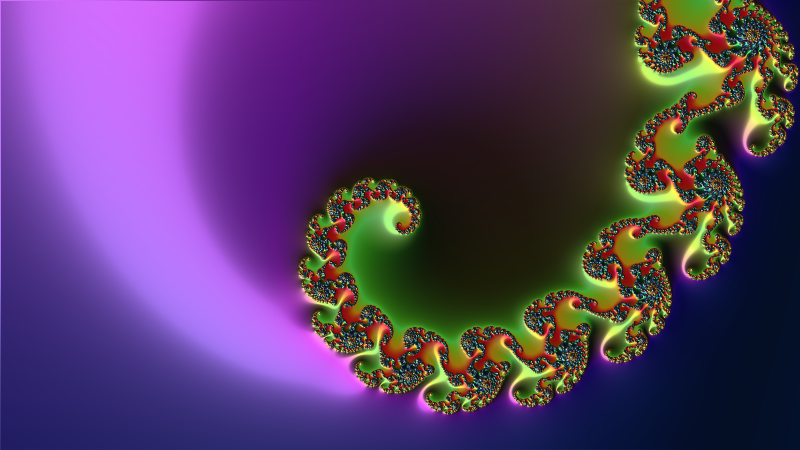 |

With the advanced Iridescence field set to 1, changing thickness shifts the reflected hues. This uses the separate thickness-related field, not the Surface inspector alias for Thin Film Color.

[Before settings](examples/film-thickness-before.rfc) · [After settings](examples/film-thickness-after.rfc)

### Prism spread

| Before: Liquid Metal; Prism Spread: 0 | After: Liquid Metal; Prism Spread: 1 |
| --- | --- |
| 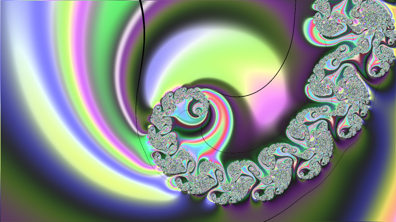 | 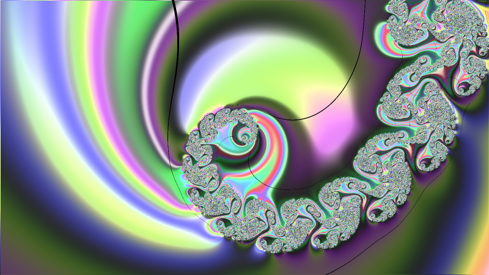 |

The Liquid Metal recipe is held fixed and only Prism Spread changes. This is a subtle variation in the colored reflection bands, not a change to the entire surface recipe.

[Before settings](examples/prism-spread-before.rfc) · [After settings](examples/prism-spread-after.rfc)

## Surface details

### Frost strength

| Before: Black Metal; Frost Strength: 0 | After: Black Metal; Frost Strength: 2 |
| --- | --- |
| 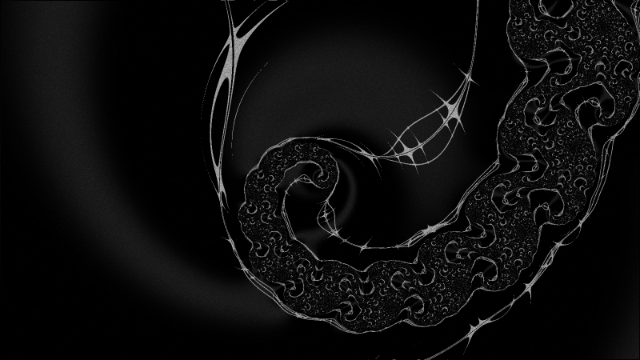 | 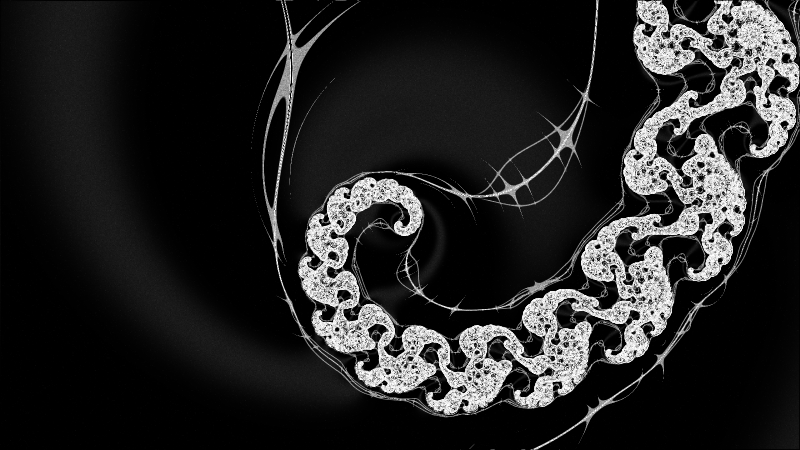 |

Frost fills more of the fine structure in the Black Metal treatment. Its other recipe settings, including monochrome finish, remain fixed.

[Before settings](examples/frost-before.rfc) · [After settings](examples/frost-after.rfc)

### Emission

| Before: Deep Sea; Emission: 0 | After: Deep Sea; Emission: 3 |
| --- | --- |
| 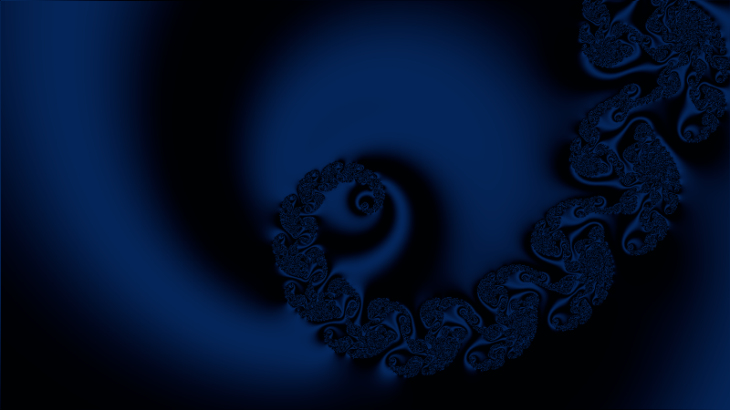 | 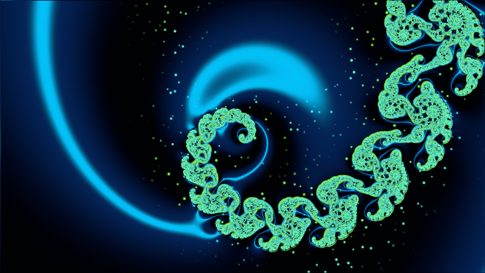 |

Deep Sea emission brightens the body highlights and luminous detail. Emission is the Surface editor name for Sea Glow.

[Before settings](examples/emission-before.rfc) · [After settings](examples/emission-after.rfc)

### Luminous particles

| Before: Deep Sea; Particle Amount: 0 | After: Deep Sea; Particle Amount: 1; Particle Size: 2 |
| --- | --- |
| 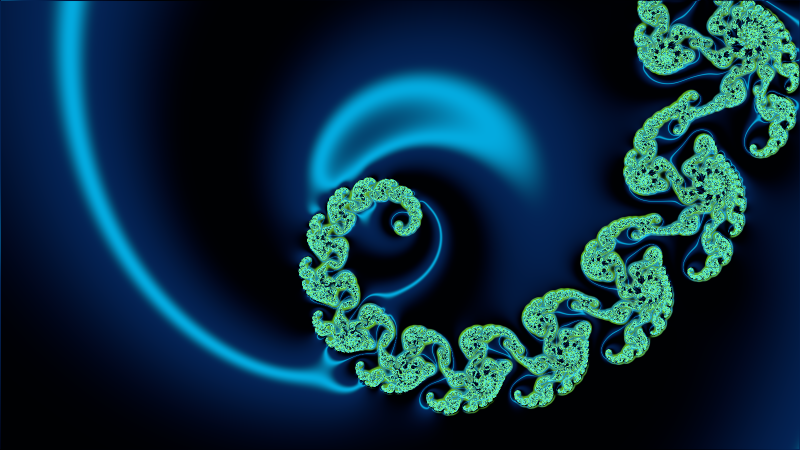 | 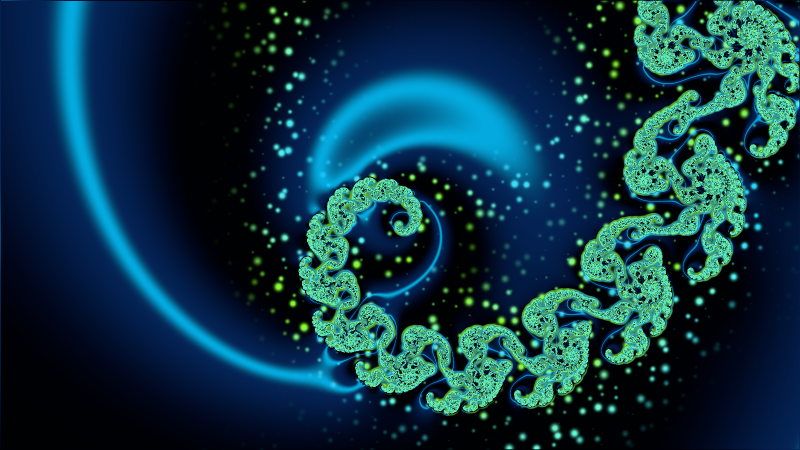 |

Particle Amount enables more visible luminous dots; Particle Size is also increased as stated. This is an effect setup example, not an isolated size test.

[Before settings](examples/sea-particles-before.rfc) · [After settings](examples/sea-particles-after.rfc)

### Print color count

| Before: Ukiyo-e; Color Count: 3 | After: Ukiyo-e; Color Count: 6 |
| --- | --- |
| 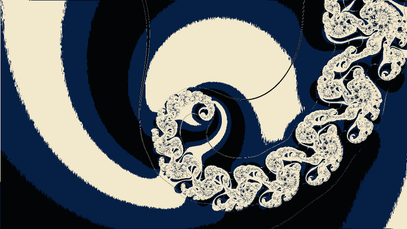 | 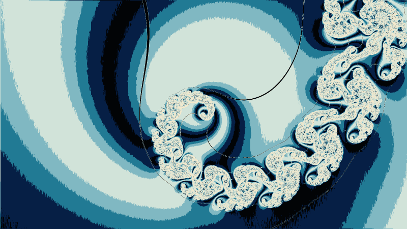 |

Three print colors produce fewer tonal regions; six permit additional blue/green tones. The location and Ukiyo-e recipe otherwise stay fixed.

[Before settings](examples/print-colors-before.rfc) · [After settings](examples/print-colors-after.rfc)

### Nearest pixelation

| Before: VHS / Nearest Effects: 1; VHS Noise: 0; Chromatic Shift: 0; Nearest Mix: 0 | After: Nearest Mix: 1; Pixel Size: 12; noise and channel shift remain 0 |
| --- | --- |
|  |  |

Nearest Mix adds intentional block sampling. These square blocks are the selected effect, not a loss of fractal calculation precision.

[Before settings](examples/pixelation-before.rfc) · [After settings](examples/pixelation-after.rfc)

### Chromatic shift

| Before: VHS / Nearest Effects: 1; VHS Noise: 0; Nearest Mix: 0; Chromatic Shift: 0 | After: Chromatic Shift: 6; noise and pixelation remain 0 |
| --- | --- |
|  |  |

Color channels separate near fine edges. VHS noise and nearest pixelation are held at zero to make the shift easier to identify.

[Before settings](examples/chromatic-shift-before.rfc) · [After settings](examples/chromatic-shift-after.rfc)

## Pattern and layer order

### Pattern outlines

| Before: Dots; Screen UV; Repeat 12/8; Opacity 0.8; Edge Enabled: Off | After: Edge Enabled: On; red Edge Color; Edge Width: 0.25; Edge Opacity: 1 |
| --- | --- |
| 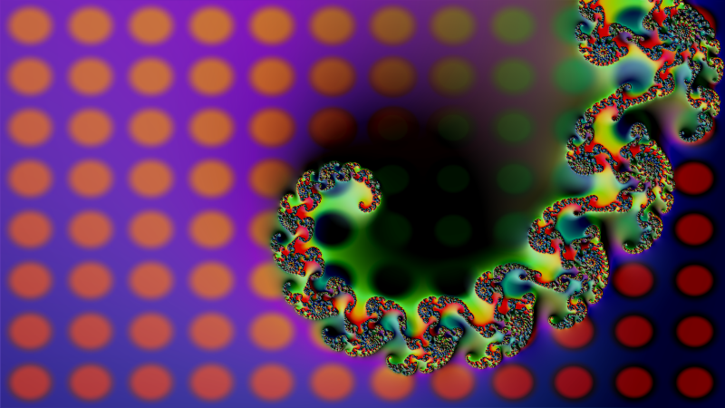 | 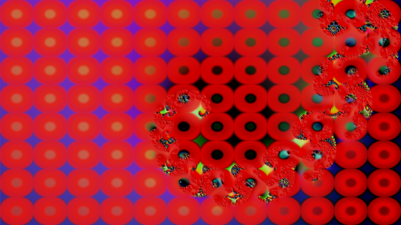 |

A red ring appears around the same procedural dots. Edge color, width, and opacity are set explicitly in the enabled example.

[Before settings](examples/pattern-outline-before.rfc) · [After settings](examples/pattern-outline-after.rfc)

### Layer order

| Before: Custom Layer Order: On; Pattern 1 below Color Correction; Saturation: -1 | After: Pattern 1 moved to front, above Color Correction; same settings |
| --- | --- |
| 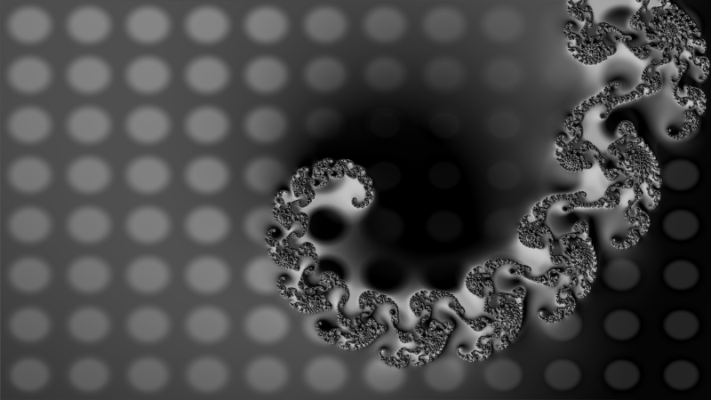 | 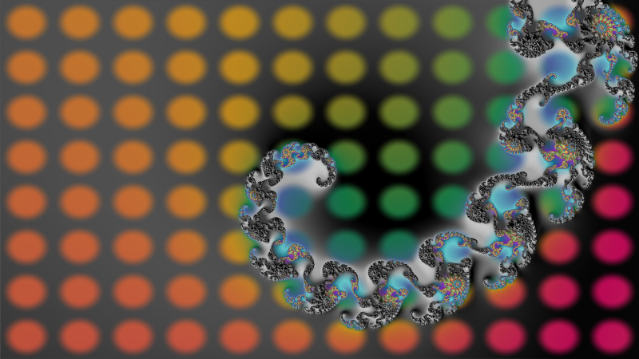 |

When the pattern is below desaturation, it turns gray too. Moving Pattern 1 to the front adds colored dots after desaturation. Both images use Custom Layer Order.

[Before settings](examples/layer-order-before.rfc) · [After settings](examples/layer-order-after.rfc)

## HDR and animated materials

### HDR shoulder

| Before: HDR On; Exposure: +2 stops; Tone Mapping: Clip | After: HDR On; Exposure: +2 stops; Tone Mapping: MFR Shoulder |
| --- | --- |
| 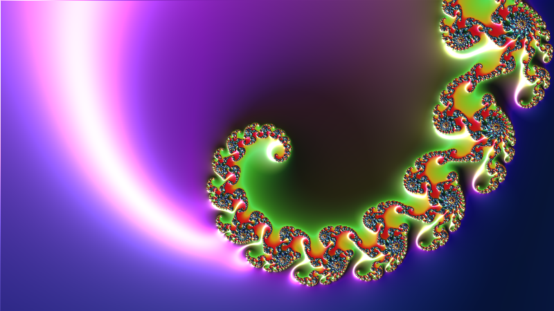 | 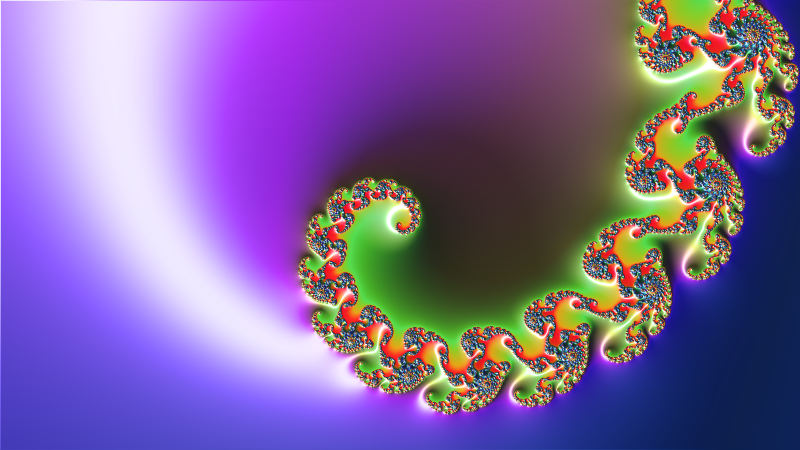 |

These are SDR PNG previews of HDR source light at +2 stops. MFR Shoulder compresses highlights differently from Clip; they are not HDR-encoded image files.

[Before settings](examples/hdr-shoulder-before.rfc) · [After settings](examples/hdr-shoulder-after.rfc)

### HDR false color

| Before: HDR On; Exposure: 0 stops; Tone Mapping: MFR Shoulder | After: HDR On; Exposure: 0 stops; Tone Mapping: MFR False Color |
| --- | --- |
| 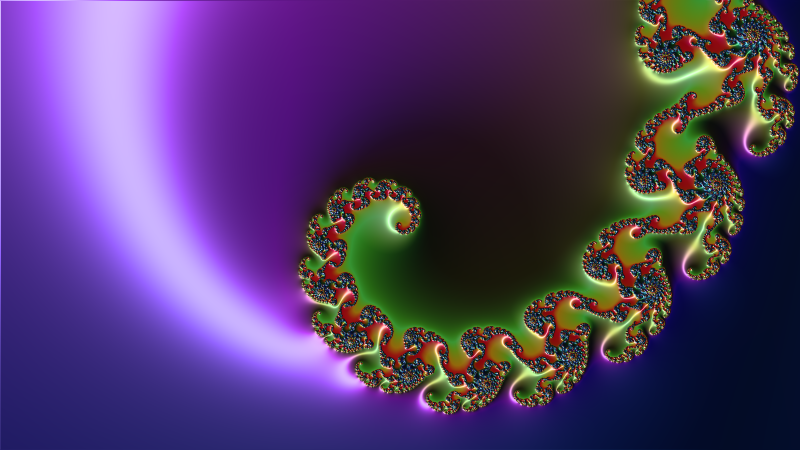 | 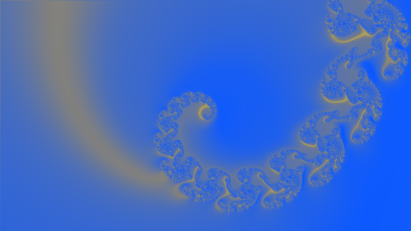 |

False Color visualizes exposure ranges. Its blue/gray/yellow colors are diagnostic output, not corruption or a natural-color palette.

[Before settings](examples/hdr-false-color-before.rfc) · [After settings](examples/hdr-false-color-after.rfc)

### Mist

| Before: Mist Layer 1: Off; t = 2 s | After: Mist Layer 1: On; Opacity: 1; Density: 0.8; pale blue Primary Color; t = 2 s |
| --- | --- |
|  | 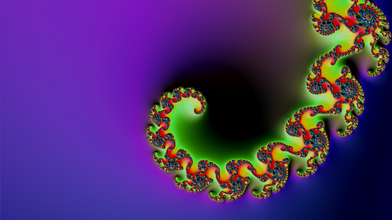 |

The pale-blue material adds a soft, subtle change at 2 seconds. A still pair demonstrates the enabled layer, not its animation speed.

[Before settings](examples/mist-before.rfc) · [After settings](examples/mist-after.rfc)
