<!-- Created by GPT-6 on 2026-09-24. -->
<!-- Modified by GPT-6 on 2026-09-25. -->
# Actual UI gallery and form inventory

[Manual](user-manual.md) · [Explanations and dependencies](settings-reference.md)

These are actual production Windows form controls rendered offscreen, not redrawn mockups. Settings use controlled default/example state. The panels are widened and made taller for legibility; the application normally scrolls them. Click an image to inspect it at its original size. Individual field explanations remain in the linked manual/reference.

The standalone form images omit application-wired transport/exploration actions where these are attached by the enclosing workspace. The full timeline image includes its real editor shell; no source folder is loaded. Local AI requests and timers are disabled for its two images. No model output is simulated.

Some current UI text is imperfect: Location calls base-10 zoom natural-log; Reference hints can ambiguously describe zero compression threshold; old boolean selectors show O/X. Use the corrected explanations in the manual. Two Local AI zoom section headings remain Japanese in the English UI: they mean Exploration settings and After exploration.

## Contents

- [Explore](#explore)
- [Animation](#animation)
- [Render & Preview](#render--preview)
- [Lighting & Relief](#lighting--relief)
- [Palette](#palette)
- [Textures](#textures)
- [Patterns](#patterns)
- [Warp & Stripe](#warp--stripe)
- [Finishing](#finishing)
- [Animated Materials](#animated-materials)
- [Zoom Overlay](#zoom-overlay)
- [Shader Layers](#shader-layers)
- [Export](#export)
- [A/B Comparison](#ab-comparison)
- [Local AI](#local-ai)
- [Timeline editor](#timeline-editor)

## Explore

[Field explanations](settings-reference.md) · [Workflow chapters](user-manual.md)

### Location

Show actual Explore / Location panel

| Control | Available choices / input guidance |
| --- | --- |
| Real | High-precision center coordinate. |
| Imaginary | High-precision center coordinate. |
| Log Zoom (e) | Base-10 zoom. Adding 1 gives 10× magnification at fixed canvas size; current UI hint is incorrect. |
| Rotation | Degrees. Also controls panorama yaw. |

### Iterations

Show actual Explore / Iterations panel

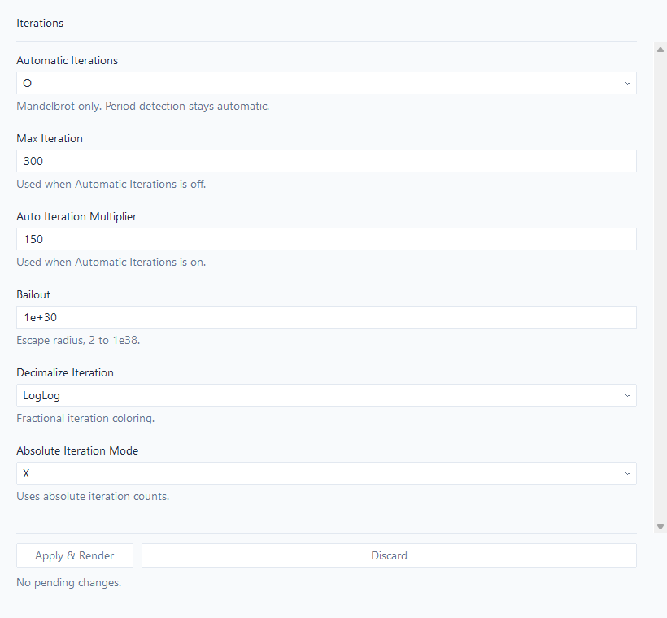

| Control | Available choices / input guidance |
| --- | --- |
| Automatic Iterations | O, X |
| Max Iteration | Used when Automatic Iterations is off. |
| Auto Iteration Multiplier | Used when Automatic Iterations is on. |
| Bailout | Escape radius, 2 to 1e38. |
| Decimalize Iteration | Linear, Square root, Log, LogLog |
| Absolute Iteration Mode | O, X |

### Reference

Show actual Explore / Reference panel

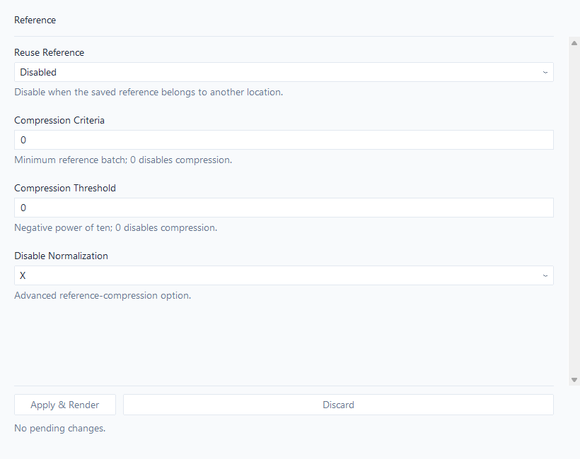

| Control | Available choices / input guidance |
| --- | --- |
| Reuse Reference | Current, Centered, Disabled |
| Compression Criteria | Minimum reference batch; 0 disables compression. |
| Compression Threshold | Reference matching exponent. Set Compression Criteria to 0 to explicitly disable compression. |
| Disable Normalization | O, X |

### MP-Approximation

Show actual Explore / MP-Approximation panel

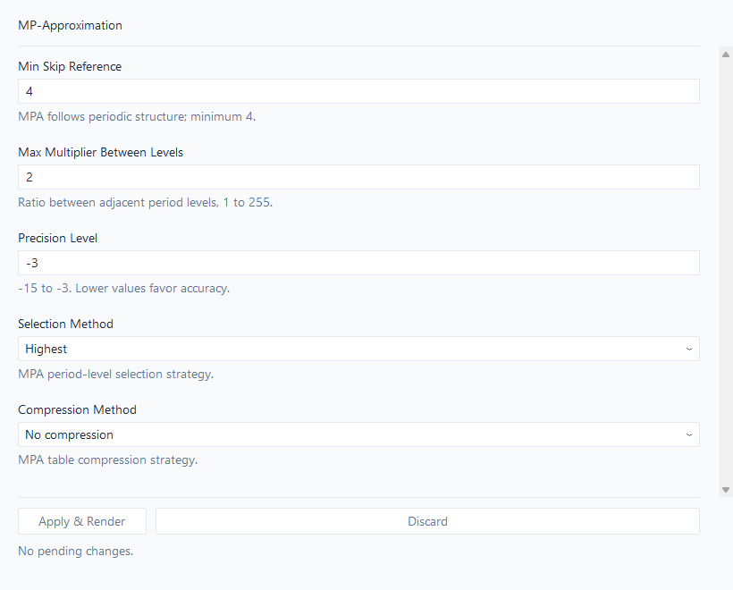

| Control | Available choices / input guidance |
| --- | --- |
| Min Skip Reference | MPA follows periodic structure; minimum 4. |
| Max Multiplier Between Levels | Ratio between adjacent period levels, 1 to 255. |
| Precision Level | -15 to -3. Lower values favor accuracy. |
| Selection Method | Lowest, Highest |
| Compression Method | No compression, Little compression, Strongest |

### Formula

Show actual Explore / Formula panel

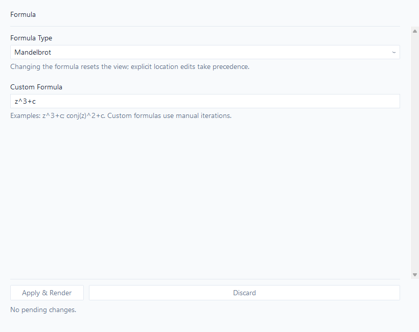

| Control | Available choices / input guidance |
| --- | --- |
| Formula Type | Mandelbrot, Custom |
| Custom Formula | Examples: z^3+c; conj(z)^2+c. Custom formulas use manual iterations. |

### Projection

Show actual Explore / Projection panel

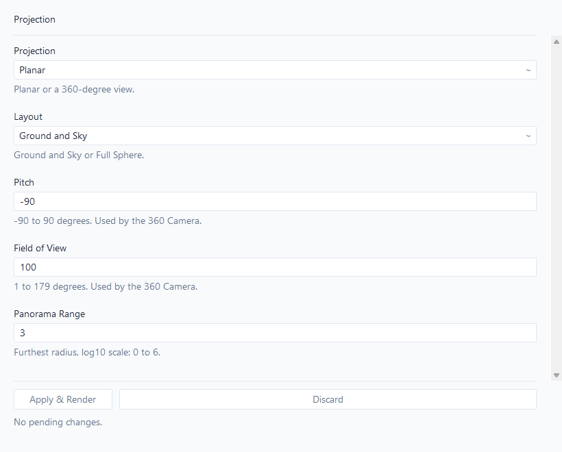

| Control | Available choices / input guidance |
| --- | --- |
| Projection | Planar, 360° Equirectangular, 360° Camera |
| Layout | Ground and Sky, Full Sphere |
| Pitch | -90 to 90 degrees. Used by the 360 Camera. |
| Field of View | 1 to 179 degrees. Used by the 360 Camera. |
| Panorama Range | Furthest radius, log10 scale: 0 to 6. |

## Animation

[Field explanations](settings-reference.md) · [Workflow chapters](user-manual.md)

### Color Motion

Show actual Animation / Color Motion panel

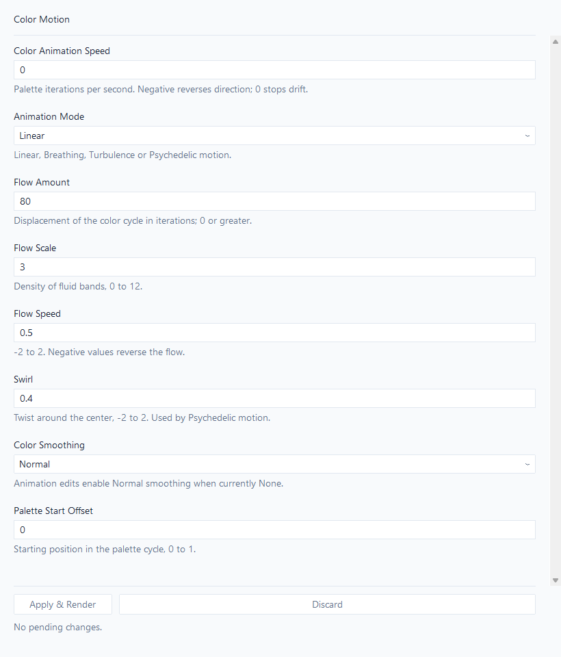

| Control | Available choices / input guidance |
| --- | --- |
| Color Animation Speed | Palette iterations per second. Negative reverses direction; 0 stops drift. |
| Animation Mode | Linear, Breathing, Turbulence, Psychedelic |
| Flow Amount | Displacement of the color cycle in iterations; 0 or greater. |
| Flow Scale | Density of fluid bands, 0 to 12. |
| Flow Speed | -2 to 2. Negative values reverse the flow. |
| Swirl | Twist around the center, -2 to 2. Used by Psychedelic motion. |
| Color Smoothing | None, Normal, Reversed |
| Palette Start Offset | Starting position in the palette cycle, 0 to 1. |

### Frozen Colors

Show actual Animation / Frozen Colors panel

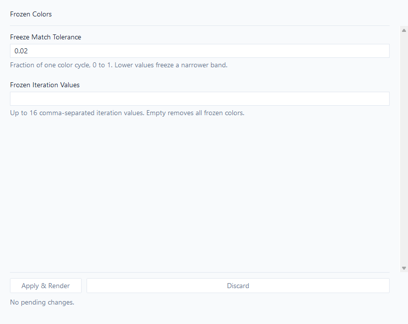

| Control | Available choices / input guidance |
| --- | --- |
| Freeze Match Tolerance | Fraction of one color cycle, 0 to 1. Lower values freeze a narrower band. |
| Frozen Iteration Values | Up to 16 comma-separated iteration values. Empty removes all frozen colors. |

### Zoom Motion

Show actual Animation / Zoom Motion panel

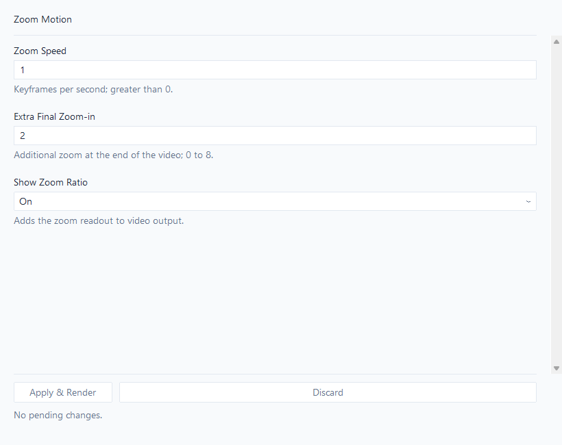

| Control | Available choices / input guidance |
| --- | --- |
| Zoom Speed | Keyframes per second; greater than 0. |
| Extra Final Zoom-in | Additional zoom at the end of the video; 0 to 8. |
| Show Zoom Ratio | On, Off |

### Timeline

Show actual Animation / Timeline panel

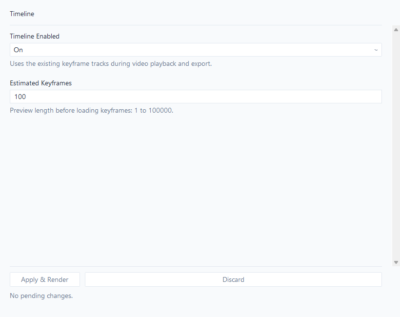

| Control | Available choices / input guidance |
| --- | --- |
| Timeline Enabled | On, Off |
| Estimated Keyframes | Preview length before loading keyframes: 1 to 100000. |

### Keyframe Generation

Show actual Animation / Keyframe Generation panel

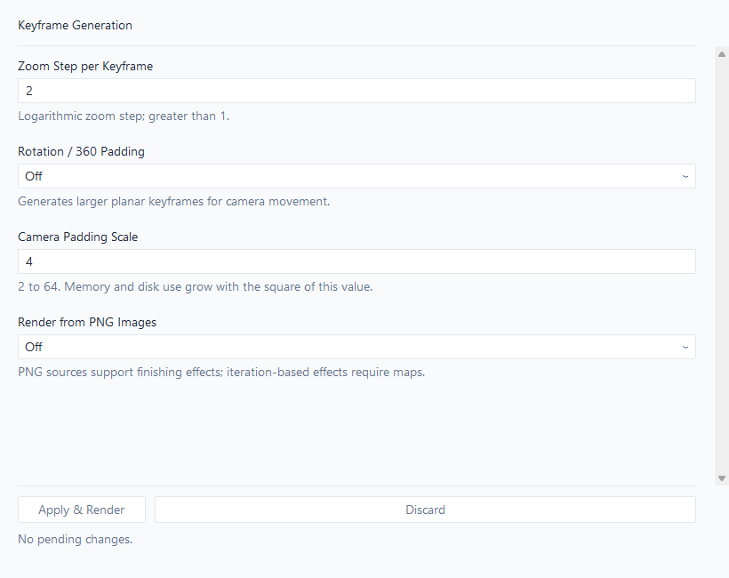

| Control | Available choices / input guidance |
| --- | --- |
| Zoom Step per Keyframe | Logarithmic zoom step; greater than 1. |
| Rotation / 360 Padding | On, Off |
| Camera Padding Scale | 2 to 64. Memory and disk use grow with the square of this value. |
| Render from PNG Images | On, Off |

### Camera

Show actual Animation / Camera panel

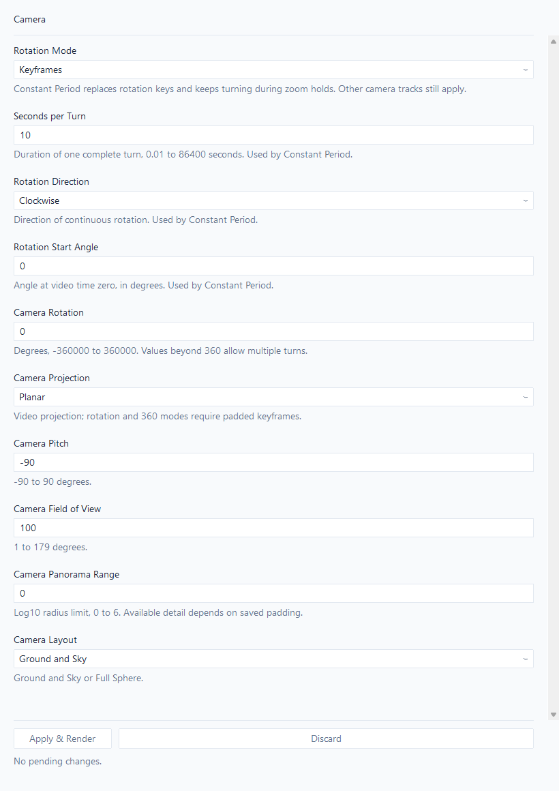

| Control | Available choices / input guidance |
| --- | --- |
| Rotation Mode | Keyframes, Constant Period |
| Seconds per Turn | Duration of one complete turn, 0.01 to 86400 seconds. Used by Constant Period. |
| Rotation Direction | Clockwise, Counterclockwise |
| Rotation Start Angle | Angle at video time zero, in degrees. Used by Constant Period. |
| Camera Rotation | Degrees, -360000 to 360000. Values beyond 360 allow multiple turns. |
| Camera Projection | Planar, 360° Equirectangular, 360° Camera |
| Camera Pitch | -90 to 90 degrees. |
| Camera Field of View | 1 to 179 degrees. |
| Camera Panorama Range | Log10 radius limit, 0 to 6. Available detail depends on saved padding. |
| Camera Layout | Ground and Sky, Full Sphere |

## Render & Preview

[Field explanations](settings-reference.md) · [Workflow chapters](user-manual.md)

### Performance

Show actual Render & Preview / Performance panel

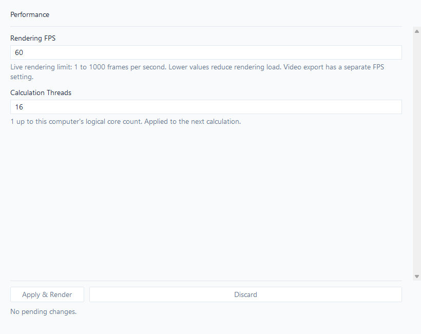

| Control | Available choices / input guidance |
| --- | --- |
| Rendering FPS | Live rendering limit: 1 to 1000 frames per second. Lower values reduce rendering load. Video export has a separate FPS setting. |
| Calculation Threads | 1 up to this computer's logical core count. Applied to the next calculation. |

### Calculation Preview

Show actual Render & Preview / Calculation Preview panel

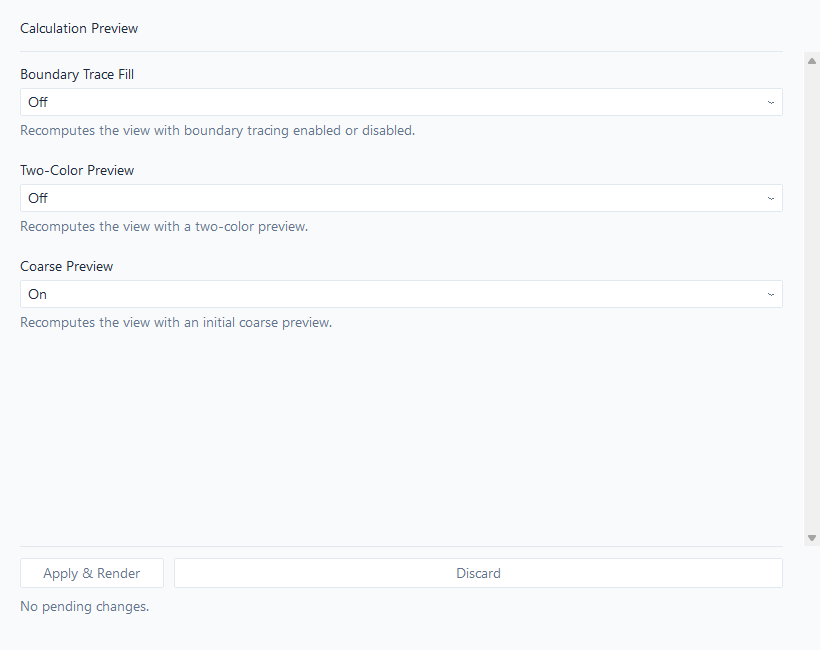

| Control | Available choices / input guidance |
| --- | --- |
| Boundary Trace Fill | On, Off |
| Two-Color Preview | On, Off |
| Coarse Preview | On, Off |

## Lighting & Relief

[Field explanations](settings-reference.md) · [Workflow chapters](user-manual.md)

### Slope Shading

Show actual Lighting & Relief / Slope Shading panel

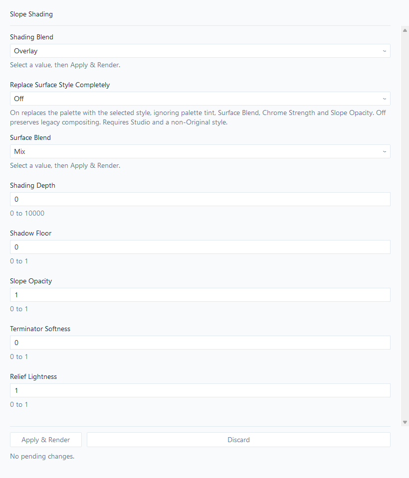

| Control | Available choices / input guidance |
| --- | --- |
| Shading Blend | Overlay, OKLab Lightness |
| Replace Surface Style Completely | On, Off |
| Surface Blend | Mix, Add, Multiply, Screen |
| Shading Depth | 0 to 10000 |
| Shadow Floor | 0 to 1 |
| Slope Opacity | 0 to 1 |
| Terminator Softness | 0 to 1 |
| Relief Lightness | 0 to 1 |

### Light Direction

Show actual Lighting & Relief / Light Direction panel

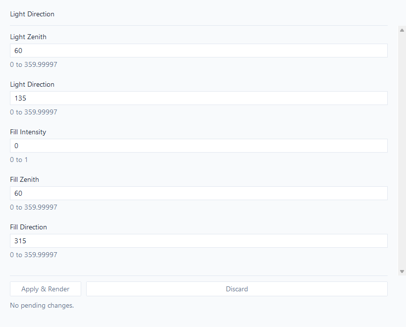

| Control | Available choices / input guidance |
| --- | --- |
| Light Zenith | 0 to 359.99997 |
| Light Direction | 0 to 359.99997 |
| Fill Intensity | 0 to 1 |
| Fill Zenith | 0 to 359.99997 |
| Fill Direction | 0 to 359.99997 |

### Specular

Show actual Lighting & Relief / Specular panel

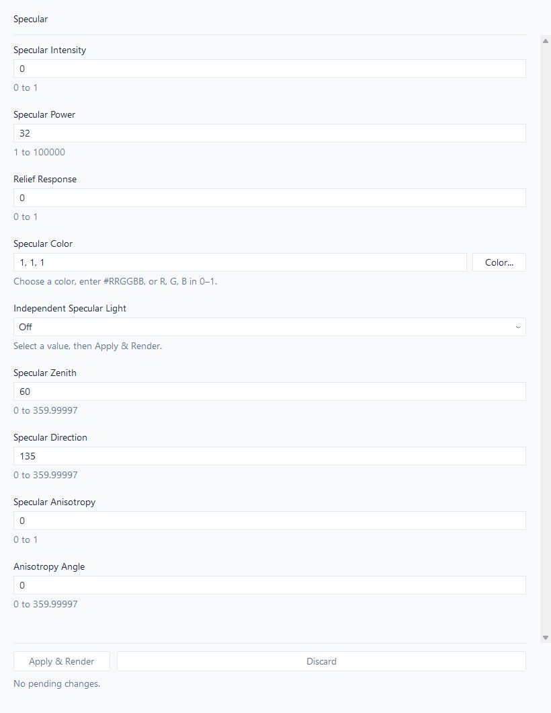

| Control | Available choices / input guidance |
| --- | --- |
| Specular Intensity | 0 to 1 |
| Specular Power | 1 to 100000 |
| Relief Response | 0 to 1 |
| Specular Color | Choose a color, enter #RRGGBB, or R, G, B in 0–1. |
| Independent Specular Light | On, Off |
| Specular Zenith | 0 to 359.99997 |
| Specular Direction | 0 to 359.99997 |
| Specular Anisotropy | 0 to 1 |
| Anisotropy Angle | 0 to 359.99997 |

### Relief Detail

Show actual Lighting & Relief / Relief Detail panel

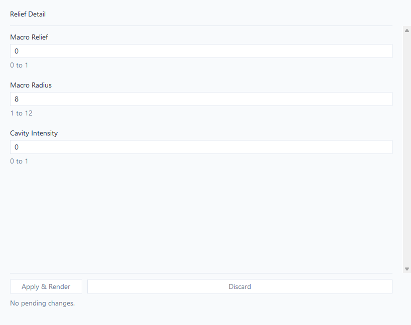

| Control | Available choices / input guidance |
| --- | --- |
| Macro Relief | 0 to 1 |
| Macro Radius | 1 to 12 |
| Cavity Intensity | 0 to 1 |

### Lit / Shadow Tint

Show actual Lighting & Relief / Lit / Shadow Tint panel

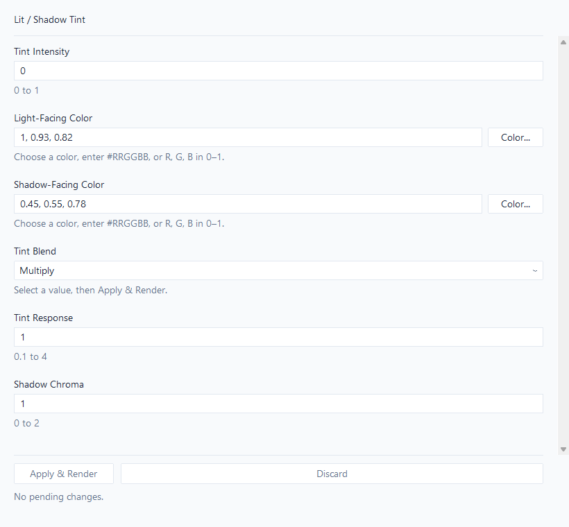

| Control | Available choices / input guidance |
| --- | --- |
| Tint Intensity | 0 to 1 |
| Light-Facing Color | Choose a color, enter #RRGGBB, or R, G, B in 0–1. |
| Shadow-Facing Color | Choose a color, enter #RRGGBB, or R, G, B in 0–1. |
| Tint Blend | Multiply, OKLab Tint |
| Tint Response | 0.1 to 4 |
| Shadow Chroma | 0 to 2 |

### Tone Mapping

Show actual Lighting & Relief / Tone Mapping panel

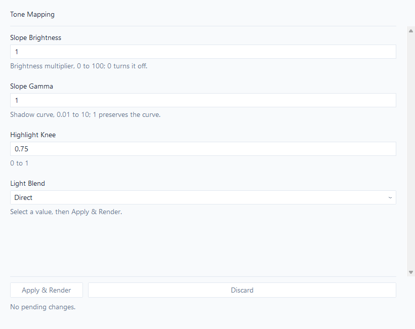

| Control | Available choices / input guidance |
| --- | --- |
| Slope Brightness | Brightness multiplier, 0 to 100; 0 turns it off. |
| Slope Gamma | Shadow curve, 0.01 to 10; 1 preserves the curve. |
| Highlight Knee | 0 to 1 |
| Light Blend | Direct, Linear RGB Add |

### Rim Light

Show actual Lighting & Relief / Rim Light panel

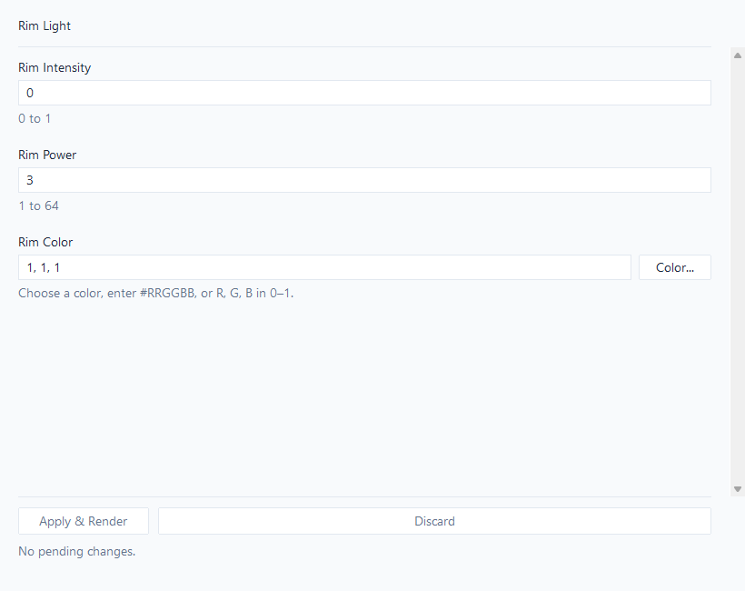

| Control | Available choices / input guidance |
| --- | --- |
| Rim Intensity | 0 to 1 |
| Rim Power | 1 to 64 |
| Rim Color | Choose a color, enter #RRGGBB, or R, G, B in 0–1. |

### Gloss

Show actual Lighting & Relief / Gloss panel

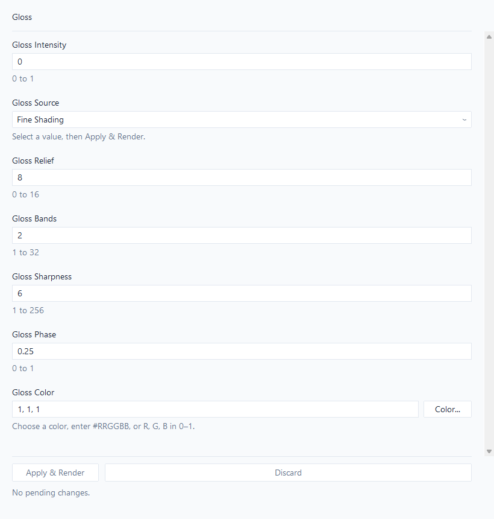

| Control | Available choices / input guidance |
| --- | --- |
| Gloss Intensity | 0 to 1 |
| Gloss Source | Fine Shading, Shading, Relief Detail, Slope Facing |
| Gloss Relief | 0 to 16 |
| Gloss Bands | 1 to 32 |
| Gloss Sharpness | 1 to 256 |
| Gloss Phase | 0 to 1 |
| Gloss Color | Choose a color, enter #RRGGBB, or R, G, B in 0–1. |

### Lustre Relief

Show actual Lighting & Relief / Lustre Relief panel

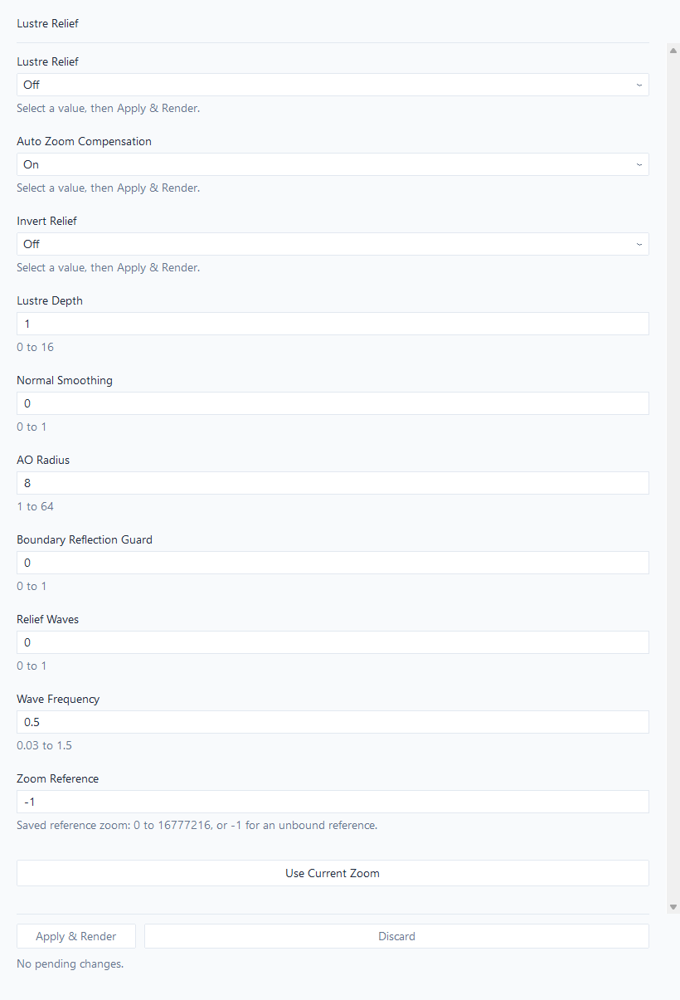

| Control | Available choices / input guidance |
| --- | --- |
| Lustre Relief | On, Off |
| Auto Zoom Compensation | On, Off |
| Invert Relief | On, Off |
| Lustre Depth | 0 to 16 |
| Normal Smoothing | 0 to 1 |
| AO Radius | 1 to 64 |
| Boundary Reflection Guard | 0 to 1 |
| Relief Waves | 0 to 1 |
| Wave Frequency | 0.03 to 1.5 |
| Zoom Reference | Saved reference zoom: 0 to 16777216, or -1 for an unbound reference. |

Actions: **Use Current Zoom**.

## Palette

[Field explanations](settings-reference.md) · [Workflow chapters](user-manual.md)

### Color Cycle

Show actual Palette / Color Cycle panel

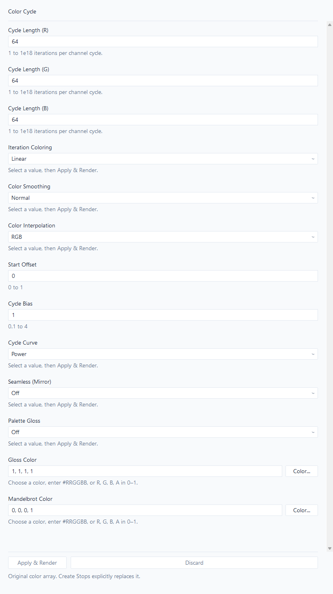

| Control | Available choices / input guidance |
| --- | --- |
| Cycle Length (R) | 1 to 1e18 iterations per channel cycle. |
| Cycle Length (G) | 1 to 1e18 iterations per channel cycle. |
| Cycle Length (B) | 1 to 1e18 iterations per channel cycle. |
| Iteration Coloring | Linear, Square root, Cube root, Log, LogLog, Smoothstep, Smootherstep |
| Color Smoothing | None, Normal, Reversed |
| Color Interpolation | RGB, OKLab, Linear RGB |
| Start Offset | 0 to 1 |
| Cycle Bias | 0.1 to 4 |
| Cycle Curve | Power, Wave |
| Seamless (Mirror) | On, Off |
| Palette Gloss | On, Off |
| Gloss Color | Choose a color, enter #RRGGBB, or R, G, B, A in 0–1. |
| Mandelbrot Color | Choose a color, enter #RRGGBB, or R, G, B, A in 0–1. |

### Band Line

Show actual Palette / Band Line panel

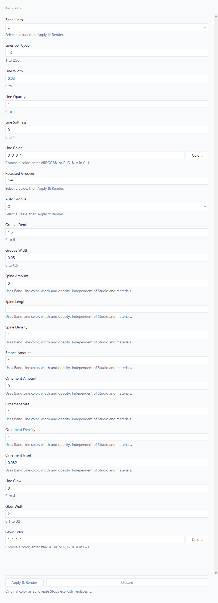

| Control | Available choices / input guidance |
| --- | --- |
| Band Lines | On, Off |
| Lines per Cycle | 1 to 256 |
| Line Width | 0 to 1 |
| Line Opacity | 0 to 1 |
| Line Softness | 0 to 1 |
| Line Color | Choose a color, enter #RRGGBB, or R, G, B, A in 0–1. |
| Recessed Grooves | On, Off |
| Auto Groove | On, Off |
| Groove Depth | 0 to 5 |
| Groove Width | 0 to 0.5 |
| Spine Amount | Uses Band Line color, width and opacity. Independent of Studio and materials. |
| Spine Length | Uses Band Line color, width and opacity. Independent of Studio and materials. |
| Spine Density | Uses Band Line color, width and opacity. Independent of Studio and materials. |
| Branch Amount | Uses Band Line color, width and opacity. Independent of Studio and materials. |
| Ornament Amount | Uses Band Line color, width and opacity. Independent of Studio and materials. |
| Ornament Size | Uses Band Line color, width and opacity. Independent of Studio and materials. |
| Ornament Density | Uses Band Line color, width and opacity. Independent of Studio and materials. |
| Ornament Inset | Uses Band Line color, width and opacity. Independent of Studio and materials. |
| Line Glow | 0 to 4 |
| Glow Width | 0.1 to 32 |
| Glow Color | Choose a color, enter #RRGGBB, or R, G, B, A in 0–1. |

### Color Stops

Show actual Palette / Color Stops panel

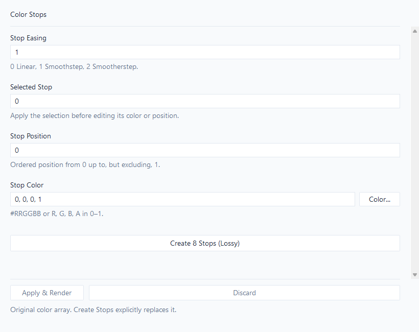

| Control | Available choices / input guidance |
| --- | --- |
| Stop Easing | 0 Linear, 1 Smoothstep, 2 Smootherstep. |
| Selected Stop | Apply the selection before editing its color or position. |
| Stop Position | Ordered position from 0 up to, but excluding, 1. |
| Stop Color | #RRGGBB or R, G, B, A in 0–1. |

Actions: **Create 8 Stops (Lossy)**.

### Arrange Stops

Show actual Palette / Arrange Stops panel

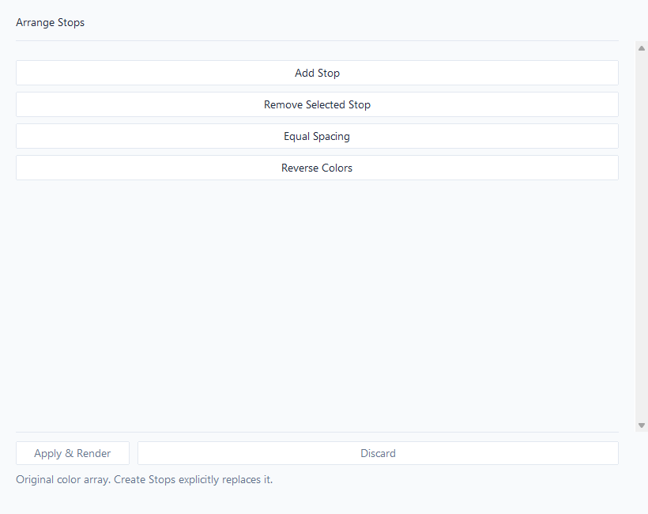

Actions: **Add Stop**, **Remove Selected Stop**, **Equal Spacing**, **Reverse Colors**.

### Preset Library

Show actual Palette / Preset Library panel

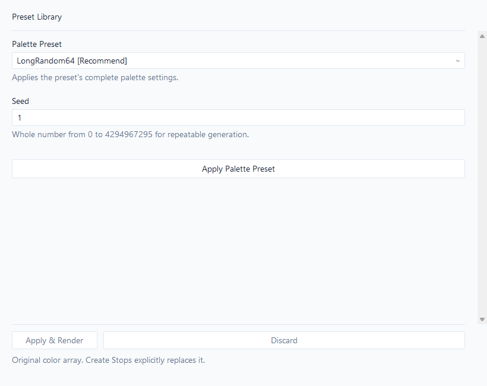

| Control | Available choices / input guidance |
| --- | --- |
| Palette Preset | LongRandom64 [Recommend], RandomSmooth [Recommend], Classic 1, Classic 2, Arctic Aurora, Azure, Cinematic, Crimson Magma, Deep Space, Desert, Electric Dreams, Flame, Glossy Berry, Glossy Cyber, Glossy Fire, Glossy Forest, Glossy Ice, Glossy Metal, Glossy Neon, Glossy Ocean, Glossy Pastel, Glossy Sunset, Long Rainbow 7, Midnight Neon, Misty Forest, Pastel Dream, Rainbow, Volcanic Ash, LongRandom64 2 [DANGER] |
| Seed | Whole number from 0 to 4294967295 for repeatable generation. |

Actions: **Apply Palette Preset**.

### Import Colors

Show actual Palette / Import Colors panel

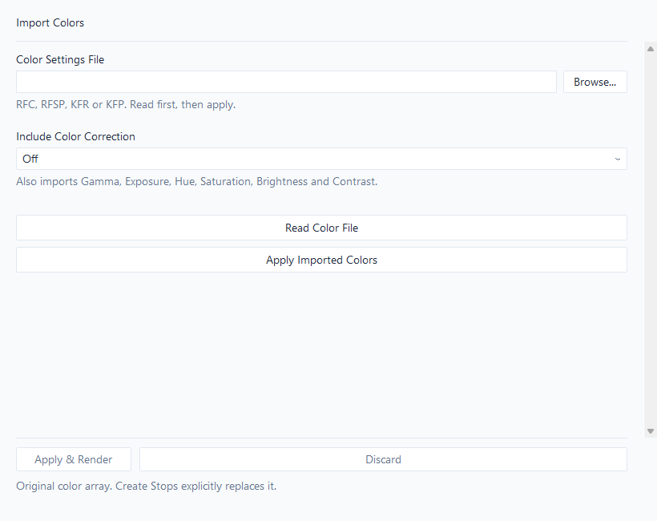

| Control | Available choices / input guidance |
| --- | --- |
| Color Settings File | RFC, RFSP, KFR or KFP. Read first, then apply. |
| Include Color Correction | Off, On |

Actions: **Read Color File**, **Apply Imported Colors**.

## Textures

[Field explanations](settings-reference.md) · [Workflow chapters](user-manual.md)

### Layer 1 (Bottom)

Show actual Textures / Layer 1 (Bottom) panel

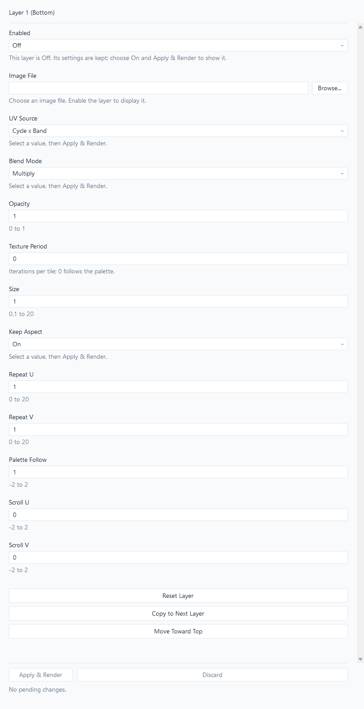

| Control | Available choices / input guidance |
| --- | --- |
| Enabled | On, Off |
| Image File | Choose an image file. Enable the layer to display it. |
| UV Source | Cycle x Band, Cycle x Angle, Cycle x Screen, Screen |
| Blend Mode | Multiply, Overlay, Replace |
| Opacity | 0 to 1 |
| Texture Period | Iterations per tile; 0 follows the palette. |
| Size | 0.1 to 20 |
| Keep Aspect | On, Off |
| Repeat U | 0 to 20 |
| Repeat V | 0 to 20 |
| Palette Follow | -2 to 2 |
| Scroll U | -2 to 2 |
| Scroll V | -2 to 2 |

Actions: **Reset Layer**, **Copy to Next Layer**, **Move Toward Top**.

### Layer 2

Show actual Textures / Layer 2 panel

| Control | Available choices / input guidance |
| --- | --- |
| Enabled | On, Off |
| Image File | Choose an image file. Enable the layer to display it. |
| UV Source | Cycle x Band, Cycle x Angle, Cycle x Screen, Screen |
| Blend Mode | Multiply, Overlay, Replace |
| Opacity | 0 to 1 |
| Texture Period | Iterations per tile; 0 follows the palette. |
| Size | 0.1 to 20 |
| Keep Aspect | On, Off |
| Repeat U | 0 to 20 |
| Repeat V | 0 to 20 |
| Palette Follow | -2 to 2 |
| Scroll U | -2 to 2 |
| Scroll V | -2 to 2 |

Actions: **Reset Layer**, **Copy to Next Layer**, **Move Toward Bottom**, **Move Toward Top**.

### Layer 3

Show actual Textures / Layer 3 panel

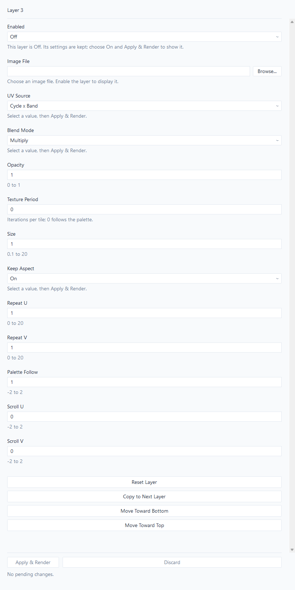

| Control | Available choices / input guidance |
| --- | --- |
| Enabled | On, Off |
| Image File | Choose an image file. Enable the layer to display it. |
| UV Source | Cycle x Band, Cycle x Angle, Cycle x Screen, Screen |
| Blend Mode | Multiply, Overlay, Replace |
| Opacity | 0 to 1 |
| Texture Period | Iterations per tile; 0 follows the palette. |
| Size | 0.1 to 20 |
| Keep Aspect | On, Off |
| Repeat U | 0 to 20 |
| Repeat V | 0 to 20 |
| Palette Follow | -2 to 2 |
| Scroll U | -2 to 2 |
| Scroll V | -2 to 2 |

Actions: **Reset Layer**, **Copy to Next Layer**, **Move Toward Bottom**, **Move Toward Top**.

### Layer 4 (Top)

Show actual Textures / Layer 4 (Top) panel

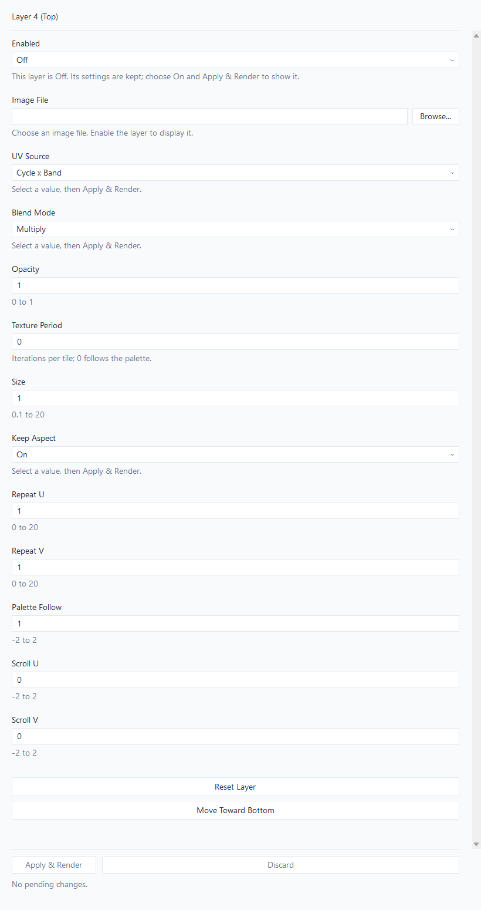

| Control | Available choices / input guidance |
| --- | --- |
| Enabled | On, Off |
| Image File | Choose an image file. Enable the layer to display it. |
| UV Source | Cycle x Band, Cycle x Angle, Cycle x Screen, Screen |
| Blend Mode | Multiply, Overlay, Replace |
| Opacity | 0 to 1 |
| Texture Period | Iterations per tile; 0 follows the palette. |
| Size | 0.1 to 20 |
| Keep Aspect | On, Off |
| Repeat U | 0 to 20 |
| Repeat V | 0 to 20 |
| Palette Follow | -2 to 2 |
| Scroll U | -2 to 2 |
| Scroll V | -2 to 2 |

Actions: **Reset Layer**, **Move Toward Bottom**.

## Patterns

[Field explanations](settings-reference.md) · [Workflow chapters](user-manual.md)

### Layer 1 (Bottom)

Show actual Patterns / Layer 1 (Bottom) panel

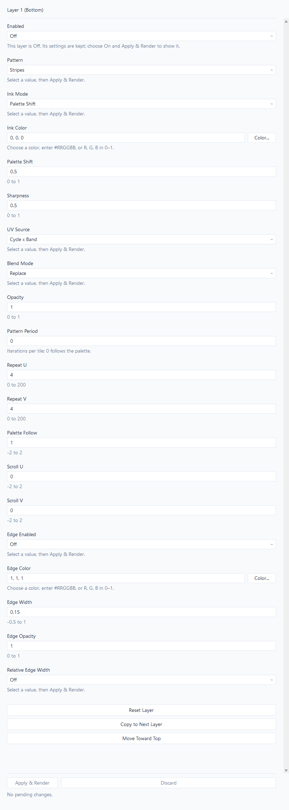

| Control | Available choices / input guidance |
| --- | --- |
| Enabled | On, Off |
| Pattern | Stripes, Checker, Grid, Dots, Diamond, Honeycomb, Waves, Cloud |
| Ink Mode | Palette Shift, Solid Color |
| Ink Color | Choose a color, enter #RRGGBB, or R, G, B in 0–1. |
| Palette Shift | 0 to 1 |
| Sharpness | 0 to 1 |
| UV Source | Cycle x Band, Cycle x Angle, Cycle x Screen, Screen |
| Blend Mode | Multiply, Overlay, Replace |
| Opacity | 0 to 1 |
| Pattern Period | Iterations per tile; 0 follows the palette. |
| Repeat U | 0 to 200 |
| Repeat V | 0 to 200 |
| Palette Follow | -2 to 2 |
| Scroll U | -2 to 2 |
| Scroll V | -2 to 2 |
| Edge Enabled | On, Off |
| Edge Color | Choose a color, enter #RRGGBB, or R, G, B in 0–1. |
| Edge Width | -0.5 to 1 |
| Edge Opacity | 0 to 1 |
| Relative Edge Width | On, Off |

Actions: **Reset Layer**, **Copy to Next Layer**, **Move Toward Top**.

### Layer 2

Show actual Patterns / Layer 2 panel

| Control | Available choices / input guidance |
| --- | --- |
| Enabled | On, Off |
| Pattern | Stripes, Checker, Grid, Dots, Diamond, Honeycomb, Waves, Cloud |
| Ink Mode | Palette Shift, Solid Color |
| Ink Color | Choose a color, enter #RRGGBB, or R, G, B in 0–1. |
| Palette Shift | 0 to 1 |
| Sharpness | 0 to 1 |
| UV Source | Cycle x Band, Cycle x Angle, Cycle x Screen, Screen |
| Blend Mode | Multiply, Overlay, Replace |
| Opacity | 0 to 1 |
| Pattern Period | Iterations per tile; 0 follows the palette. |
| Repeat U | 0 to 200 |
| Repeat V | 0 to 200 |
| Palette Follow | -2 to 2 |
| Scroll U | -2 to 2 |
| Scroll V | -2 to 2 |
| Edge Enabled | On, Off |
| Edge Color | Choose a color, enter #RRGGBB, or R, G, B in 0–1. |
| Edge Width | -0.5 to 1 |
| Edge Opacity | 0 to 1 |
| Relative Edge Width | On, Off |

Actions: **Reset Layer**, **Copy to Next Layer**, **Move Toward Bottom**, **Move Toward Top**.

### Layer 3

Show actual Patterns / Layer 3 panel

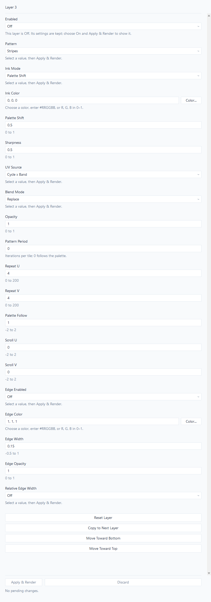

| Control | Available choices / input guidance |
| --- | --- |
| Enabled | On, Off |
| Pattern | Stripes, Checker, Grid, Dots, Diamond, Honeycomb, Waves, Cloud |
| Ink Mode | Palette Shift, Solid Color |
| Ink Color | Choose a color, enter #RRGGBB, or R, G, B in 0–1. |
| Palette Shift | 0 to 1 |
| Sharpness | 0 to 1 |
| UV Source | Cycle x Band, Cycle x Angle, Cycle x Screen, Screen |
| Blend Mode | Multiply, Overlay, Replace |
| Opacity | 0 to 1 |
| Pattern Period | Iterations per tile; 0 follows the palette. |
| Repeat U | 0 to 200 |
| Repeat V | 0 to 200 |
| Palette Follow | -2 to 2 |
| Scroll U | -2 to 2 |
| Scroll V | -2 to 2 |
| Edge Enabled | On, Off |
| Edge Color | Choose a color, enter #RRGGBB, or R, G, B in 0–1. |
| Edge Width | -0.5 to 1 |
| Edge Opacity | 0 to 1 |
| Relative Edge Width | On, Off |

Actions: **Reset Layer**, **Copy to Next Layer**, **Move Toward Bottom**, **Move Toward Top**.

### Layer 4 (Top)

Show actual Patterns / Layer 4 (Top) panel

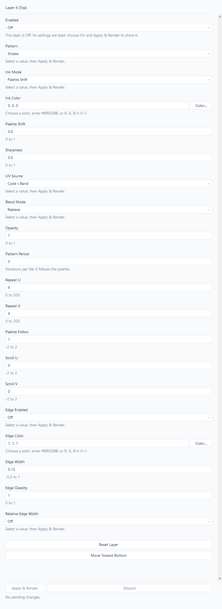

| Control | Available choices / input guidance |
| --- | --- |
| Enabled | On, Off |
| Pattern | Stripes, Checker, Grid, Dots, Diamond, Honeycomb, Waves, Cloud |
| Ink Mode | Palette Shift, Solid Color |
| Ink Color | Choose a color, enter #RRGGBB, or R, G, B in 0–1. |
| Palette Shift | 0 to 1 |
| Sharpness | 0 to 1 |
| UV Source | Cycle x Band, Cycle x Angle, Cycle x Screen, Screen |
| Blend Mode | Multiply, Overlay, Replace |
| Opacity | 0 to 1 |
| Pattern Period | Iterations per tile; 0 follows the palette. |
| Repeat U | 0 to 200 |
| Repeat V | 0 to 200 |
| Palette Follow | -2 to 2 |
| Scroll U | -2 to 2 |
| Scroll V | -2 to 2 |
| Edge Enabled | On, Off |
| Edge Color | Choose a color, enter #RRGGBB, or R, G, B in 0–1. |
| Edge Width | -0.5 to 1 |
| Edge Opacity | 0 to 1 |
| Relative Edge Width | On, Off |

Actions: **Reset Layer**, **Move Toward Bottom**.

## Warp & Stripe

[Field explanations](settings-reference.md) · [Workflow chapters](user-manual.md)

### Domain Warp

Show actual Warp & Stripe / Domain Warp panel

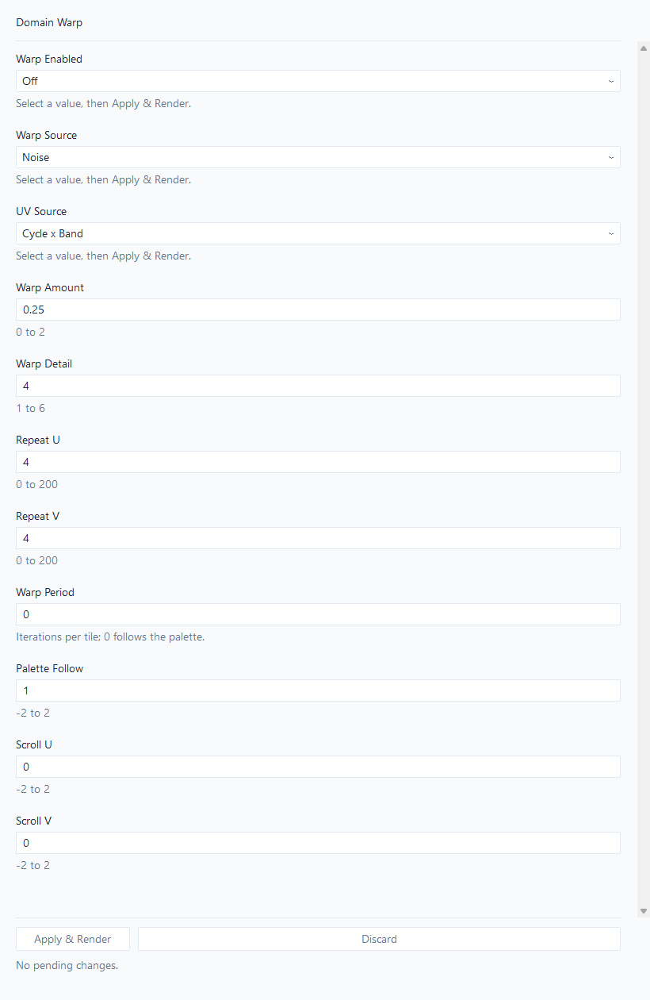

| Control | Available choices / input guidance |
| --- | --- |
| Warp Enabled | On, Off |
| Warp Source | Noise, Texture 1, Texture 2, Texture 3, Texture 4 |
| UV Source | Cycle x Band, Cycle x Angle, Cycle x Screen, Screen |
| Warp Amount | 0 to 2 |
| Warp Detail | 1 to 6 |
| Repeat U | 0 to 200 |
| Repeat V | 0 to 200 |
| Warp Period | Iterations per tile; 0 follows the palette. |
| Palette Follow | -2 to 2 |
| Scroll U | -2 to 2 |
| Scroll V | -2 to 2 |

### Stripe

Show actual Warp & Stripe / Stripe panel

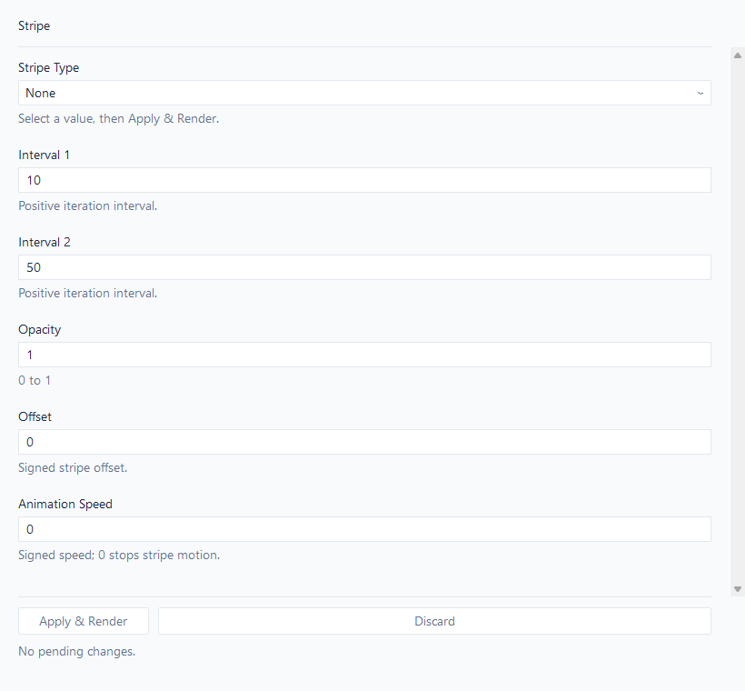

| Control | Available choices / input guidance |
| --- | --- |
| Stripe Type | None, Single Direction, Smooth, Squared |
| Interval 1 | Positive iteration interval. |
| Interval 2 | Positive iteration interval. |
| Opacity | 0 to 1 |
| Offset | Signed stripe offset. |
| Animation Speed | Signed speed; 0 stops stripe motion. |

## Finishing

[Field explanations](settings-reference.md) · [Workflow chapters](user-manual.md)

### Color Correction

Show actual Finishing / Color Correction panel

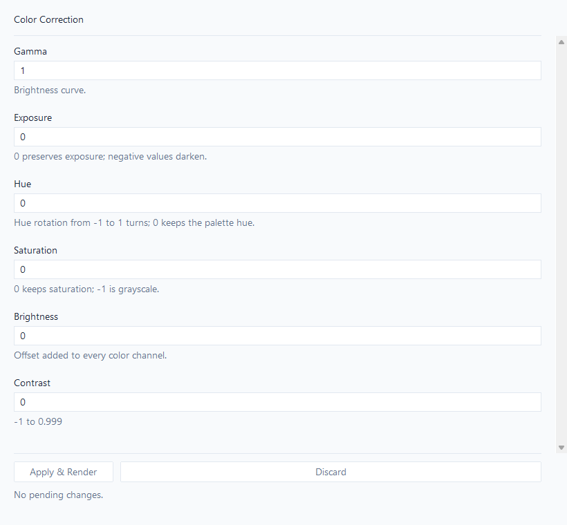

| Control | Available choices / input guidance |
| --- | --- |
| Gamma | Brightness curve. |
| Exposure | 0 preserves exposure; negative values darken. |
| Hue | Hue rotation from -1 to 1 turns; 0 keeps the palette hue. |
| Saturation | 0 keeps saturation; -1 is grayscale. |
| Brightness | Offset added to every color channel. |
| Contrast | -1 to 0.999 |

### Bloom

Show actual Finishing / Bloom panel

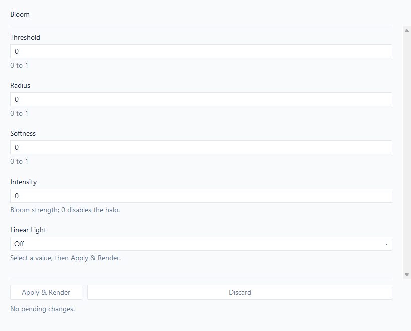

| Control | Available choices / input guidance |
| --- | --- |
| Threshold | 0 to 1 |
| Radius | 0 to 1 |
| Softness | 0 to 1 |
| Intensity | Bloom strength; 0 disables the halo. |
| Linear Light | On, Off |

### Fog

Show actual Finishing / Fog panel

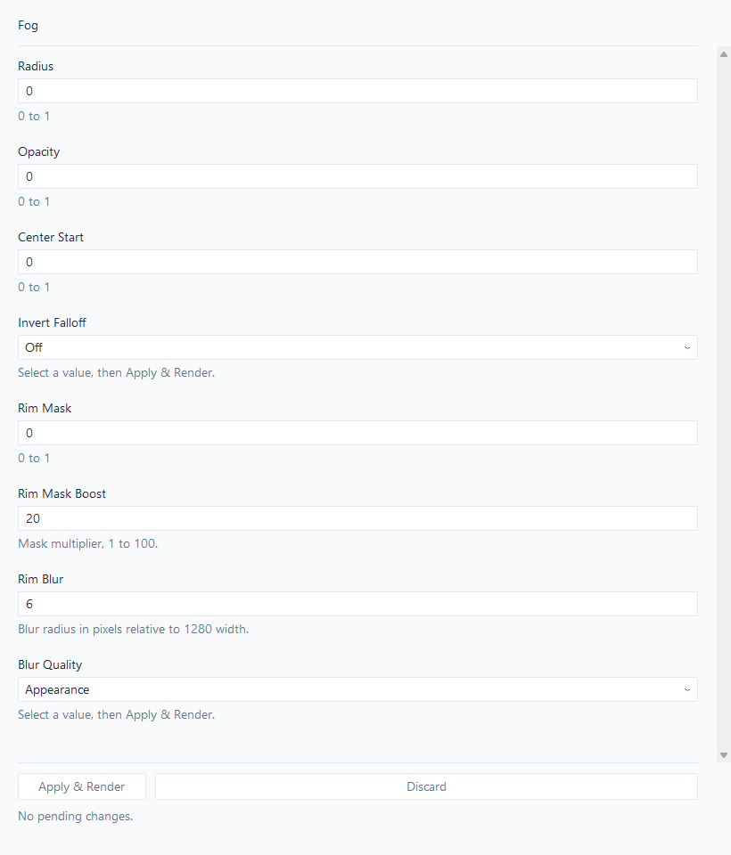

| Control | Available choices / input guidance |
| --- | --- |
| Radius | 0 to 1 |
| Opacity | 0 to 1 |
| Center Start | 0 to 1 |
| Invert Falloff | On, Off |
| Rim Mask | 0 to 1 |
| Rim Mask Boost | Mask multiplier, 1 to 100. |
| Rim Blur | Blur radius in pixels relative to 1280 width. |
| Blur Quality | Speed, Appearance |

### Focus Band

Show actual Finishing / Focus Band panel

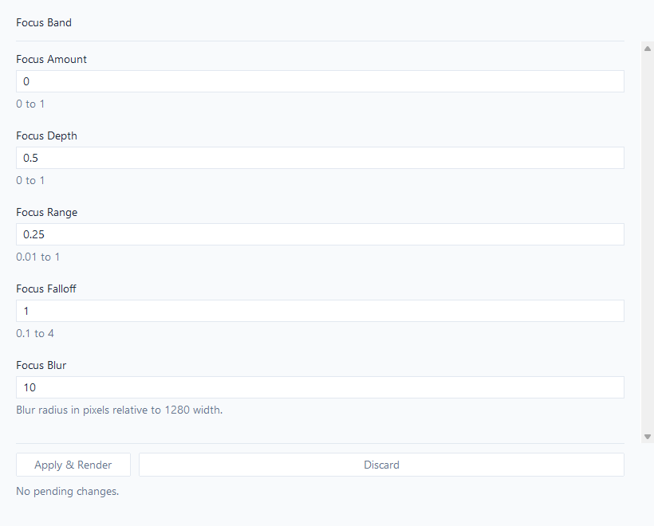

| Control | Available choices / input guidance |
| --- | --- |
| Focus Amount | 0 to 1 |
| Focus Depth | 0 to 1 |
| Focus Range | 0.01 to 1 |
| Focus Falloff | 0.1 to 4 |
| Focus Blur | Blur radius in pixels relative to 1280 width. |

### Chaos Blur

Show actual Finishing / Chaos Blur panel

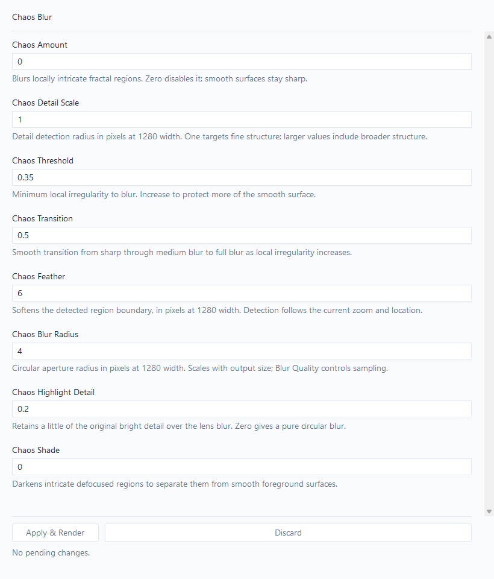

| Control | Available choices / input guidance |
| --- | --- |
| Chaos Amount | Blurs locally intricate fractal regions. Zero disables it; smooth surfaces stay sharp. |
| Chaos Detail Scale | Detail detection radius in pixels at 1280 width. One targets fine structure; larger values include broader structure. |
| Chaos Threshold | Minimum local irregularity to blur. Increase to protect more of the smooth surface. |
| Chaos Transition | Smooth transition from sharp through medium blur to full blur as local irregularity increases. |
| Chaos Feather | Softens the detected region boundary, in pixels at 1280 width. Detection follows the current zoom and location. |
| Chaos Blur Radius | Circular aperture radius in pixels at 1280 width. Scales with output size; Blur Quality controls sampling. |
| Chaos Highlight Detail | Retains a little of the original bright detail over the lens blur. Zero gives a pure circular blur. |
| Chaos Shade | Darkens intricate defocused regions to separate them from smooth foreground surfaces. |

## Animated Materials

[Field explanations](settings-reference.md) · [Workflow chapters](user-manual.md)

### Layer 1 (Bottom)

Show actual Animated Materials / Layer 1 (Bottom) panel

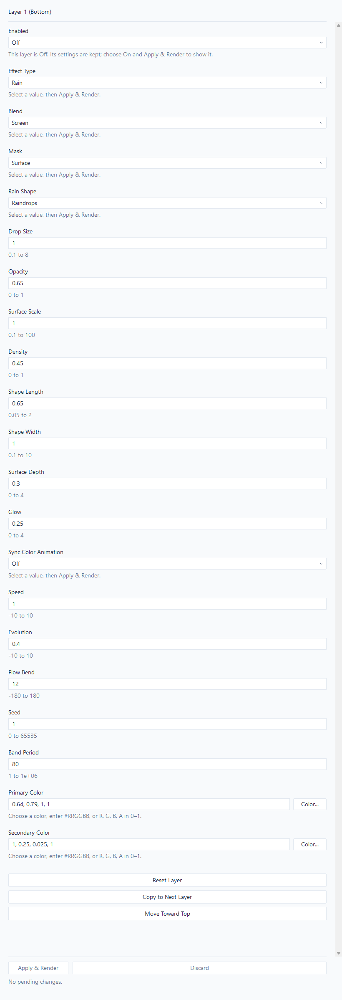

| Control | Available choices / input guidance |
| --- | --- |
| Enabled | On, Off |
| Effect Type | Rain, Flame, Embers, Mist, Heat Haze, Ripples, Flow Light, Aurora |
| Blend | Normal, Add, Screen, Multiply |
| Mask | Surface, Exterior, No Surface, Bands, Iteration Edges |
| Rain Shape | Raindrops, Water Streaks |
| Drop Size | 0.1 to 8 |
| Opacity | 0 to 1 |
| Surface Scale | 0.1 to 100 |
| Density | 0 to 1 |
| Shape Length | 0.05 to 2 |
| Shape Width | 0.1 to 10 |
| Surface Depth | 0 to 4 |
| Glow | 0 to 4 |
| Sync Color Animation | On, Off |
| Speed | -10 to 10 |
| Evolution | -10 to 10 |
| Flow Bend | -180 to 180 |
| Seed | 0 to 65535 |
| Band Period | 1 to 1e+06 |
| Primary Color | Choose a color, enter #RRGGBB, or R, G, B, A in 0–1. |
| Secondary Color | Choose a color, enter #RRGGBB, or R, G, B, A in 0–1. |

Actions: **Reset Layer**, **Copy to Next Layer**, **Move Toward Top**.

### Layer 2

Show actual Animated Materials / Layer 2 panel

| Control | Available choices / input guidance |
| --- | --- |
| Enabled | On, Off |
| Effect Type | Rain, Flame, Embers, Mist, Heat Haze, Ripples, Flow Light, Aurora |
| Blend | Normal, Add, Screen, Multiply |
| Mask | Surface, Exterior, No Surface, Bands, Iteration Edges |
| Rain Shape | Raindrops, Water Streaks |
| Drop Size | 0.1 to 8 |
| Opacity | 0 to 1 |
| Surface Scale | 0.1 to 100 |
| Density | 0 to 1 |
| Shape Length | 0.05 to 2 |
| Shape Width | 0.1 to 10 |
| Surface Depth | 0 to 4 |
| Glow | 0 to 4 |
| Sync Color Animation | On, Off |
| Speed | -10 to 10 |
| Evolution | -10 to 10 |
| Flow Bend | -180 to 180 |
| Seed | 0 to 65535 |
| Band Period | 1 to 1e+06 |
| Primary Color | Choose a color, enter #RRGGBB, or R, G, B, A in 0–1. |
| Secondary Color | Choose a color, enter #RRGGBB, or R, G, B, A in 0–1. |

Actions: **Reset Layer**, **Copy to Next Layer**, **Move Toward Bottom**, **Move Toward Top**.

### Layer 3

Show actual Animated Materials / Layer 3 panel

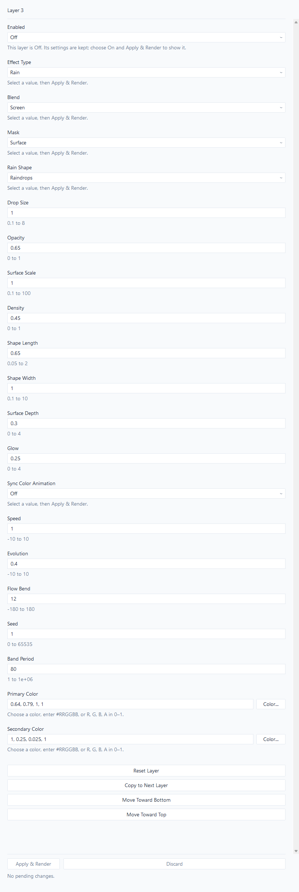

| Control | Available choices / input guidance |
| --- | --- |
| Enabled | On, Off |
| Effect Type | Rain, Flame, Embers, Mist, Heat Haze, Ripples, Flow Light, Aurora |
| Blend | Normal, Add, Screen, Multiply |
| Mask | Surface, Exterior, No Surface, Bands, Iteration Edges |
| Rain Shape | Raindrops, Water Streaks |
| Drop Size | 0.1 to 8 |
| Opacity | 0 to 1 |
| Surface Scale | 0.1 to 100 |
| Density | 0 to 1 |
| Shape Length | 0.05 to 2 |
| Shape Width | 0.1 to 10 |
| Surface Depth | 0 to 4 |
| Glow | 0 to 4 |
| Sync Color Animation | On, Off |
| Speed | -10 to 10 |
| Evolution | -10 to 10 |
| Flow Bend | -180 to 180 |
| Seed | 0 to 65535 |
| Band Period | 1 to 1e+06 |
| Primary Color | Choose a color, enter #RRGGBB, or R, G, B, A in 0–1. |
| Secondary Color | Choose a color, enter #RRGGBB, or R, G, B, A in 0–1. |

Actions: **Reset Layer**, **Copy to Next Layer**, **Move Toward Bottom**, **Move Toward Top**.

### Layer 4 (Top)

Show actual Animated Materials / Layer 4 (Top) panel

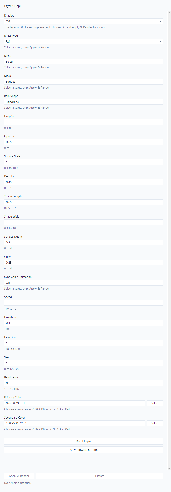

| Control | Available choices / input guidance |
| --- | --- |
| Enabled | On, Off |
| Effect Type | Rain, Flame, Embers, Mist, Heat Haze, Ripples, Flow Light, Aurora |
| Blend | Normal, Add, Screen, Multiply |
| Mask | Surface, Exterior, No Surface, Bands, Iteration Edges |
| Rain Shape | Raindrops, Water Streaks |
| Drop Size | 0.1 to 8 |
| Opacity | 0 to 1 |
| Surface Scale | 0.1 to 100 |
| Density | 0 to 1 |
| Shape Length | 0.05 to 2 |
| Shape Width | 0.1 to 10 |
| Surface Depth | 0 to 4 |
| Glow | 0 to 4 |
| Sync Color Animation | On, Off |
| Speed | -10 to 10 |
| Evolution | -10 to 10 |
| Flow Bend | -180 to 180 |
| Seed | 0 to 65535 |
| Band Period | 1 to 1e+06 |
| Primary Color | Choose a color, enter #RRGGBB, or R, G, B, A in 0–1. |
| Secondary Color | Choose a color, enter #RRGGBB, or R, G, B, A in 0–1. |

Actions: **Reset Layer**, **Move Toward Bottom**.

## Zoom Overlay

[Field explanations](settings-reference.md) · [Workflow chapters](user-manual.md)

### Appearance

Show actual Zoom Overlay / Appearance panel

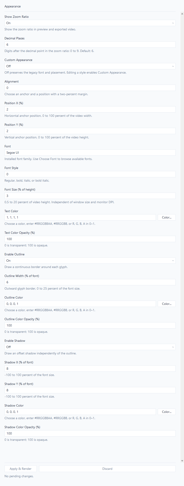

| Control | Available choices / input guidance |
| --- | --- |
| Show Zoom Ratio | On, Off |
| Decimal Places | Digits after the decimal point in the zoom ratio: 0 to 9. Default: 6. |
| Custom Appearance | On, Off |
| Alignment | Choose an anchor and a position with a two-percent margin. |
| Position X (%) | Horizontal anchor position, 0 to 100 percent of the video width. |
| Position Y (%) | Vertical anchor position, 0 to 100 percent of the video height. |
| Font | Installed font family. Use Choose Font to browse available fonts. |
| Font Style | Regular, bold, italic, or bold italic. |
| Font Size (% of height) | 0.5 to 20 percent of video height. Independent of window size and monitor DPI. |
| Text Color | Choose a color, enter #RRGGBBAA, #RRGGBB, or R, G, B, A in 0–1. |
| Text Color Opacity (%) | 0 is transparent; 100 is opaque. |
| Enable Outline | On, Off |
| Outline Width (% of font) | Outward glyph border, 0 to 25 percent of the font size. |
| Outline Color | Choose a color, enter #RRGGBBAA, #RRGGBB, or R, G, B, A in 0–1. |
| Outline Color Opacity (%) | 0 is transparent; 100 is opaque. |
| Enable Shadow | On, Off |
| Shadow X (% of font) | -100 to 100 percent of the font size. |
| Shadow Y (% of font) | -100 to 100 percent of the font size. |
| Shadow Color | Choose a color, enter #RRGGBBAA, #RRGGBB, or R, G, B, A in 0–1. |
| Shadow Color Opacity (%) | 0 is transparent; 100 is opaque. |

## Shader Layers

[Field explanations](settings-reference.md) · [Workflow chapters](user-manual.md)

### Layer Order

Show actual Shader Layers / Layer Order panel

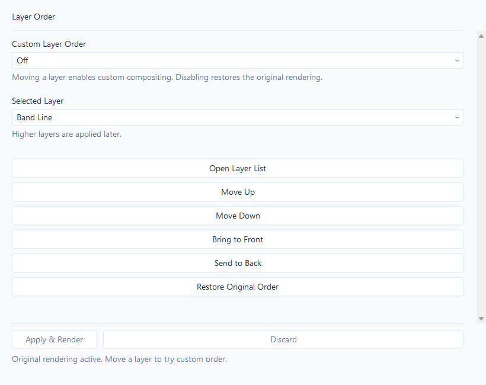

| Control | Available choices / input guidance |
| --- | --- |
| Custom Layer Order | Off, On |
| Selected Layer | Band Line, Texture 1, Texture 2, Texture 3, Texture 4, Pattern 1, Pattern 2, Pattern 3, Pattern 4, Stripe, Lighting & Base Material, Metal, Cyber Sigilism, PHONK, Frost, Sea, Print Material, Material Color & Rim, Effect 1, Effect 2, Effect 3, Effect 4, Color Correction, Fog, Bloom, HDR / Tone Mapping, Print Color Quantization, VHS Finish, Monochrome Finish |

Actions: **Open Layer List**, **Move Up**, **Move Down**, **Bring to Front**, **Send to Back**, **Restore Original Order**.

## Export

[Field explanations](settings-reference.md) · [Workflow chapters](user-manual.md)

### Image

Show actual Export / Image panel

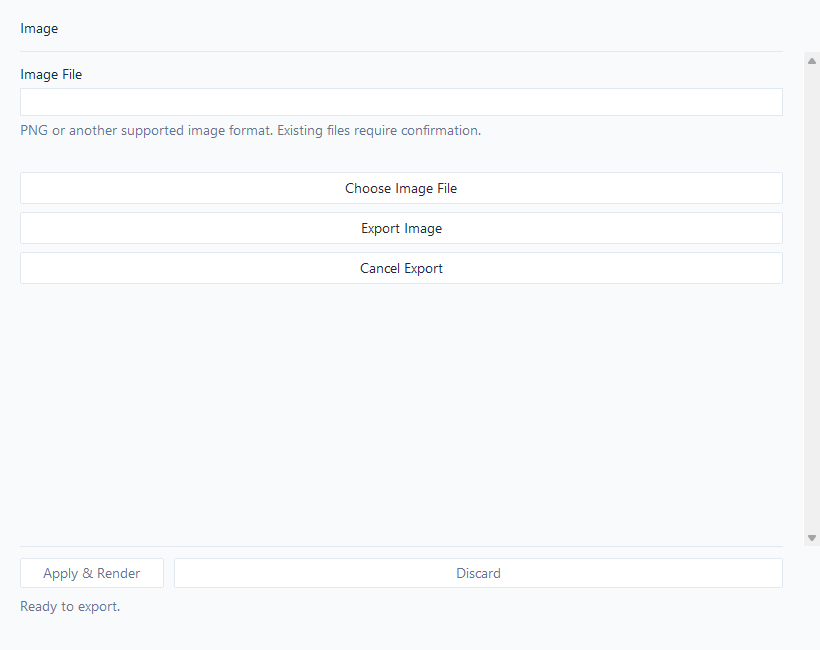

| Control | Available choices / input guidance |
| --- | --- |
| Image File | PNG or another supported image format. Existing files require confirmation. |

Actions: **Choose Image File**, **Export Image**, **Cancel Export**.

### Video

Show actual Export / Video panel

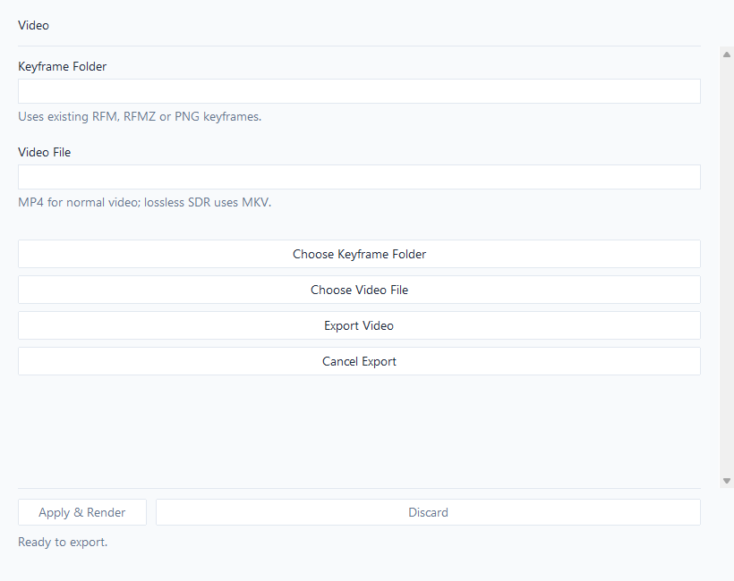

| Control | Available choices / input guidance |
| --- | --- |
| Keyframe Folder | Uses existing RFM, RFMZ or PNG keyframes. |
| Video File | MP4 for normal video; lossless SDR uses MKV. |

Actions: **Choose Keyframe Folder**, **Choose Video File**, **Export Video**, **Cancel Export**.

### Resolution & Quality

Show actual Export / Resolution & Quality panel

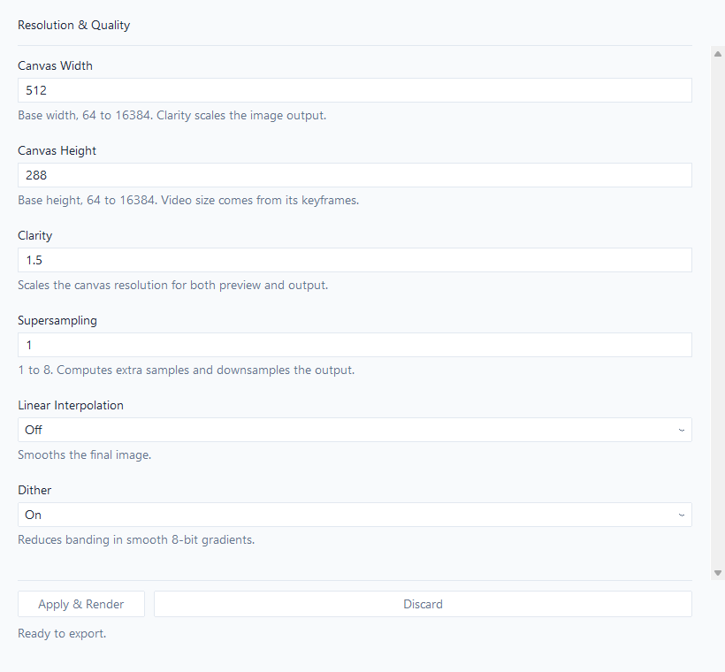

| Control | Available choices / input guidance |
| --- | --- |
| Canvas Width | Base width, 64 to 16384. Clarity scales the image output. |
| Canvas Height | Base height, 64 to 16384. Video size comes from its keyframes. |
| Clarity | Scales the canvas resolution for both preview and output. |
| Supersampling | 1 to 8. Computes extra samples and downsamples the output. |
| Linear Interpolation | On, Off |
| Dither | On, Off |

### Video Encoding

Show actual Export / Video Encoding panel

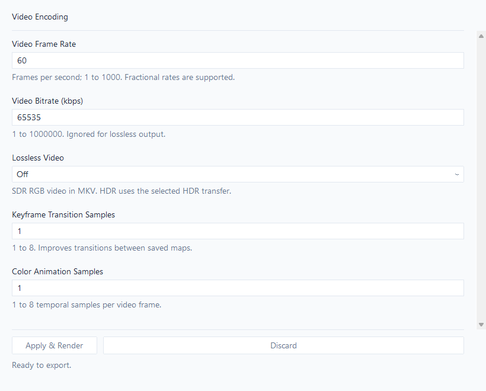

| Control | Available choices / input guidance |
| --- | --- |
| Video Frame Rate | Frames per second; 1 to 1000. Fractional rates are supported. |
| Video Bitrate (kbps) | 1 to 1000000. Ignored for lossless output. |
| Lossless Video | On, Off |
| Keyframe Transition Samples | 1 to 8. Improves transitions between saved maps. |
| Color Animation Samples | 1 to 8 temporal samples per video frame. |

### HDR & Tone Mapping

Show actual Export / HDR & Tone Mapping panel

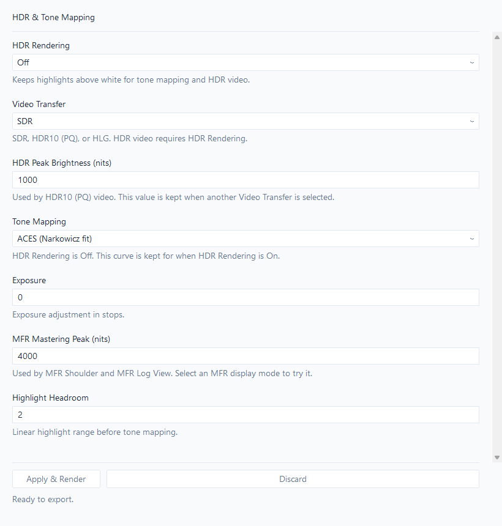

| Control | Available choices / input guidance |
| --- | --- |
| HDR Rendering | On, Off |
| Video Transfer | SDR, HDR10 (PQ), HLG |
| HDR Peak Brightness (nits) | 100 to 10000. Used by PQ output. |
| Tone Mapping | Clip, Reinhard, ACES (Narkowicz fit), Filmic, MFR Shoulder, MFR Log View, MFR Linear Clip, MFR False Color |
| Exposure | Exposure adjustment in stops. |
| MFR Mastering Peak (nits) | MFR display metadata: reference white is 203 nits. Does not change source light. 100 to 10000. |
| Highlight Headroom | Linear highlight range before tone mapping. |

### Keyframe Output

Show actual Export / Keyframe Output panel

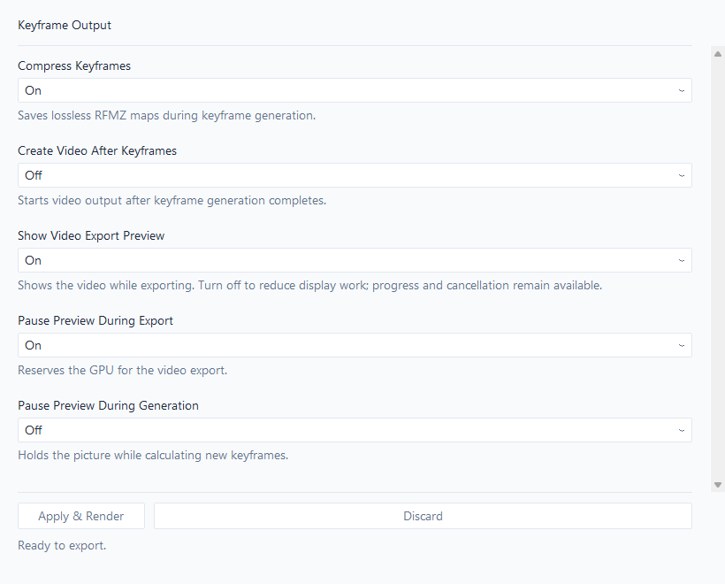

| Control | Available choices / input guidance |
| --- | --- |
| Compress Keyframes | On, Off |
| Create Video After Keyframes | On, Off |
| Show Video Export Preview | On, Off |
| Pause Preview During Export | On, Off |
| Pause Preview During Generation | On, Off |

## A/B Comparison

[Field explanations](settings-reference.md) · [Workflow chapters](user-manual.md)

### Compare Appearance

Show actual A/B Comparison / Compare Appearance panel

| Control | Available choices / input guidance |
| --- | --- |
| Reference Source | Fixed A, Before Last Edit |
| View | Live Preview, Reference, Current, Split Reference / Current |
| Split Position (%) | 0 to 100. Drag the divider or use arrow keys. |
| Comparison Time (s) | Both looks use this fixed animation time, from 0 to 86400 seconds. |

Actions: **Capture Current as A**, **Toggle Reference / Current**, **Clear Comparison**.

## Local AI

Appearance proposal controls; no connection or generation requested.

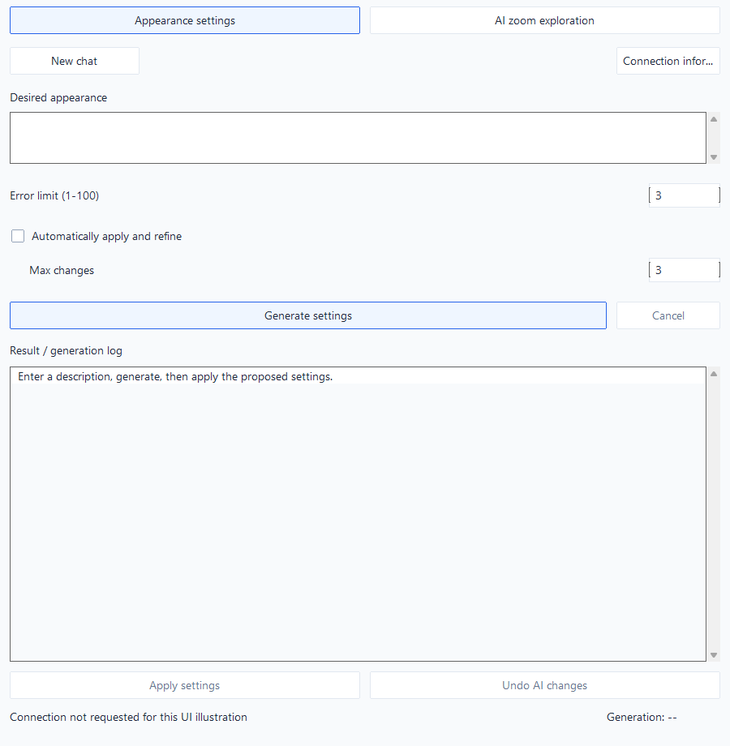

## AI zoom exploration

Actual exploration controls; no model run is shown.

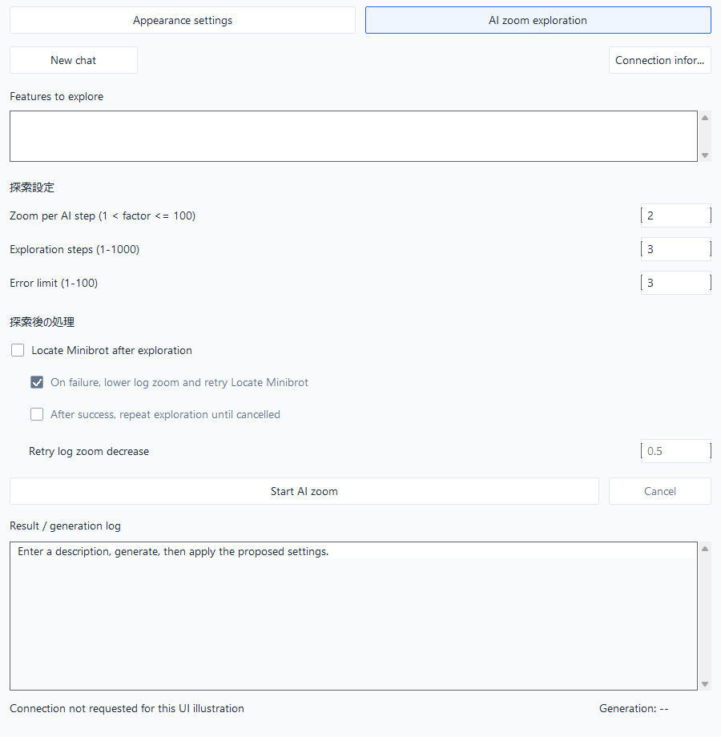

## Timeline editor

Actual editor before loading a keyframe folder. The sample overlay is intentionally not a rendered fractal preview.

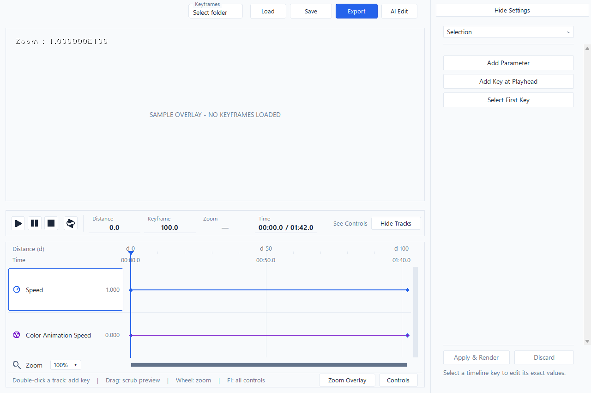
