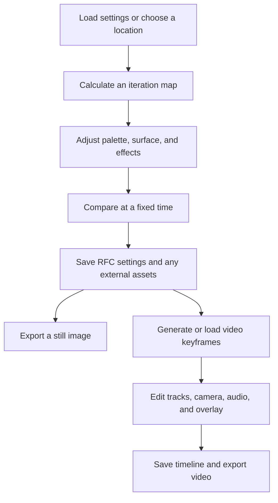

<!-- Created by GPT-6 on 2026-09-24. -->
<!-- Modified by GPT-6 on 2026-09-25. -->
# RFF_Super user manual

This English manual describes the user-facing features in the September 24, 2026 source tree. Start with a workflow chapter, then use the field reference for exact controls. All links and images use repository-relative paths for GitHub.

| What you want to do | Detailed chapter |
| --- | --- |
| Open, save, browse, compare, search, and arrange the workspace | [Workspace and files](workspace-and-files.md) |
| Navigate, calculate, locate minibrots, or tune performance | [Exploration and calculation](exploration-and-calculation.md) |
| Use a local model to propose appearance changes or explore locations | [Local AI](local-ai.md) |
| Animate colors and cameras, edit keys/audio/overlays, generate maps, and export | [Animation and export](animation-and-export.md) |
| Choose calculation/render presets, recover a session, and diagnose problems | [Presets, recovery, and diagnostics](presets-and-recovery.md) |
| Understand every shader family, its prerequisites, and advanced Surface options | [Shader feature overview](shader-overview.md) |
| Look up individual settings, choices, and dependencies | [Complete field reference](settings-reference.md) |
| See the actual controls | [UI gallery and form inventory](ui-gallery.md) |
| Find a feature by menu or workspace | [Feature coverage map](feature-coverage.md) |

## Follow a complete workflow

For a first experiment, open [source 2](examples/source-2.rfc), save a copy, and change a single appearance setting. Use [the illustrated introduction](SETTINGS_GUIDE.md) for worked comparisons and [the shader gallery](shader-comparisons.md) for more advanced combinations.

## What the visuals demonstrate

- **110 fractal images:** real production Vulkan renders, including 54 before/after pairs and two supplied locations. Each pair includes downloadable settings. See the [original comparison gallery](visual-comparisons.md) and [additional shader gallery](shader-comparisons.md).
- **Actual UI controls:** rendered from production Windows controls into image buffers in an isolated process outside the visible desktop. These show the real panel layout with controlled example/default state. They are not mockups or screenshots of the user's session. The gallery identifies its limitations.
- **Diagrams:** Mermaid workflows and six PNG illustrations explain relationships, timing, and sample counts. They are explanatory illustrations, not measurements or UI captures.

No Computer Use, desktop capture, mouse automation, or keyboard automation is used to prepare this manual. Local AI screenshots show the interface without running a model. Source-checked behavior and measured rendering results are distinguished in [validation notes](validation.md).

## Read the right kind of comparison

A new palette generally changes shading without recalculating the fractal. A new location, formula, or calculation tolerance requires a fresh calculation. A camera transform on saved video maps cannot invent detail outside those maps. A preference such as dark mode changes the controls rather than the exported artwork.

Performance depends on location, CPU/GPU, source resolution, enabled effects, and model configuration. Sample-count ratios in the guide are estimates of work or storage, not promised speedups.
