<!-- Created by GPT-6 on 2026-09-24. -->
# Visual settings comparisons

[24 additional shader comparisons](shader-comparisons.md) · [Back to the guide](SETTINGS_GUIDE.md) · [Field reference](settings-reference.md) · [Validation](validation.md)

All images use the same location, framing, and output size. Captions list the edited values; unrelated appearance effects are disabled in the shared baseline. Each source image is 800 × 450. Click an image to view it at full size. Each downloadable RFC includes the complete example state. Animation images also require the indicated playback time.

Style choices apply multi-control recipes. Other comparisons either change one value or explicitly list the setup needed to expose that effect. The Rain comparison is deliberately identified as subtle.

[Download baseline](examples/baseline.rfc) · [Unmodified supplied source 1](examples/source-1.rfc) · [Unmodified supplied source 2](examples/source-2.rfc)

## Palette

Palette Offset

Colors move around the cycle while the fractal stays in place.

| Before: Palette Start Offset: original | After: Palette Start Offset: original + 0.25 cycle |
| --- | --- |
|  | 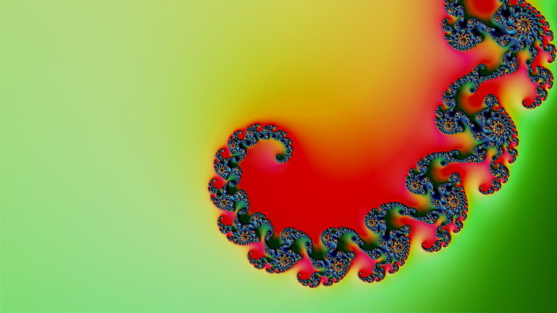 |

[Before settings](examples/palette-offset-before.rfc) · [After settings](examples/palette-offset-after.rfc)

Palette Interval

Halving the iteration intervals makes color repeat more often.

| Before: Color intervals: saved values | After: Color intervals: half the saved values |
| --- | --- |
|  | 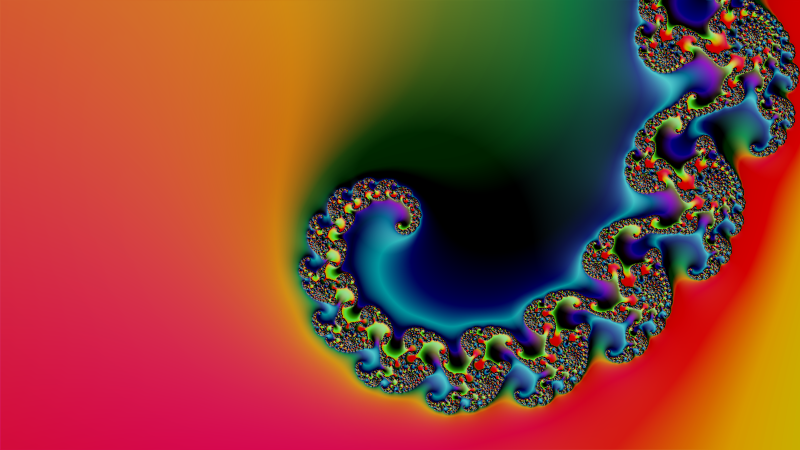 |

[Before settings](examples/palette-interval-before.rfc) · [After settings](examples/palette-interval-after.rfc)

Cycle Bias

Bias changes the proportion of the cycle occupied by different colors.

| Before: Cycle Bias: 1 | After: Cycle Bias: 2 |
| --- | --- |
|  | 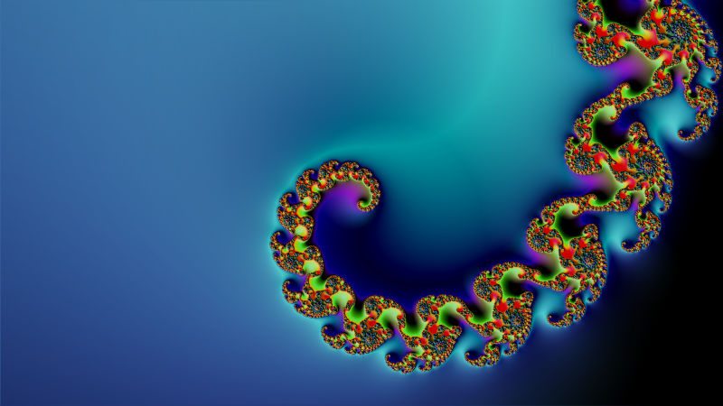 |

[Before settings](examples/cycle-bias-before.rfc) · [After settings](examples/cycle-bias-after.rfc)

Band Lines

Black boundaries separate palette bands.

| Before: Band Line: Off | After: Band Line: On; Count 8; Width 0.09 |
| --- | --- |
|  | 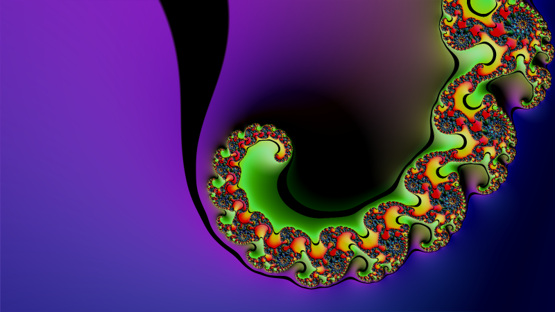 |

[Before settings](examples/band-lines-before.rfc) · [After settings](examples/band-lines-after.rfc)

## Lighting

Slope

Relief darkens the side facing away from the light.

| Before: Slope Opacity: 0 | After: Slope Opacity: 1; Depth 0.02 |
| --- | --- |
| 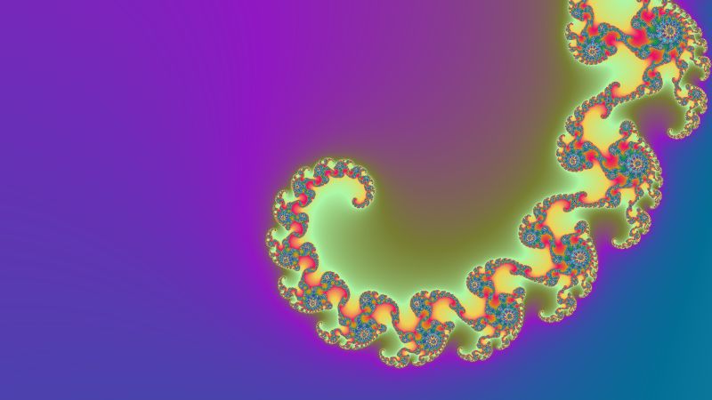 |  |

[Before settings](examples/slope-before.rfc) · [After settings](examples/slope-after.rfc)

Light Direction

Reversing the light reverses the lit/shadow orientation.

| Before: Light Direction: 45 degrees | After: Light Direction: 225 degrees |
| --- | --- |
| 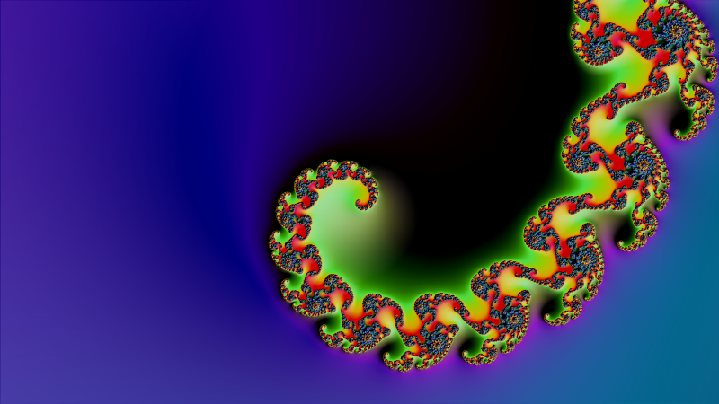 | 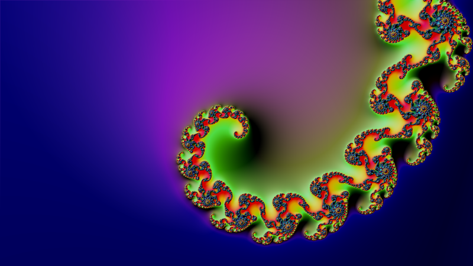 |

[Before settings](examples/light-direction-before.rfc) · [After settings](examples/light-direction-after.rfc)

Specular

A specular highlight appears on the lit surface.

| Before: Specular Intensity: 0 | After: Specular Intensity: 0.8 |
| --- | --- |
|  | 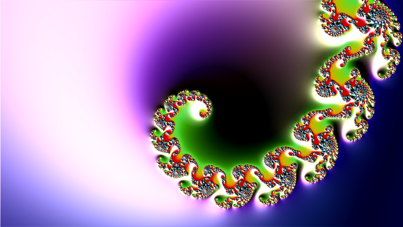 |

[Before settings](examples/specular-before.rfc) · [After settings](examples/specular-after.rfc)

Rim

Blue-white light emphasizes rim regions.

| Before: Rim Intensity: 0 | After: Rim Intensity: 0.8; blue-white Rim Color |
| --- | --- |
|  | 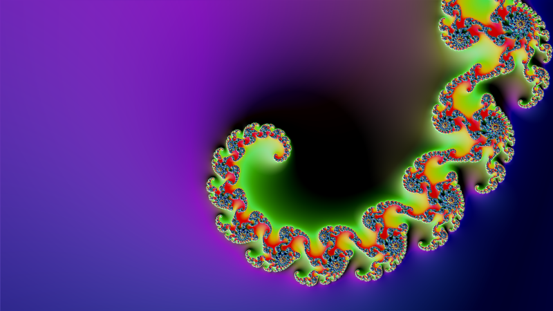 |

[Before settings](examples/rim-before.rfc) · [After settings](examples/rim-after.rfc)

Roughness

The tight reflection becomes broad and soft. Studio and a nonzero specular contribution are enabled on both sides.

| Before: Studio On; Specular Intensity 0.8; Roughness: 0.1 | After: Studio On; Specular Intensity 0.8; Roughness: 0.8 |
| --- | --- |
| 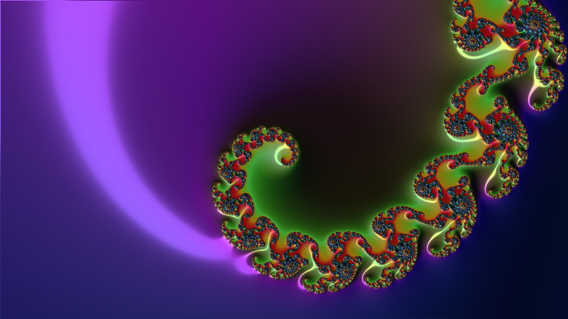 | 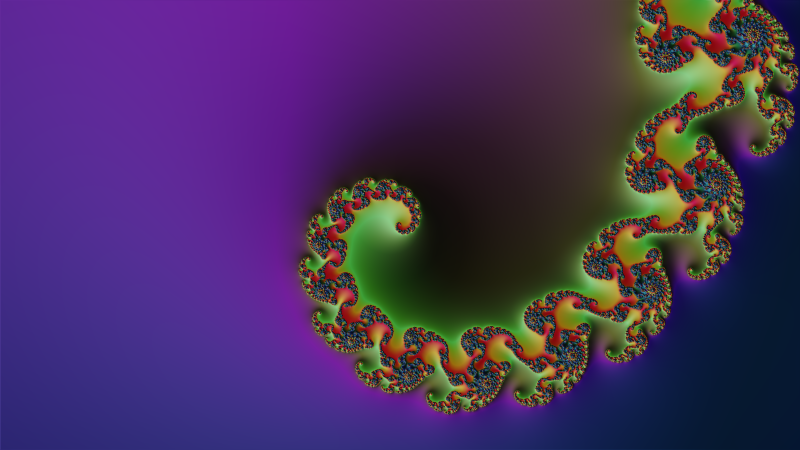 |

[Before settings](examples/roughness-before.rfc) · [After settings](examples/roughness-after.rfc)

## Surface styles

Y2K Chrome / Liquid Metal

Selecting this style applies its full surface recipe, including associated line/finishing choices.

| Before: Original surface | After: Base Style: Y2K Chrome / Liquid Metal |
| --- | --- |
|  |  |

[Before settings](examples/style-1-before.rfc) · [After settings](examples/style-1-after.rfc)

Cyber Sigilism

Selecting this style applies its full surface recipe, including associated line/finishing choices.

| Before: Original surface | After: Base Style: Cyber Sigilism |
| --- | --- |
|  | 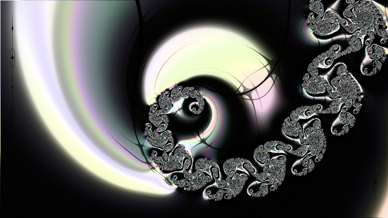 |

[Before settings](examples/style-2-before.rfc) · [After settings](examples/style-2-after.rfc)

PHONK / Drift Phonk

Selecting this style applies its full surface recipe, including associated line/finishing choices.

| Before: Original surface | After: Base Style: PHONK / Drift Phonk |
| --- | --- |
|  | 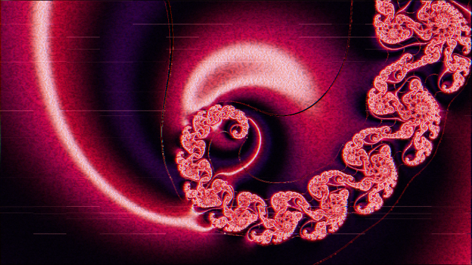 |

[Before settings](examples/style-3-before.rfc) · [After settings](examples/style-3-after.rfc)

Black Metal Album Art

Selecting this style applies its full surface recipe, including associated line/finishing choices.

| Before: Original surface | After: Base Style: Black Metal Album Art |
| --- | --- |
|  | 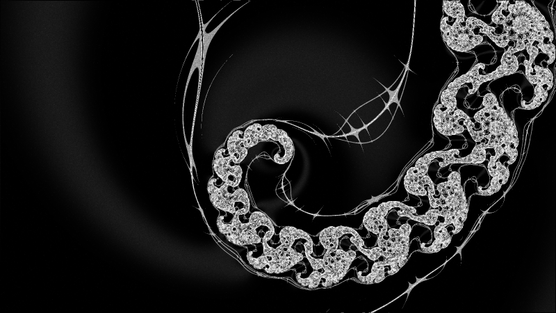 |

[Before settings](examples/style-4-before.rfc) · [After settings](examples/style-4-after.rfc)

Deep Sea Bioluminescence

Selecting this style applies its full surface recipe, including associated line/finishing choices.

| Before: Original surface | After: Base Style: Deep Sea Bioluminescence |
| --- | --- |
|  | 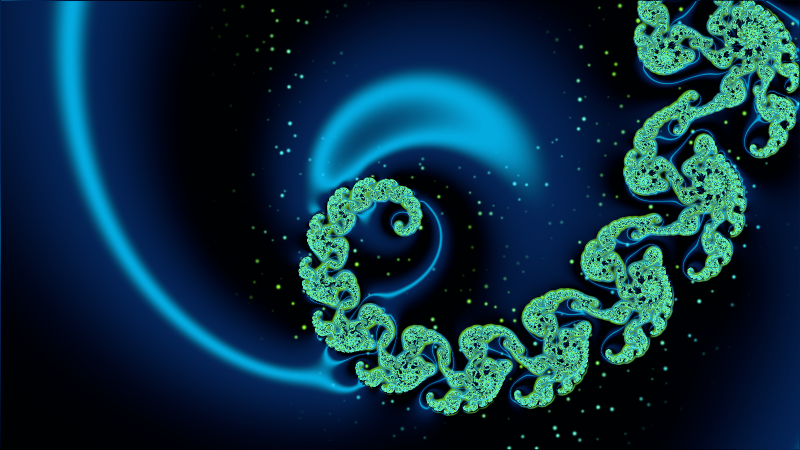 |

[Before settings](examples/style-5-before.rfc) · [After settings](examples/style-5-after.rfc)

Ukiyo-e Fractal

Selecting this style applies its full surface recipe, including associated line/finishing choices.

| Before: Original surface | After: Base Style: Ukiyo-e Fractal |
| --- | --- |
|  | 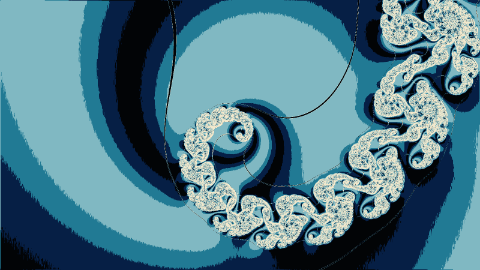 |

[Before settings](examples/style-6-before.rfc) · [After settings](examples/style-6-after.rfc)

## Decoration

Pattern

A generated checker appears over exterior color. No image file is used.

| Before: Pattern Layer 1: Off | After: Checker; Screen UV; Repeat U/V: 12/8; Opacity: 0.6 |
| --- | --- |
|  | 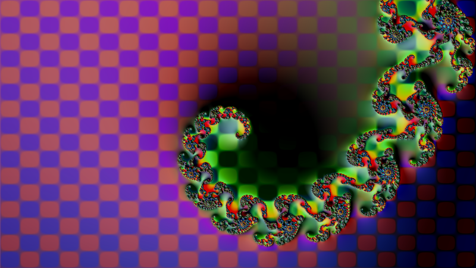 |

[Before settings](examples/pattern-before.rfc) · [After settings](examples/pattern-after.rfc)

Warp

The enabled checker and palette are displaced by noise warping.

| Before: Warp: Off (checker enabled) | After: Warp: On; Amount: 0.4 (checker enabled) |
| --- | --- |
|  | 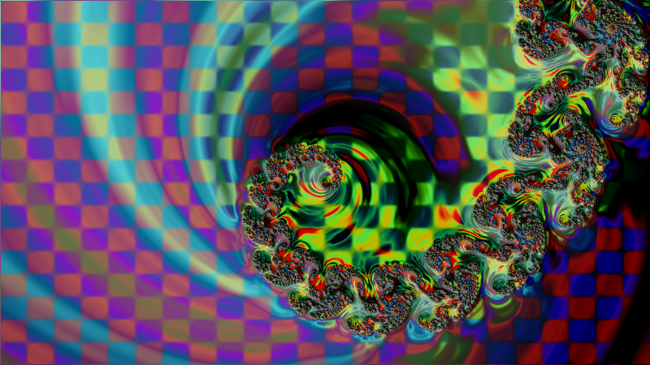 |

[Before settings](examples/warp-before.rfc) · [After settings](examples/warp-after.rfc)

Stripe

Iteration-based stripes darken the exterior.

| Before: Stripe Opacity: 0 | After: Opacity: 0.65; Intervals: 10 and 20 |
| --- | --- |
|  | 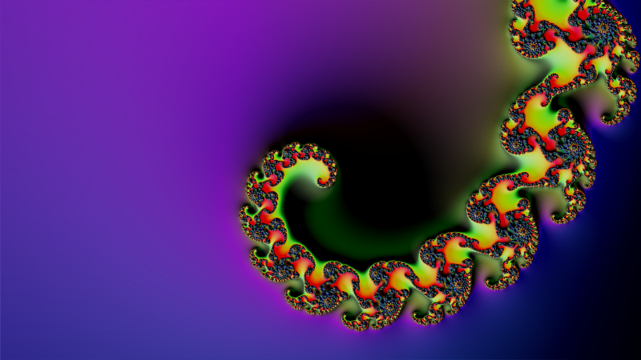 |

[Before settings](examples/stripe-before.rfc) · [After settings](examples/stripe-after.rfc)

Rain

This rain example is subtle: compare the fine surface highlights at full size. It changes only a small portion of this view; it is not a global blur.

| Before: Rain Layer 1: Off | After: Rain Layer 1: On; Opacity: 1; Drop Size: 3; Surface Depth: 2; Glow: 1 |
| --- | --- |
|  | 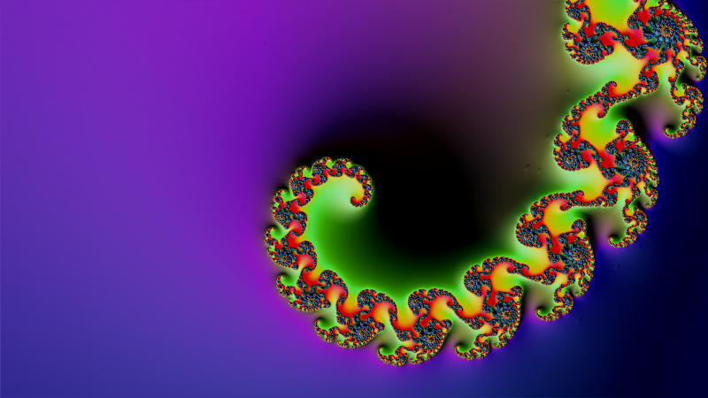 |

[Before settings](examples/rain-before.rfc) · [After settings](examples/rain-after.rfc)

Flame

The material adds flowing surface highlights. Both views are evaluated at 2 seconds; only the enabled material contribution changes.

| Before: Flame Layer 1: Off | After: Flame Layer 1: On; Opacity 0.85; Glow 1; t = 2 s |
| --- | --- |
|  | 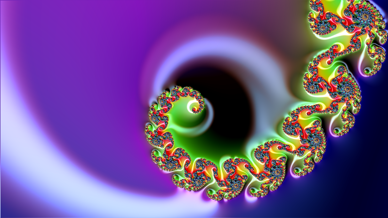 |

[Before settings](examples/flame-before.rfc) · [After settings](examples/flame-after.rfc)

## Finishing

Gamma

Midtones become brighter without changing the fractal geometry.

| Before: Gamma: 1 | After: Gamma: 1.7 |
| --- | --- |
|  | 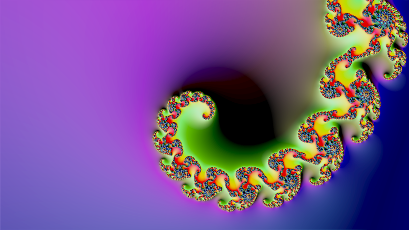 |

[Before settings](examples/gamma-before.rfc) · [After settings](examples/gamma-after.rfc)

Exposure

The positive color-grading Exposure strongly brightens the picture. This is not the HDR exposure-in-stops control.

| Before: Exposure: 0 | After: Exposure: 0.6 |
| --- | --- |
|  | 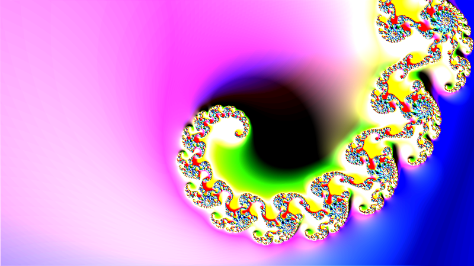 |

[Before settings](examples/exposure-before.rfc) · [After settings](examples/exposure-after.rfc)

Hue

A quarter-turn hue shift replaces the color relationships.

| Before: Hue: 0 | After: Hue: 0.25 turn |
| --- | --- |
|  | 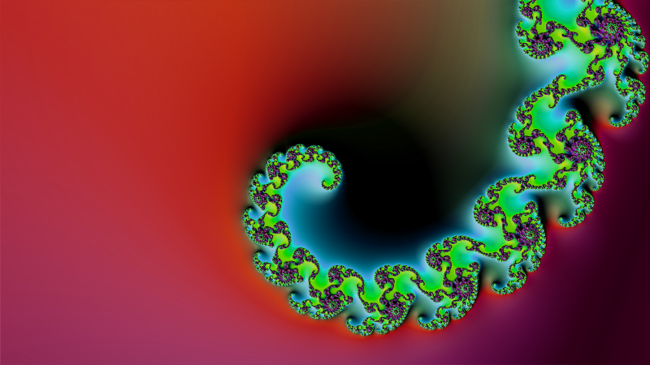 |

[Before settings](examples/hue-before.rfc) · [After settings](examples/hue-after.rfc)

Saturation

The same structure becomes grayscale.

| Before: Saturation: 0 | After: Saturation: -1 (grayscale) |
| --- | --- |
|  | 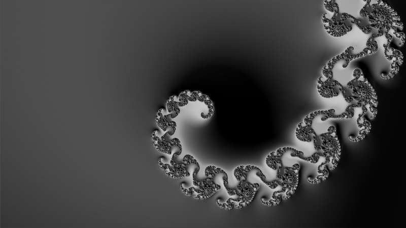 |

[Before settings](examples/saturation-before.rfc) · [After settings](examples/saturation-after.rfc)

Contrast

Highlights and dark regions separate more strongly.

| Before: Contrast: 0 | After: Contrast: 0.5 |
| --- | --- |
|  | 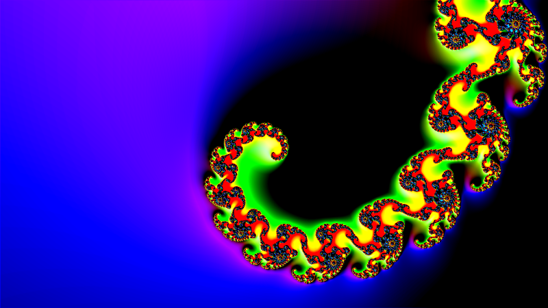 |

[Before settings](examples/contrast-before.rfc) · [After settings](examples/contrast-after.rfc)

Bloom

Bright details produce soft halos.

| Before: Bloom Intensity: 0 | After: Intensity: 1.2; Threshold: 0.3; Radius: 0.2; Softness: 1 |
| --- | --- |
|  | 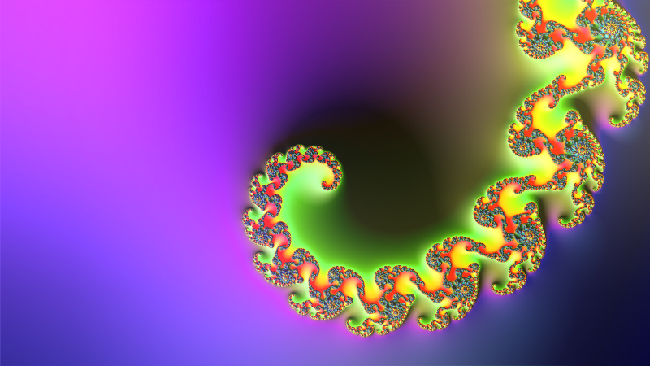 |

[Before settings](examples/bloom-before.rfc) · [After settings](examples/bloom-after.rfc)

Fog

The broad fog contribution softens the image.

| Before: Fog Opacity: 0 | After: Fog Opacity: 0.8; Radius: 0.12 |
| --- | --- |
|  | 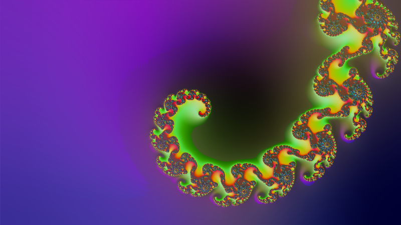 |

[Before settings](examples/fog-before.rfc) · [After settings](examples/fog-after.rfc)

Focus

Most visible detail lies outside this narrow selected depth band and becomes defocused.

| Before: Focus Amount: 0 | After: Amount: 1; Depth: 0.3; Range: 0.05; Blur: 16 |
| --- | --- |
|  |  |

[Before settings](examples/focus-before.rfc) · [After settings](examples/focus-after.rfc)

Chaos

Intricate structure softens while broad smooth regions retain their form.

| Before: Chaos Amount: 0 | After: Amount: 1; Threshold: 0.15; Blur Radius: 12 |
| --- | --- |
|  | 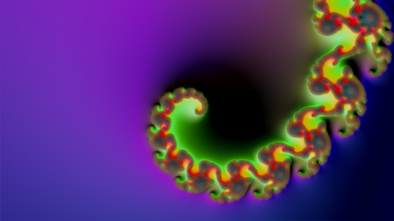 |

[Before settings](examples/chaos-before.rfc) · [After settings](examples/chaos-after.rfc)

## Animation

Animation

Only time changes: the palette advances by 16 iterations in one second.

| Before: Linear animation: t = 0 s, Speed = 16 | After: Linear animation: t = 1 s, Speed = 16 |
| --- | --- |
|  | 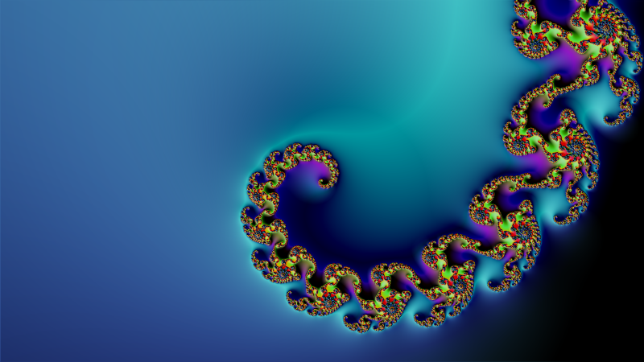 |

[Before settings](examples/animation-before.rfc) · [After settings](examples/animation-after.rfc)

