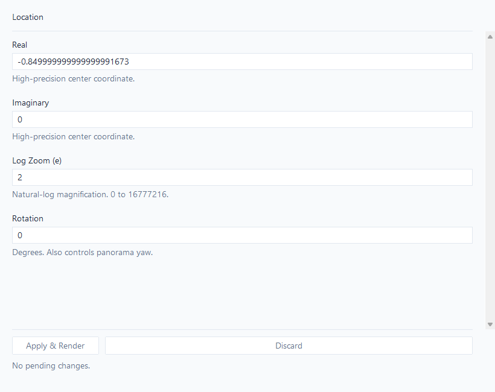
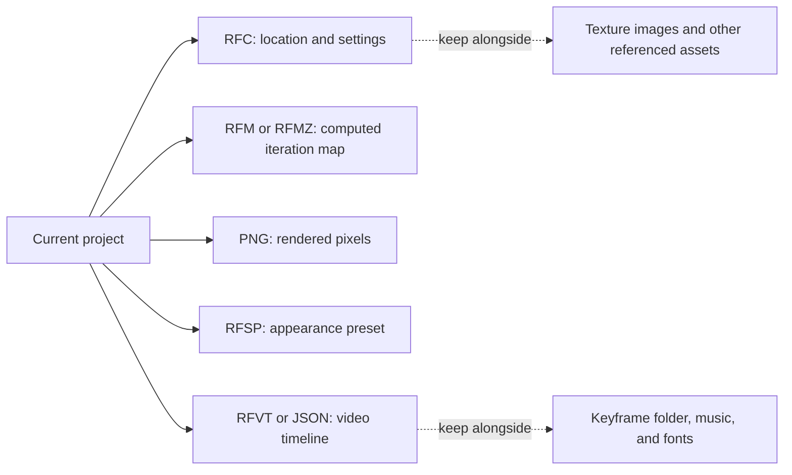
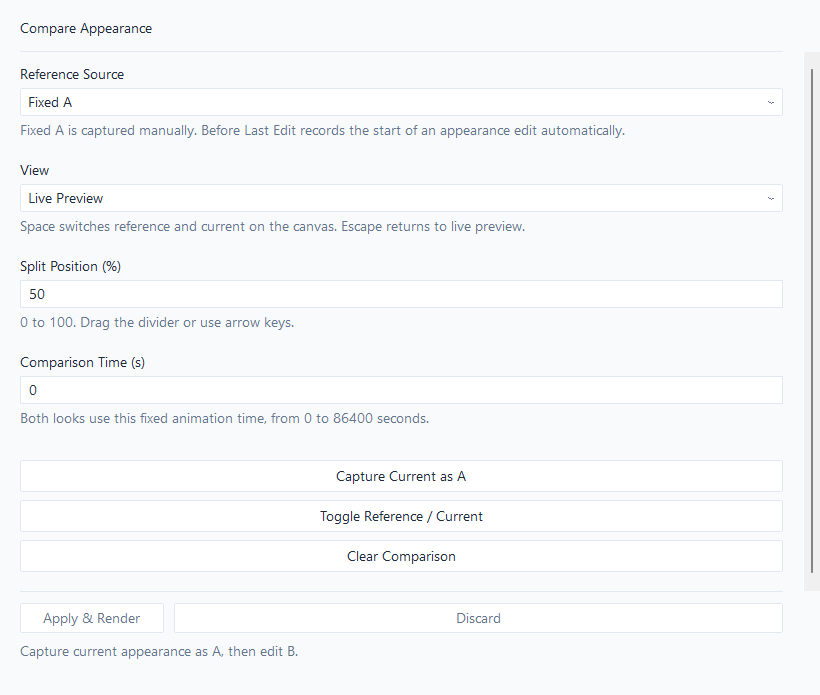

<!-- Created by GPT-6 on 2026-09-24. -->
<!-- Modified by GPT-6 on 2026-09-25. -->
# Workspace and files

[Manual](user-manual.md) · [Actual UI gallery](ui-gallery.md)

## Workspaces, sections, and pending changes

The four main workspaces are **Location & Calculation**, **Surface Effects**, **Animation**, and **Export**. A workspace can contain several modules: for example, appearance has separate Palette, Lighting & Relief, Textures, Patterns, Warp & Stripe, Finishing, Animated Materials, Comparison, and Shader Layers modules.

Choose a section to show its controls. Type a value, read the validation message, then choose **Apply & Render**. Until applied, the text is a draft; the picture still uses the last valid applied settings. **Discard** restores the displayed fields to their applied values. Switching sections does not mean that a pending edit has been applied. A marked invalid field must be corrected before that draft can be committed.

The location panel illustrates this arrangement:

**Zoom-label correction:** this version displays “Log Zoom (e)” and a natural-log hint. The actual renderer uses base 10. Adding 1 multiplies magnification by 10 at a fixed canvas size. The image reproduces the current UI; the explanation here follows the calculation.

The workspace's history follows applied edits. **Undo** returns to the previous committed state and **Redo** reapplies it. In an active text field, normal text editing shortcuts can take precedence over workspace history. Loading/replacing a document changes the context in which history is valid; save named versions for durable checkpoints.

| Shortcut or control | Use |
| --- | --- |
| Ctrl+F | Focus the settings search. Search an English control name used in this manual. |
| Ctrl+Tab / Ctrl+Shift+Tab | Move forward/backward among the four workspaces. |
| F6 / Shift+F6 | Move focus between workspace regions and the preview. |
| Tab / Shift+Tab | Move among controls in a region. |
| Enter in a form field | Apply the form, unless an open selection list is handling Enter. |
| Ctrl+Z / Ctrl+Y | Undo/redo an applied workspace edit outside text editing. |
| Ctrl+S | Save the current settings document; choose a filename for an unnamed document. |

Search results lead to the relevant setting rather than enabling an effect automatically. If a setting changes nothing, check its master switch, opacity, selected source, and animation mode. [Dependency troubleshooting](SETTINGS_GUIDE.md#when-a-setting-seems-to-do-nothing) explains common cases.

## Surface navigation and shader layers

The Surface editor offers **Basic** and **Detail** views. Basic reduces the number of controls presented; Detail exposes more of the same appearance. Changing the view is not a different rendering algorithm. **All**, **Used**, and **Favorites** filter surface categories. Used reflects contributions from the base style and added effects; a favorite is a workspace preference, not a shader value.

Select a base style first, then adjust its effects. Resetting a group changes artwork values; hiding a group or removing a docked panel does not. The [shader overview](shader-overview.md) explains all 27 Surface groups and alternate names used in the older panels.

Shader Layers controls the enabled compositing order. Moving a layer changes what later layers receive: a color change before bloom can change the light that blooms, while the same change after bloom changes the already-composited image. Disabled custom ordering uses the standard pipeline. See [the order comparison](shader-comparisons.md) and the [29-slot coverage map](shader-coverage.md).

## Panel layout

Use the Panel Layout module to place the main settings panel on the left or right, position navigation independently, and choose whether the section list or settings panel is outside. **Layer Panel Height** changes the space reserved for the layer list. **Side Panel Width** and **Bottom Panel Height** size additional appearance panels.

**Add Appearance Panel** creates another view of the shared settings. Select its content and choose left, right, or bottom placement. **Selected Panel** determines which extra panel the content/position controls edit. **Remove Selected Panel** removes that view, leaving the appearance settings in place. **Restore Panel Layout** restores the arrangement. Resolve pending or invalid edits before replacing panel content. Narrow windows can place extra panels below the preview.

These controls change the working arrangement, not the image resolution. Set the document's canvas dimensions in Export when you want a different output size.

## Save the correct kind of file

| File / command | What it keeps and how to use it |
| --- | --- |
| **Save Settings**, `.rfc` | Saves the current configuration and document canvas size. Use this to resume work with the same location, calculation, shader, and video settings. It is not the computed map or a package of external assets. |
| **Save Location / Settings**, `.rfc` | Choose a new named settings file. Useful for before/after checkpoints. |
| **Save Location / Settings**, `.rfl` | Stores the legacy location data: center, log zoom, and iteration limit. Loading it leaves other settings in place; use it to try a location with the current look. |
| **Save Map**, `.rfm` | Saves calculated dynamic iteration data. Wait until calculation finishes before saving. Use it for recoloring or as a video source. |
| **Save Map**, `.rfmz` | Losslessly compresses dynamic map data on disk. It is separate from reference-orbit and MPA table compression. |
| **Save Image** | Writes rendered pixels. A PNG does not contain the iteration data needed to redo palette/relief calculations. |
| **Save Shader Preset**, `.rfsp` | Saves appearance for reuse at another location. Load Shader Preset applies the look without using it as a location file. |
| **Timeline Save**, `.rfvt` or `.json` | Saves timing, tracks, audio references, and zoom-overlay settings. It does not embed keyframe maps, music, texture images, or font files. |

New settings saves use RFC version 7. RFF_Super still reads RFC versions 3 through 6, but older releases cannot open version 7. Shader preset and timeline formats are unchanged.

**New Document** creates a fresh document. When replacing work, use the program's unsaved-change prompt to keep or discard it deliberately. If saving reports a failure, the open edits remain; correct the destination problem and save again.

**Load Location / Settings** restores the selected file. After loading an RFC with reference reuse enabled, disable Reuse Reference and recompute if it would otherwise use an orbit belonging to the previous location. If an external texture is missing, select its image again; the affected layer renders nothing until its source is available. A file whose combined resolution/clarity/supersampling exceeds the GPU limit is rejected rather than silently accepting that size.

## Browse maps and images

**Load Map** opens calculated map data; **Load Image** displays an image. These are different inputs: an image already has colors, whereas a dynamic map can be reshaded from iteration values. Loading an image does not reconstruct its original Mandelbrot coordinates.

While browsing a folder, **Left/Right** moves to the previous/next item, **Up/Down** takes larger steps, and **Home/End** goes to the first/last item. For maps, type a one-based item number and press Enter to jump; Backspace edits the number and Escape cancels the typed jump. Escape exits image browsing. A long calculation/generation/export can reserve the data and temporarily prevent browsing.

## Compare appearances fairly

1. Set the desired location and wait for the calculation.
2. Choose **Capture Current as A** to retain a fixed appearance reference.
3. Change the appearance and apply it.
4. Select **Split Reference / Current**, or toggle Reference/Current.
5. Set **Comparison Time (s)** to the same animation time for both looks. Move **Split Position** to inspect fine detail.

**Reference Source** chooses fixed A or the appearance before the last tracked edit. Fixed A survives a sequence of appearance edits; Before Last Edit is useful for one-step adjustments. Both comparisons use the current view, so this is an appearance comparison rather than a stored picture of an unrelated location. **Live Preview** returns to ordinary animation. **Clear Comparison** removes the stored comparison state. In the comparison view, Space toggles the two versions and Escape returns to live preview.

For a reproducible comparison, retain the RFC files and use a fixed time, canvas size, sampling, and source map. A moving palette can otherwise look different even when the setting under investigation did nothing.

## Language, theme, and legacy panels

**View → Language / 言語** selects English or Japanese; restart is required. **Show Setting Descriptions** shows explanatory text under controls. **Dark Mode** changes the interface colors. **Use Legacy Settings UI** makes relevant menu entries open the older settings windows instead of the corresponding workspace sections. The old and new interfaces edit the same application settings, although labels and control arrangement differ.

Source basis: [Application](../src/rff2/ui/Application.cpp), [File commands](../src/rff2/ui/CallbackFile.cpp), [WorkspaceShell](../src/rff2/ui/workspace/WorkspaceShell.hpp), and [ComparisonWorkspace](../src/rff2/ui/workspace/ComparisonWorkspace.cpp).
